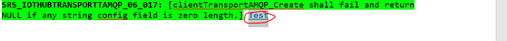
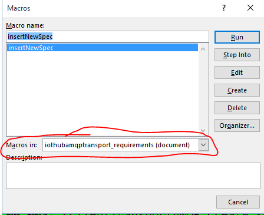
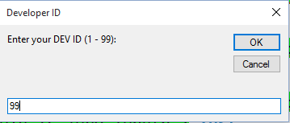
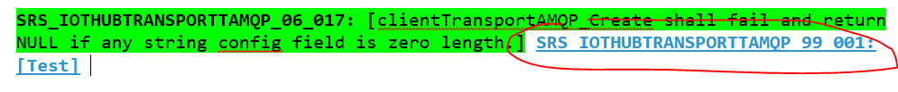

**The Azure IoT SDKs team wants to hear from you!**

- [Ask a question](#ask-a-question)
- [File a bug](#file-a-bug)
- [Contribute documentation](#contribute-documentation)
- [Contribute code](#contribute-code)

# Ask a question
Our team monitors Stack Overflow, especially the [azure-iot-hub](http://stackoverflow.com/questions/tagged/azure-iot-hub) tag. It really is the best place to ask.

We monitor the Github issues section specifically for bugs found with our SDK, however we will reply to questions asked using Github issues too.

# File a bug (code or documentation)
That is definitely something we want to hear about. Please open an issue on github, we'll address it as fast as possible. Typically here's the information we're going to ask for to get started:
- What SDK are you using (Node, C, C#, Python, Java?)
- What version of the SDK?
- Do you have a snippet of code that would help us reproduce the bug?
- Do you have logs showing what's happening?

Our SDK is entirely open-source and we do accept pull-requests if you feel like taking a stab at fixing the bug and maybe adding your name to our commit history :) Please mention
any relevant issue number in the pull request description.

# Contribute documentation
For simple markdown files, we accept documentation pull requests submitted against the `master` branch, if it's about existing SDK features.
If your PR is about future changes or has changes to the comments in the code itself, we'll treat is as a code change (see the next section).

# Contribute code
Unlike documentation, we require pull-requests for code to be submitted against the `develop` branch in order to review and run it in our gated build system. We try to maintain a high bar
for code quality and maintainability, we insist on having tests associated with the code, and if necessary, additions/modifications to the requirement documents.

Also, have you signed the [Contribution License Agreement](https://cla.microsoft.com/) ([CLA](https://cla.microsoft.com/))? A friendly bot will remind you about it when you submit your pull-request.

If you feel like your contribution is going to be a major effort, you should probably give us a heads-up. We have a lot of items captured in our backlog and we release every two weeks, so before you spend the time, just check with us to make
sure your plans and ours are in sync :) Just open an issue on github and tag it "enhancement" or "feature request"

## Editing module requirements
We use requirement documents to describe the expected behavior for each code modules. It works as a basis to understand what tests need to be written.

Each requirement has a unique tag that is re-used in the code comments to identify where it's implemented and where it's tested. To generate these unique identifiers, we used to use a Microsoft Word macro.
We are progressively switching to Markdown though, for which we have no macro, therefore we have to be careful about numbering.

The following steps describe adding a new requirement in a Word document:

* Add the requirement text and select it

* Invoke the macro with the selected text

* Select developer id 99

* Done!

When contributing to markdown requirement docs, you can also use `99` for a developer id, and just increment the last number of the requirement to be unique.

## Adding new files
If your contribution is not part of an already existed code, you must create a new requirement file and a new unit test project. Our team created a template to help you on it. For the requirements you can copy the [template_requirements.md](https://github.com/Azure/azure-c-shared-utility/blob/develop/devdoc/template_requirements.md) to the appropriate `devdoc` directory and change it to fits your needs.

For the unit test, copy the directory [template_ut](https://github.com/Azure/azure-c-shared-utility/tree/develop/tests/template_ut) to the appropriate `tests` directory and change it to fits your needs. To include your new test suite in the `cmake`, add your new test suite in `test/CMakeLists.txt` with the command `add_subdirectory(template_ut)`.
