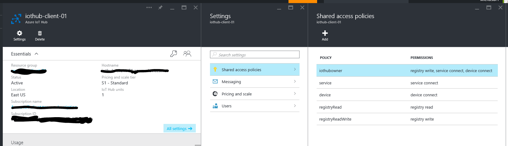
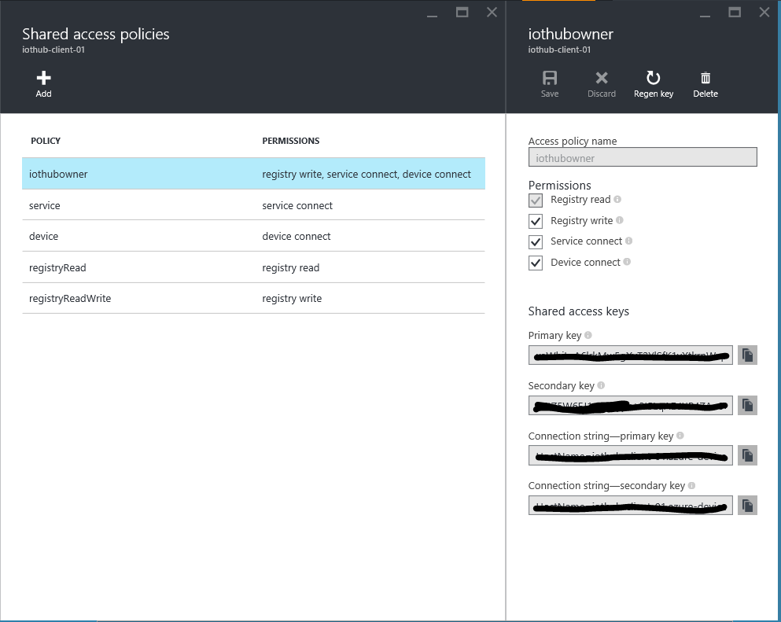
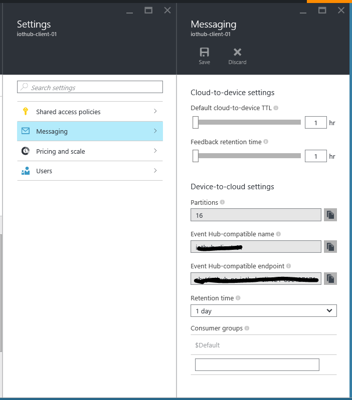

# Run End to End Tests

This document describes how to run the end to end tests.

- [Set up the test parameters](#testparams)
- [Run end to end tests on a Windows development environment](#windows_client)
- [Run end to end tests for "iothub_client" on a Linux development environment](#linux_client)

<a name="testparams"/>
## Setup the test parameters

- Open the file "iot_device_params.txt" located under the tools\iot_hub_e2e_tests_params folders in your local copy of the repository.
- Populate the information required in this file by extracting it from the Azure portal & Device Explorer.
    - Open the Azure IoT Hub you created in the Azure portal and navigate through "All Settings", "Shared Access Policies", and "iothubowner" as shown in the figure below.
    
    

    - Locate one of the IoT Hub connection strings as shown in the figure below
    
        

    - The connection string will be in the following form: HostName=<IOTHUB_NAME>.<IOTHUB_SUFFIX>;SharedAccessKeyName=<IOTHUB_POLICY_NAME>;SharedAccessKey=<IOTHUB_POLICY_KEY>
    - Populate the following variables in the "iot_device_params.txt"  file by matching the place holders with the ones from the IoT Hub connection string shown above.
      
      - IOTHUB_CONNECTION_STRING=[entire connection string from azure portal]
     
    - Locate the Event Hub settings as shown in the figure below

    

    - Populate the following variables as described below.

      - IOTHUB_EVENTHUB_CONNECTION_STRING=Endpoint=[Event Hub-compatible endpoint];SharedAccessKeyName=[IOTHUB_POLICY_NAME];SharedAccessKey=[IOTHUB_POLICY_KEY]
      - IOTHUB_EVENTHUB_CONSUMER_GROUP=$Default
      - IOTHUB_PARTITION_COUNT=[Partition count from portal]
	  
	  Note: IOTHUB_EVENTHUB_CONSUMER_GROUP is optional. If not provided, the assumed value is "$Default".

<a name="windows_client"/>
## Run end to end tests on a Windows development environment

- Start the Windows PowerShell in Administrator mode.
- Navigate to the folder tools\iot_hub_e2e_tests_params in your local copy of the repository.
- Run the script "Set-IOTDeviceParametersForE2ETests.ps1" located under the tools\iot_hub_e2e_tests_params folders in your local copy of the repository.
- Start the Visual Studio solution "azure_iot_sdks.sln" located under the folder cmake in your home directory. 
- Build the solution
- Run the tests by Test -> Run -> All Tests menu item inside of Visual Studio.

<a name="linux_client"/>
## Run end to end tests for "iothub_client" on a Linux development environment

- Navigate to the folder c/build_all/linux in your local copy of the repository.
- Run the build.sh script.
- Execute the command "sudo ./setiotdeviceparametersfore2etests.sh" located under the tools\iot_hub_e2e_tests_params folders in your local copy of the repository.
- Restart the Linux machine.
- In your home folder, in the cmake folder, run the ctest command with parameters -C "Debug"
