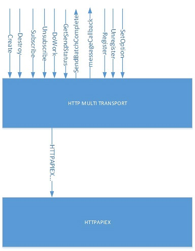

# IoTHubHTTPTransport Requirements
================

## Overview

The Http Transport is a transport mechanismism to connect the IoT Hub to multiple devices though a single TLS connection. It exposes a transport handle and a device handle.  The transport handle is responsible for the connection, sending, and receiving messages, and the device handle is used to identify the correct Iot Hub device related to these devices.



## Exposed API

```c
extern const TRANSPORT_PROVIDER* HTTP_Protocol(void);
```

  The following static functions are provided in the fields of the TRANSPORT_PROVIDER structure:

    - IoTHubTransportHttp_Subscribe_DeviceMethod,
    - IoTHubTransportHttp_Unsubscribe_DeviceMethod,
    - IoTHubTransportHttp_Subscribe_DeviceTwin,
    - IoTHubTransportHttp_Unsubscribe_DeviceTwin,
    - IoTHubTransportHttp_GetHostname,
    - IoTHubTransportHttp_SetOption,
    - IoTHubTransportHttp_Create,
    - IoTHubTransportHttp_Destroy,
    - IoTHubTransportHttp_Register,
    - IoTHubTransportHttp_Unregister, 
    - IoTHubTransportHttp_Subscribe, 
    - IoTHubTransportHttp_Unsubscribe, 
    - IoTHubTransportHttp_DoWork, 
    - IoTHubTransportHttp_GetSendStatus 
    
## IoTHubTransportHttp_Create
```c
	extern TRANSPORT_LL_HANDLE IoTHubTransportHttp_Create(const IOTHUB_CLIENT_TRANSPORT_CONFIG* config);
```

`IoTHubTransportHttp_Create` shall create an `TRANSPORT_LL_HANDLE` to be used as the single connection used by multiple devices. This handle will be used by subsequent calls to this module's API.


**SRS_TRANSPORTMULTITHTTP_17_001: [**If parameter `config` is `NULL`, then `IoTHubTransportHttp_Create` shall return `NULL`.**]**   
**SRS_TRANSPORTMULTITHTTP_17_002: [** If field `transportConfig` is `NULL`, then `IoTHubTransportHttp_Create` shall return `NULL`. **]**  
**SRS_TRANSPORTMULTITHTTP_17_003: [** If fields `protocol`, `iotHubName` or `iotHubSuffix` in `transportConfig` are NULL, then `IoTHubTransportHttp_Create` shall return `NULL`. **]**    
**SRS_TRANSPORTMULTITHTTP_17_005: [**If config->upperConfig->protocolGatewayHostName is NULL, `IoTHubTransportHttp_Create` shall create an immutable string (further called hostname) containing `config->transportConfig->iotHubName + config->transportConfig->iotHubSuffix`. **]**   
**SRS_TRANSPORTMULTITHTTP_20_001: [**If config->upperConfig->protocolGatewayHostName is not NULL, IoTHubTransportHttp_Create shall use it as hostname**]
**SRS_TRANSPORTMULTITHTTP_17_006: [** If creating the hostname fails then `IoTHubTransportHttp_Create` shall fail and return `NULL`. **]**   
**SRS_TRANSPORTMULTITHTTP_17_007: [** `IoTHubTransportHttp_Create` shall create a `HTTPAPIEX_HANDLE` by a call to `HTTPAPIEX_Create` passing for `hostName` the hostname so far constructed by `IoTHubTransportHttp_Create`. **]**   
**SRS_TRANSPORTMULTITHTTP_17_008: [** If creating the `HTTPAPIEX_HANDLE` fails then `IoTHubTransportHttp_Create` shall fail and return `NULL`. **]**   
**SRS_TRANSPORTMULTITHTTP_17_009: [** `IoTHubTransportHttp_Create` shall call `VECTOR_create` to create a list of registered devices. **]**   
**SRS_TRANSPORTMULTITHTTP_17_010: [** If creating the list fails, then `IoTHubTransportHttp_Create` shall fail and return `NULL`. **]**   
**SRS_TRANSPORTMULTITHTTP_17_130: [** `IoTHubTransportHttp_Create` shall allocate memory for the handle. **]**   
**SRS_TRANSPORTMULTITHTTP_17_131: [** If allocation fails, `IoTHubTransportHttp_Create` shall fail and return `NULL`. **]**   
**SRS_TRANSPORTMULTITHTTP_17_011: [** Otherwise, `IoTHubTransportHttp_Create` shall succeed and return a non-`NULL` value. **]**
 
## IoTHubTransportHttp_Destroy
```c
	extern void IoTHubTransportHttp_Destroy(TRANSPORT_LL_HANDLE handle);
```

**SRS_TRANSPORTMULTITHTTP_17_012: [** `IoTHubTransportHttp_Destroy` shall do nothing is handle is `NULL`. **]**   
**SRS_TRANSPORTMULTITHTTP_17_013: [** Otherwise, `IoTHubTransportHttp_Destroy` shall free all the resources currently in use. **]**

## IoTHubTransportHttp_Register
```c
	extern IOTHUB_DEVICE_HANDLE IoTHubTransportHttp_Register(TRANSPORT_LL_HANDLE handle, const char* deviceId, const char* deviceKey, IOTHUB_CLIENT_LL_HANDLE iotHubClientHandle, PDLIST_ENTRY waitingToSend);
```

`IoTHubTransportHttp_Register` shall bind an IoT Hub device to a transport handle and return a device handle for subsequent device specific calls to this API.

**SRS_TRANSPORTMULTITHTTP_17_142: [** If `handle` is `NULL` or `device` is `NULL`, then `IoTHubTransportHttp_Register` shall return `NULL`. **]**   
**SRS_TRANSPORTMULTITHTTP_17_014: [** If IOTHUB_DEVICE_CONFIG field `deviceId` is `NULL`, then `IoTHubTransportHttp_Register` shall return `NULL`. **]**
**SRS_TRANSPORTMULTITHTTP_17_015: [** If IOTHUB_DEVICE_CONFIG fields `deviceKey` and `deviceSasToken` are `NULL`, then `IoTHubTransportHttp_Register` shall assume a x509 authentication. **]**   
**SRS_TRANSPORTMULTITHTTP_17_143: [** If parameter `iotHubClientHandle` is `NULL`, then `IoTHubTransportHttp_Register` shall return `NULL`. **]**   
**SRS_TRANSPORTMULTITHTTP_17_016: [** If parameter `waitingToSend` is `NULL`, then `IoTHubTransportHttp_Register` shall return `NULL`. **]**   
**SRS_TRANSPORTMULTITHTTP_17_137: [** `IoTHubTransportHttp_Register` shall search the devices list for any device matching name `deviceId`. If `deviceId` is found it shall return NULL. **]**   
**SRS_TRANSPORTMULTITHTTP_17_133: [** `IoTHubTransportHttp_Register` shall create an immutable string (further called "deviceId") from config->deviceConfig->deviceId. **]**   
**SRS_TRANSPORTMULTITHTTP_17_134: [** If deviceId is not created, then `IoTHubTransportHttp_Register` shall fail and return `NULL`. **]**   
**SRS_TRANSPORTMULTITHTTP_17_135: [** `IoTHubTransportHttp_Register` shall create an immutable string (further called "deviceKey") from deviceKey.  **]**   
**SRS_TRANSPORTMULTITHTTP_17_136: [** If deviceKey is not created, then `IoTHubTransportHttp_Register` shall fail and return `NULL`.   **]**
**SRS_TRANSPORTMULTITHTTP_03_135: [** `IoTHubTransportHttp_Register` shall create an immutable string (further called "deviceSasToken") from deviceSasToken.  **]**
**SRS_TRANSPORTMULTITHTTP_03_136: [** If deviceSasToken is not created, then `IoTHubTransportHttp_Register` shall fail and return `NULL`.   **]**   
**SRS_TRANSPORTMULTITHTTP_17_017: [** `IoTHubTransportHttp_Register` shall create an immutable string (further called "event HTTP relative path") from the following pieces: "/devices/" + URL_ENCODED(deviceId) + "/messages/events" + APIVERSION. **]**   
**SRS_TRANSPORTMULTITHTTP_17_018: [** If creating the string fail for any reason then `IoTHubTransportHttp_Register` shall fail and return `NULL`. **]**   
**SRS_TRANSPORTMULTITHTTP_17_019: [** `IoTHubTransportHttp_Register` shall create an immutable string (further called "message HTTP relative path") from the following pieces: "/devices/" + URL_ENCODED(deviceId) + "/messages/devicebound" + APIVERSION. **]**   
**SRS_TRANSPORTMULTITHTTP_17_020: [** If creating the message HTTP relative path fails, then `IoTHubTransportHttp_Register` shall fail and return `NULL`. **]**   
**SRS_TRANSPORTMULTITHTTP_17_021: [** `IoTHubTransportHttp_Register` shall create a set of HTTP headers (further called "event HTTP request headers") consisting of the following fixed field names and values:
"iothub-to":"/devices/" + URL_ENCODED(deviceId) + "/messages/events";
"Authorization":""  
"Accept":"application/json"  
"Connection":"Keep-Alive" **]**   
**SRS_TRANSPORTMULTITHTTP_17_022: [** If creating the event HTTP request headers fails, then `IoTHubTransportHttp_Register` shall fail and return `NULL`.**]**
**SRS_TRANSPORTMULTITHTTP_17_132: [** `IoTHubTransportHttp_Register` shall create a set of HTTP headers (further called "message HTTP request headers") consisting of the following fixed field names and values:   
"Authorization": "" **]**    
**SRS_TRANSPORTMULTITHTTP_17_023: [** If creating message HTTP request headers then `IoTHubTransportHttp_Register` shall fail and return `NULL`. **]**    
**SRS_TRANSPORTMULTITHTTP_17_024: [** `IoTHubTransportHttp_Register` shall create a STRING containing: "/devices/" + URL_ENCODED(device id) +"/messages/deviceBound/" called abandonHTTPrelativePathBegin. **]**   
**SRS_TRANSPORTMULTITHTTP_17_025: [** If creating the abandonHTTPrelativePathBegin fails then `IoTHubTransportHttp_Register` shall fail and return `NULL`. **]**   
**SRS_TRANSPORTMULTITHTTP_17_026: [** `IoTHubTransportHttp_Register` shall invoke `URL_EncodeString` with an argument of device id. **]**   
**SRS_TRANSPORTMULTITHTTP_17_027: [** If the encode fails then `IoTHubTransportHttp_Register` shall fail and return `NULL`. **]**
The result of the `URL_EncodeString` shall be known as `keyName`.   
**SRS_TRANSPORTMULTITHTTP_17_028: [** `IoTHubTransportHttp_Register` shall invoke STRING_clone using the previously created hostname. **]**   
**SRS_TRANSPORTMULTITHTTP_17_029: [** If the clone fails then `IoTHubTransportHttp_Register` shall fail and return `NULL`. **]**
The result of the clone shall be known as uriResouce.   
**SRS_TRANSPORTMULTITHTTP_17_030: [** `IoTHubTransportHttp_Register` shall invoke STRING_concat with arguments uriResource and the string "/devices/". **]**   
**SRS_TRANSPORTMULTITHTTP_17_141: [** If the STRING_concat fails, then it shall fail and return NULL. **]**    
**SRS_TRANSPORTMULTITHTTP_17_031: [** `IoTHubTransportHttp_Register` shall invoke `STRING_concat_with_STRING` with arguments uriResource and `keyName`. **]**   
**SRS_TRANSPORTMULTITHTTP_17_032: [** If the `STRING_concat_with_STRING` fails then `IoTHubTransportHttp_Register` shall fail and return `NULL`. **]**   
**SRS_TRANSPORTMULTITHTTP_17_033: [** `IoTHubTransportHttp_Register` shall invoke `STRING_construct` with an argument of config->deviceConfig->deviceKey. **]**   
**SRS_TRANSPORTMULTITHTTP_17_034: [** If the `STRING_construct` fails then `IoTHubTransportHttp_Register` shall fail and return `NULL`. **]**
The result of the `STRING_construct` shall be known as key.   
**SRS_TRANSPORTMULTITHTTP_17_035: [** The `keyName` is shortened to zero length, if that fails then `IoTHubTransportHttp_Register` shall fail and return `NULL`. **]**   
**SRS_TRANSPORTMULTITHTTP_17_036: [** `IoTHubTransportHttp_Register` shall invoke `HTTPAPIEX_SAS_Create` with arguments key, uriResource, and `keyName`. **]**   
**SRS_TRANSPORTMULTITHTTP_17_037: [** If the `HTTPAPIEX_SAS_Create` fails then `IoTHubTransportHttp_Register` shall fail and return `NULL`. **]**   
**SRS_TRANSPORTMULTITHTTP_17_038: [** Otherwise, `IoTHubTransportHttp_Register` shall allocate the `IOTHUB_DEVICE_HANDLE` structure. **]**   
**SRS_TRANSPORTMULTITHTTP_17_039: [** If the allocating the device handle fails then `IoTHubTransportHttp_Register` shall fail and return `NULL`. **]**   
**SRS_TRANSPORTMULTITHTTP_17_040: [** `IoTHubTransportHttp_Register` shall put event HTTP relative path, message HTTP relative path, event HTTP request headers, message HTTP request headers, abandonHTTPrelativePathBegin, HTTPAPIEX_SAS_HANDLE, and the device handle into a device structure. **]**    
**SRS_TRANSPORTMULTITHTTP_17_128: [** `IoTHubTransportHttp_Register` shall mark this device as unsubscribed. **]**   
**SRS_TRANSPORTMULTITHTTP_17_041: [** `IoTHubTransportHttp_Register` shall call `VECTOR_push_back` to store the new device information. **]**   
**SRS_TRANSPORTMULTITHTTP_17_042: [** If the `VECTOR_push_back` fails then `IoTHubTransportHttp_Register` shall fail and return `NULL`. **]**   

**SRS_TRANSPORTMULTITHTTP_17_043: [** Upon success, `IoTHubTransportHttp_Register` shall store the transport handle, iotHubClientHandle, and the waitingToSend queue in the device handle return a non-`NULL` value. **]**


## IoTHubTransportHttp_Unregister
```c
	extern void IoTHubTransportHttp_Unregister(IOTHUB_DEVICE_HANDLE deviceHandle);
```

**SRS_TRANSPORTMULTITHTTP_17_044: [** If `deviceHandle` is `NULL`, then `IoTHubTransportHttp_Unregister` shall do nothing. **]**   
**SRS_TRANSPORTMULTITHTTP_17_045: [** `IoTHubTransportHttp_Unregister` shall locate `deviceHandle` in the transport device list by calling `list_find_if`. **]**   
**SRS_TRANSPORTMULTITHTTP_17_046: [** If the device structure is not found, then this function shall fail and do nothing. **]**   
**SRS_TRANSPORTMULTITHTTP_17_047: [** `IoTHubTransportHttp_Unregister` shall free all the resources used in the device structure. **]**       
**SRS_TRANSPORTMULTITHTTP_17_048: [** `IoTHubTransportHttp_Unregister` shall call `VECTOR_erase` to remove device from devices list. **]**   

## IoTHubTransportHttp_DoWork
```c
	void IoTHubTransportHttp_DoWork(TRANSPORT_LL_HANDLE handle, IOTHUB_CLIENT_LL_HANDLE iotHubClientHandle);
```

`IoTHubTransportHttp_DoWork` performs all the work for all devices registered to the iothub HTTP transport. This includes sending event messages, filtering "too big" messages, pulling messages, pushing them to the upper layer and conveying the answer from the upper layer to iothub.  Devices are processed in round-robin scheduling.

**SRS_TRANSPORTMULTITHTTP_17_049: [** If `handle` is `NULL`, then `IoTHubTransportHttp_DoWork` shall do nothing. **]**   
**SRS_TRANSPORTMULTITHTTP_17_140: [** If `iotHubClientHandle` is `NULL`, then `IoTHubTransportHttp_DoWork` shall do nothing. **]**
**SRS_TRANSPORTMULTITHTTP_17_050: [** `IoTHubTransportHttp_DoWork` shall call loop through the device list. **]**   
**SRS_TRANSPORTMULTITHTTP_17_051: [** IF the list is empty, then `IoTHubTransportHttp_DoWork` shall do nothing. **]**   

**SRS_TRANSPORTMULTITHTTP_17_052: [** `IoTHubTransportHttp_DoWork` shall perform a round-robin loop through every `deviceHandle` in the transport device list, using the iotHubClientHandle field saved in the `IOTHUB_DEVICE_HANDLE`. **]**

MultiDevTransportHttp shall perform the following actions on each device:

### "SendEvent" action:
-	**SRS_TRANSPORTMULTITHTTP_17_059: [** It shall inspect the "waitingToSend" `DLIST` passed in config structure. **]** 
    -	**SRS_TRANSPORTMULTITHTTP_17_060: [** If the list is empty then `IoTHubTransportHttp_DoWork` shall proceed to the following action. **]** 

#### Batched Event

**SRS_TRANSPORTMULTITHTTP_17_053: [** If option `SetBatching` is `true` then `_DoWork` shall send batched event message as specced below. **]** 

**SRS_TRANSPORTMULTITHTTP_17_054: [** Request HTTP headers shall have the value of "Content-Type" created or updated to "application/vnd.microsoft.iothub.json" by a call to `HTTPHeaders_ReplaceHeaderNameValuePair`. **]**   
**SRS_TRANSPORTMULTITHTTP_17_055: [** If updating Content-Type fails for any reason, then `_DoWork` shall advance to the next action. **]**    
**SRS_TRANSPORTMULTITHTTP_17_056: [** `IoTHubTransportHttp_DoWork` shall build the following string:[{"body":"base64 encoding of the message1 content"},{"body":"base64 encoding of the message2 content"}...] **]**   
**SRS_TRANSPORTMULTITHTTP_17_057: [** If a messages to be send has type `IOTHUBMESSAGE_STRING`, then its serialization shall be {"body":"JSON encoding of the string", "base64Encoded":false} **]**   
**SRS_TRANSPORTMULTITHTTP_17_058: [** If IoTHubMessage has properties, then they shall be serialized at the same level as "body" using the following pattern: "properties":{"iothub-app-name1":"value1","iothub-app-name2":"value2"} **]**   
**SRS_TRANSPORTMULTITHTTP_17_061: [** The message size shall be limited to 255KB - 1 byte. **]**   
**SRS_TRANSPORTMULTITHTTP_17_062: [** The message size is computed from the length of the payload + 384.  **]**   
**SRS_TRANSPORTMULTITHTTP_17_063: [** Every property name shall add to the message size the length of the property name + the length of the property value + 16 bytes.  **]**   

384 is a magic overhead added by the service with every message in a batch.   
16 is a magic overhead added by the service to every property.   

**SRS_TRANSPORTMULTITHTTP_17_064: [** If IoTHubMessage does not have properties, then "properties":{...} shall be missing from the payload.  **]**

**SRS_TRANSPORTMULTITHTTP_17_065: [** If the oldest message in `waitingToSend` causes the message size to exceed the message size limit then it shall be removed from waitingToSend, and `IoTHubClient_LL_SendComplete` shall be called.  Parameter `PDLIST_ENTRY` completed shall point to a list containing only the oldest item, and parameter `IOTHUB_BATCHSTATE` result shall be set to `IOTHUB_BATCHSTATE_FAILED`. **]**

**SRS_TRANSPORTMULTITHTTP_17_066: [** If at any point during construction of the string there are errors, `IoTHubTransportHttp_DoWork` shall use the so far constructed string as payload. **]**   
**SRS_TRANSPORTMULTITHTTP_17_067: [** If there is no valid payload, `IoTHubTransportHttp_DoWork` shall advance to the next activity. **]**    
**SRS_TRANSPORTMULTITHTTP_17_068: [** Once a final payload has been obtained, `IoTHubTransportHttp_DoWork` shall call `HTTPAPIEX_SAS_ExecuteRequest` passing the following parameters: **]**   
- requestType: POST  
- relativePath: the event relative path constructed by `IoTHubTransportHttp_Register` API   
- requestHttpHeadersHandle: the request HTTP headers build by  `IoTHubTransportHttp_Register` API    
- requestContent: a BUFFER representation of the batch string build by `IoTHubTransportHttp_DoWork`.   
- statusCode: a pointer to unsigned int which shall be later examined   
- responseHeadearsHandle: `NULL`   
- responseContent: `NULL`   

**SRS_TRANSPORTMULTITHTTP_17_069: [** if `HTTPAPIEX_SAS_ExecuteRequest` fails or the http status code >=300 then `IoTHubTransportHttp_DoWork` shall not do any other action (it is assumed at the next `_DoWork` it shall be retried).  **]**   
**SRS_TRANSPORTMULTITHTTP_17_070: [** If `HTTPAPIEX_SAS_ExecuteRequest` does not fail and http status code < 300 then `IoTHubTransportHttp_DoWork` shall call `IoTHubClient_LL_SendComplete`. Parameter `PDLIST_ENTRY` completed shall point to a list containing all the items batched, and parameter `IOTHUB_BATCHSTATE` result shall be set to `IOTHUB_BATCHSTATE_OK`. The batched items shall be removed from `waitingToSend`. **]**

#### NonBatched Event

**SRS_TRANSPORTMULTITHTTP_17_071: [** If option `SetBatching` is false then `_DoWork` shall send individual event message as specced below.  **]**   
**SRS_TRANSPORTMULTITHTTP_17_072: [** The message size shall be limited to 255KB -1 bytes. **]**   
**SRS_TRANSPORTMULTITHTTP_17_073: [** The message size is computed from the length of the payload + 384. **]**      
**SRS_TRANSPORTMULTITHTTP_17_074: [** Every property name shall add to the message size the length of the property name + the length of the property value + 16 bytes. **]**    
**SRS_TRANSPORTMULTITHTTP_17_075: [** If the oldest message in waitingToSend causes the message to exceed the message size limit then it shall be removed from `waitingToSend`, and `IoTHubClient_LL_SendComplete` shall be called. Parameter `PDLIST_ENTRY` completed shall point to a list containing only the oldest item, and parameter `IOTHUB_BATCHSTATE` result shall be set to `IOTHUB_BATCHSTATE_FAILED`.  **]**

**SRS_TRANSPORTMULTITHTTP_17_076: [** A clone of the event HTTP request headers shall be created. **]**   
**SRS_TRANSPORTMULTITHTTP_17_077: [** The cloned HTTP headers shall have the HTTP header "Content-Type" set to "application/octet-stream".  **]**      
**SRS_TRANSPORTMULTITHTTP_17_078: [** Every message property "property":"value" shall be added to the HTTP headers as an individual header "iothub-app-property":"value". **]**      
**SRS_TRANSPORTMULTITHTTP_17_079: [** If any HTTP header operation fails, `_DoWork` shall advance to the next action.  **]**   
**SRS_TRANSPORTMULTITHTTP_17_080: [** `IoTHubTransportHttp_DoWork` shall call `HTTPAPIEX_SAS_ExecuteRequest` passing the following parameters **]**   
- requestType: POST    
- relativePath: the event relative path constructed by `IoTHubTransportHttp_Register` API    
- requestHttpHeadersHandle: the HTTP headers containing the application properties    
- requestContent: a BUFFER representation of the oldest IoTHubMessage.   
- statusCode: a pointer to unsigned int which shall be later examined   
- responseHeadearsHandle: `NULL`  
- responseContent: `NULL`  

**SRS_TRANSPORTMULTITHTTP_17_081: [** If `HTTPAPIEX_SAS_ExecuteRequest` fails or the http status code >=300 then `IoTHubTransportHttp_DoWork` shall not do any other action (it is assumed at the next `_DoWork` it shall be retried). **]** 
**SRS_TRANSPORTMULTITHTTP_17_082: [** If `HTTPAPIEX_SAS_ExecuteRequest` does not fail and http status code < 300 then `IoTHubTransportHttp_DoWork` shall call `IoTHubClient_LL_SendComplete`. Parameter `PDLIST_ENTRY` completed shall point to a list the item send, and parameter `IOTHUB_BATCHSTATE` result shall be set to `IOTHUB_BATCHSTATE_SUCCESS`. The item shall be removed from `waitingToSend`.  **]**

### "ExecuteMessage" action:

**SRS_TRANSPORTMULTITHTTP_17_083: [** If device is not subscribed then `_DoWork` shall advance to the next action.  **]**   
**SRS_TRANSPORTMULTITHTTP_17_084: [** Otherwise, `IoTHubTransportHttp_DoWork` shall call `HTTPAPIEX_SAS_ExecuteRequest` passing the following parameters   
- requestType: GET   
- relativePath: the message HTTP relative path   
- requestHttpHeadersHandle: message HTTP request headers created by _Create   
- requestContent: `NULL`   
- statusCode: a pointer to unsigned int which shall be later examined   
- responseHeadearsHandle: a new instance of HTTP headers   
- responseContent: a new instance of buffer **]**   

**SRS_TRANSPORTMULTITHTTP_17_085: [** If the call to `HTTPAPIEX_SAS_ExecuteRequest` did not executed successfully or building any part of the prerequisites of the call fails, then `_DoWork` shall advance to the next action in this description. **]**    
**SRS_TRANSPORTMULTITHTTP_17_086: [** If the `HTTPAPIEX_SAS_ExecuteRequest` executed successfully then status code shall be examined. Any status code different than 200 causes `_DoWork` to advance to the next action.  **]**   
**SRS_TRANSPORTMULTITHTTP_17_087: [** If status code is 200, then `_DoWork` shall make a copy of the value of the "ETag" http header. **]**   
**SRS_TRANSPORTMULTITHTTP_17_088: [** If no such header is found or is invalid, then `_DoWork` shall advance to the next action.  **]**   
**SRS_TRANSPORTMULTITHTTP_17_089: [** `_DoWork` shall assemble an `IOTHUBMESSAGE_HANDLE` from the received HTTP content (using the responseContent buffer). **]**   
**SRS_TRANSPORTMULTITHTTP_17_090: [** All the HTTP headers of the form iothub-app-name:somecontent shall be transformed in message properties {name, somecontent}.  **]**   
**SRS_TRANSPORTMULTITHTTP_17_091: [** The HTTP header value of iothub-messageid shall be set in the `IoTHub_SetMessageId`.  **]**   
**SRS_TRANSPORTMULTITHTTP_17_092: [** If assembling the message fails in any way, then `_DoWork` shall "abandon" the message. **]**   
**SRS_TRANSPORTMULTITHTTP_17_093: [** Otherwise, `_DoWork` shall call `IoTHubClient_LL_MessageCallback` with parameters handle = iotHubClientHandle and message = newly created message. **]**    
**SRS_TRANSPORTMULTITHTTP_17_094: [** If `IoTHubClient_LL_MessageCallback` returns `IOTHUBMESSAGE_ACCEPTED` then `_DoWork` shall "accept" the message.  **]**     
**SRS_TRANSPORTMULTITHTTP_17_095: [** If `IoTHubClient_LL_MessageCallback` returns `IOTHUBMESSAGE_REJECTED` then `_DoWork` shall "reject" the message.  **]**    
**SRS_TRANSPORTMULTITHTTP_17_096: [** If `IoTHubClient_LL_MessageCallback` returns `IOTHUBMESSAGE_ABANDONED` then `_DoWork` shall "abandon" the message. **]**   

#### Abandoning a message. 

**SRS_TRANSPORTMULTITHTTP_17_097: [** `_DoWork` shall call HTTPAPIEX_SAS_ExecuteRequest with the following parameters:   
- requestType: POST
- relativePath: abandon relative path begin (as created by _Create) + value of ETag + "/abandon" + APIVERSION
- requestHttpHeadersHandle: an HTTP headers instance containing the following   
	Authorization: " "   
	If-Match: value of ETag   
- requestContent: `NULL`
- statusCode: a pointer to unsigned int which might be examined for logging
- responseHeadearsHandle: `NULL`
- responseContent: `NULL` **]**

**SRS_TRANSPORTMULTITHTTP_17_098: [** Abandoning the message is considered successful if the `HTTPAPIEX_SAS_ExecuteRequest` doesn't fail and the statusCode is 204. **]**

#### Accepting a message. 

**SRS_TRANSPORTMULTITHTTP_17_099: [** `_DoWork` shall call `HTTPAPIEX_SAS_ExecuteRequest` with the following parameters:   
- requestType: DELETE
- relativePath: abandon relative path begin + value of ETag + APIVERSION 
- requestHttpHeadersHandle: an HTTP headers instance containing the following   
	Authorization: " "   
	If-Match: value of ETag   
- requestContent: `NULL`
- statusCode: a pointer to unsigned int which might be used by logging
- responseHeadearsHandle: `NULL`
- responseContent: `NULL` **]**

**SRS_TRANSPORTMULTITHTTP_17_100: [** Accepting a message is successful when `HTTPAPIEX_SAS_ExecuteRequest` completes successfully and the status code is 204.  **]**

#### Rejecting a message

**SRS_TRANSPORTMULTITHTTP_17_101: [** `_DoWork` shall call `HTTPAPIEX_SAS_ExecuteRequest` with the following parameters:
- requestType: DELETE
- relativePath: abandon relative path begin + value of ETag +"?reject" + APIVERSION 
- requestHttpHeadersHandle: an HTTP headers instance containing the following   
	Authorization: " "   
	If-Match: value of ETag   
- requestContent: `NULL`
- statusCode: a pointer to unsigned int which might be used by logging
- responseHeadearsHandle: `NULL`
- responseContent: `NULL` **]**

**SRS_TRANSPORTMULTITHTTP_17_102: [** Rejecting a message is successful when `HTTPAPIEX_SAS_ExecuteRequest` completes successfully and the status code is 204. **]** 


### "Last action" action: 
return;


## IoTHubTransportHttp_Subscribe
```c
	extern SUBSCRIBE_RESULT IoTHubTransportHttp_Subscribe(IOTHUB_DEVICE_HANDLE deviceHandle, IOTHUB_CLIENT_EVENT_CONFIRMATION_CALLBACK callback, void* context);
```

**SRS_TRANSPORTMULTITHTTP_17_103: [** If parameter `deviceHandle` is `NULL` then `IoTHubTransportHttp_Subscribe` shall fail and return a non-zero value. **]**   
**SRS_TRANSPORTMULTITHTTP_17_104: [** `IoTHubTransportHttp_Subscribe` shall locate `deviceHandle` in the transport device list by calling `list_find_if`. **]**    
**SRS_TRANSPORTMULTITHTTP_17_105: [** If the device structure is not found, then this function shall fail and return a non-zero value. **]**   
**SRS_TRANSPORTMULTITHTTP_17_106: [** Otherwise, `IoTHubTransportHttp_Subscribe` shall set the device so that subsequent calls to DoWork should execute HTTP requests. **]**   

## IoTHubTransportHttp_Unsubscribe
```c
	extern void IoTHubTransportHttp_Unsubscribe(IOTHUB_DEVICE_HANDLE deviceHandle);
```

**SRS_TRANSPORTMULTITHTTP_17_107: [** If parameter `deviceHandle` is `NULL` then `IoTHubTransportHttp_Unsubscribe` shall fail do nothing. **]**  
**SRS_TRANSPORTMULTITHTTP_17_108: [** `IoTHubTransportHttp_Unsubscribe` shall locate `deviceHandle` in the transport device list by calling `list_find_if`. **]**   
**SRS_TRANSPORTMULTITHTTP_17_109: [** If the device structure is not found, then this function shall fail and do nothing. **]**   
**SRS_TRANSPORTMULTITHTTP_17_110: [** Otherwise, `IoTHubTransportHttp_Subscribe` shall set the device so that subsequent calls to DoWork shall not execute HTTP requests. **]**   

## IoTHubTransportHttp_GetSendStatus
```c
	extern IOTHUB_CLIENT_RESULT IoTHubTransportHttp_GetSendStatus(IOTHUB_DEVICE_HANDLE deviceHandle, IOTHUB_CLIENT_STATUS *iotHubClientStatus);
```

**SRS_TRANSPORTMULTITHTTP_17_111: [** `IoTHubTransportHttp_GetSendStatus` shall return `IOTHUB_CLIENT_INVALID_ARG` if called with `NULL` parameter. **]**
`IoTHubTransportHttp_GetSendStatus` shall return `IOTHUB_CLIENT_INVALID_ARG` if called with `NULL` `iotHubClientStatus` parameter.   
**SRS_TRANSPORTMULTITHTTP_17_138: [** `IoTHubTransportHttp_GetSendStatus` shall locate `deviceHandle` in the transport device list by calling `list_find_if`. **]**   
**SRS_TRANSPORTMULTITHTTP_17_139: [** If the device structure is not found, then this function shall fail and return with  `IOTHUB_CLIENT_INVALID_ARG`. **]**   
**SRS_TRANSPORTMULTITHTTP_17_112: [** `IoTHubTransportHttp_GetSendStatus` shall return `IOTHUB_CLIENT_OK` and status `IOTHUB_CLIENT_SEND_STATUS_IDLE` if there are currently no event items to be sent or being sent. **]**   
**SRS_TRANSPORTMULTITHTTP_17_113: [** `IoTHubTransportHttp_GetSendStatus` shall return `IOTHUB_CLIENT_OK` and status `IOTHUB_CLIENT_SEND_STATUS_BUSY` if there are currently event items to be sent or being sent. **]**   

## IoTHubTransportHttp_SetOption
```c
    extern IOTHUB_CLIENT_RESULT IoTHubTransportHttp_SetOption(TRANSPORT_LL_HANDLE handle, const char *optionName, const void* value);
```
`IoTHubTransportHttp_SetOption` sets the runtime option "optionName" to the value pointed to by value. 

**SRS_TRANSPORTMULTITHTTP_17_114: [** If handle parameter is `NULL` then `IoTHubTransportHttp_SetOption` shall return `IOTHUB_CLIENT_INVALID_ARG`.  **]**   
**SRS_TRANSPORTMULTITHTTP_17_115: [** If option parameter is `NULL` then `IoTHubTransportHttp_SetOption` shall return `IOTHUB_CLIENT_INVALID_ARG`.  **]**   
**SRS_TRANSPORTMULTITHTTP_17_116: [** If value parameter is `NULL` then `IoTHubTransportHttp_SetOption` shall return `IOTHUB_CLIENT_INVALID_ARG`.  **]**   
**SRS_TRANSPORTMULTITHTTP_17_117: [** If `optionName` is an option handled by `IoTHubTransportHttp` then it shall be set.  **]**   
**SRS_TRANSPORTMULTITHTTP_17_118: [** Otherwise, `IoTHubTransport_Http` shall call `HTTPAPIEX_SetOption` with the same parameters and return the translated code.  **]**   
**SRS_TRANSPORTMULTITHTTP_17_119: [** The following table translates `HTTPAPIEX` return codes to `IOTHUB_CLIENT_RESULT` return codes: **]**       

| HTTPAPIEX return code	| IOTHUB_CLIENT_RESULT         |
| --------------------- | ---------------------------- |
| HTTPAPIEX_OK	        | IOTHUB_CLIENT_OK             |
| HTTPAPIEX_ERROR	    | IOTHUB_CLIENT_ERROR          |
| HTTPAPIEX_INVALID_ARG	| IOTHUB_CLIENT_INVALID_ARG    |
| Any other error code	| IOTHUB_CLIENT_ERROR          |


Options currently handled by IoTHubTransportHttp:

| Name	                                                            | Type	        | Default Value	 | meaning |
| ----                                                              | ----          | -------------  | ------- |
|**SRS_TRANSPORTMULTITHTTP_17_120: [** "Batching" **]**             | bool	        | False	         | Set the option to true to enable event batched transfers in HTTP. |
|**SRS_TRANSPORTMULTITHTTP_17_121: [** "MinimumPollingTime" **]**   | unsigned int	| 1500	         | Set the option to the minimum number of seconds between 2 consecutive GET service requests. **SRS_TRANSPORTMULTITHTTP_17_122: [** A GET request that happens earlier than GetMinimumPollingTime shall be ignored. **]**   **SRS_TRANSPORTMULTITHTTP_17_123: [** After client creation, the first GET shall be allowed no matter what the value of GetMinimumPollingTime.  **]**  **SRS_TRANSPORTMULTITHTTP_17_124: [** If time is not available then all calls shall be treated as if they are the first one. **]** |
| **SRS_TRANSPORTMULTITHTTP_17_126: [** "TrustedCerts"**]**        | Char\*        | `NULL`	         | Sets a string that should be used as trusted certificates by the transport, freeing any previous TrustedCerts option value.   **SRS_TRANSPORTMULTITHTTP_17_127: [** `NULL` shall be allowed. **]**  **SRS_TRANSPORTMULTITHTTP_17_129: [** This option shall passed down to the lower layer by calling `HTTPAPIEX_SetOption`. **]**|

## IoTHubTransportHttp_GetHostname
```c
STRING_HANDLE IoTHubTransportHttp_GetHostname(TRANSPORT_LL_HANDLE handle)
```

`IoTHubTransportHttp_GetHostname` returns a STRING_HANDLE for the hostname.

**SRS_TRANSPORTMULTITHTTP_02_001: [** If `handle` is NULL then `IoTHubTransportHttp_GetHostname` shall fail and return NULL. **]**
**SRS_TRANSPORTMULTITHTTP_02_002: [** Otherwise `IoTHubTransportHttp_GetHostname` shall return a non-NULL STRING_HANDLE containing the hostname. **]**

## IoTHubTransportHttp_Subscribe_DeviceTwin
```c
int IoTHubTransportHttp_Subscribe_DeviceTwin(IOTHUB_DEVICE_HANDLE handle, IOTHUB_DEVICE_TWIN_STATE subscribe_state)
```

`IoTHubTransportHttp_Subscribe_DeviceTwin` subscribes to DeviceTwin's Desired Properties. Not implemented at the moment.

**SRS_TRANSPORTMULTITHTTP_02_003: [** `IoTHubTransportHttp_Subscribe_DeviceTwin` shall return a non-zero value. **]**

## IoTHubTransportHttp_Unsubscribe_DeviceTwin
```c 
void IoTHubTransportHttp_Unsubscribe_DeviceTwin(IOTHUB_DEVICE_HANDLE handle, IOTHUB_DEVICE_TWIN_STATE subscribe_state)
```

`IoTHubTransportHttp_Unsubscribe_DeviceTwin` unsubscribes from DeviceTwin's Desired Properties.

**SRS_TRANSPORTMULTITHTTP_02_004: [** `IoTHubTransportHttp_Unsubscribe_DeviceTwin` shall return **]**


### IoTHubTransportHttp_Subscribe_DeviceMethod
```c
int IoTHubTransportHttp_Subscribe_DeviceMethod(IOTHUB_DEVICE_HANDLE handle)
```
Not implemented (yet)


### IoTHubTransportHttp_Unsubscribe_DeviceMethod
```c
void IoTHubTransportHttp_Unsubscribe_DeviceMethod(IOTHUB_DEVICE_HANDLE handle)
```
Not implemented (yet)


## HTTP_Protocol
```c
extern const TRANSPORT_PROVIDER* HTTP_Protocol(void);
```

This function provides a structure containing the function pointers of this implementation.

**SRS_TRANSPORTMULTITHTTP_17_125: [** This function shall return a pointer to a structure of type `IOTHUB_TRANSPORT_PROVIDER` having the following values for its fields: **]** 

IoTHubTransport_Subscribe_DeviceMethod = IoTHubTransportHttp_Subscribe_DeviceMethod
IoTHubTransport_Unsubscribe_DeviceMethod = IoTHubTransportHttp_Unsubscribe_DeviceMethod
IoTHubTransport_Subscribe_DeviceTwin=IoTHubTransportHttp_Subscribe_DeviceTwin
IoTHubTransport_Unsubscribe_DeviceTwin= IoTHubTransportHttp_Unsubscribe_DeviceTwin
IoTHubTransport_GetHostname=IoTHubTransportHttp_GetHostName   
IoTHubTransport_SetOption=IoTHubTransportHttp_SetOption   
IoTHubTransport_Create=IoTHubTransportHttp_Create   
IoTHubTransport_Destroy=IoTHubTransportHttp_Destroy   
IoTHubTransport_Register=IoTHubTransportHttp_Register   
IotHubTransport_Unregister=IoTHubTransportHttp_Unregister   
IoTHubTransport_Subscribe=IoTHubTransportHttp_Subscribe   
IoTHubTransport_Unsubscribe=IoTHubTransportHttp_Unsubscribe   
IoTHubTransport_DoWork=IoTHubTransportHttp_DoWork   
IoTHubTransport_GetSendStatus=IoTHubTransportHttp_GetSendStatus   

