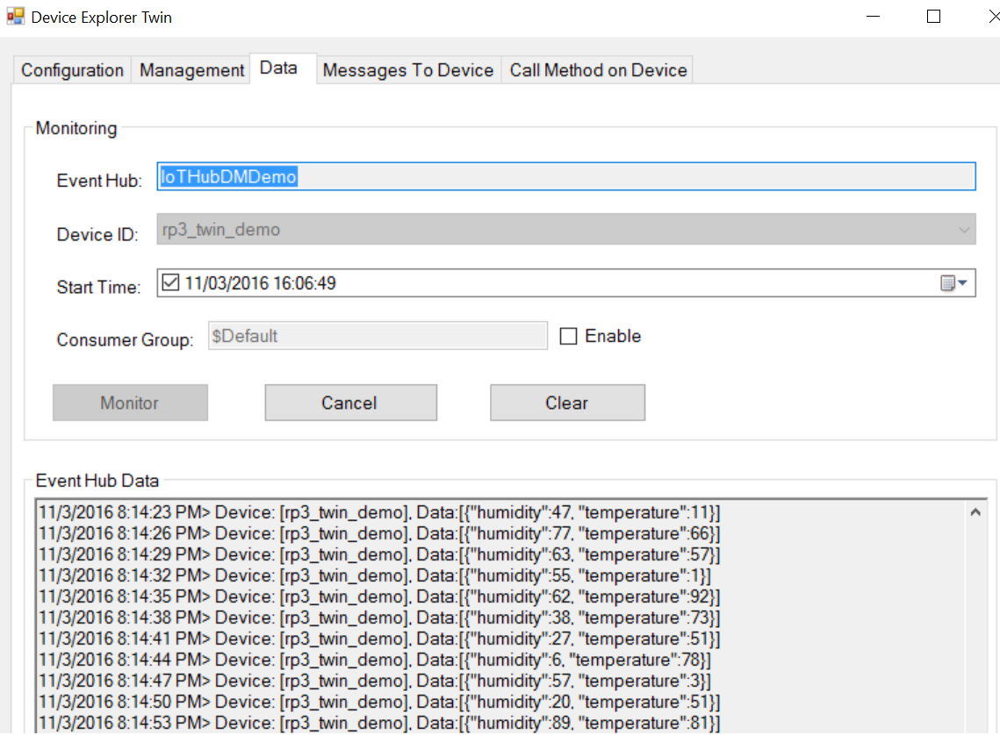
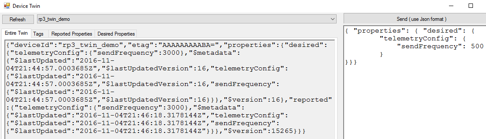
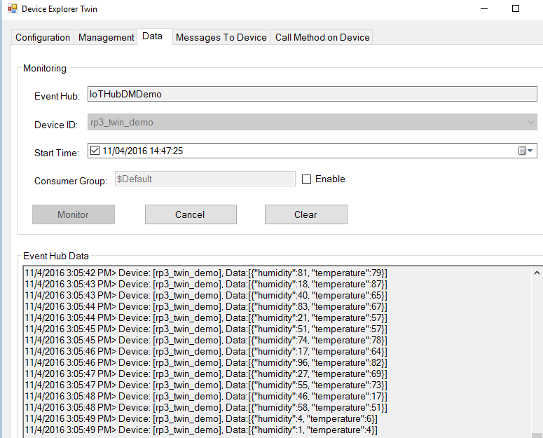
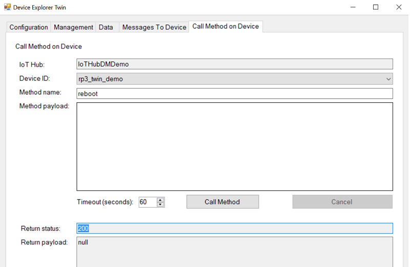

How to Update Configuration and Reboot an IoT Device with Azure IoT Device Twins
===
---

# Table of Contents
-   [Step 0: Introduction](#Introduction)
-   [Step 1: Prerequisites](#Step-1-Prerequisites)
-   [Step 2: Prepare Device](#Step-2-PrepareDevice)
-   [Step 3: Build and Run the Device Twins Sample](#Step-3-Build)
-   [Step 4: Monitor Device Twins](#Step-4-Monitor)
-   [Step 5: Reboot Device via Direct Methods](#Step-5-Reboot)

<a name="Introduction"></a>
# Introduction
## Device Twins
Device Twins is an Azure IoT Hub feature that allows synchronization between a device's configuration and cloud representation of the device. Device Twins stores device 
specific metadata in the cloud and reports the current state, such as available capabilities and conditions from your device's app. You can query Device Twins to get your metadata, configuration or state.

You can learn more about Device Twins by reading the following articles:

-   [Understand Device Twins][lnk-device-twin-intro]
-   [How to Use Device Twins][lnk-device-twin-get-started]
-   [How to Use Device Twins Properties][lnk-device-twin-properties]

## Device Methods
Device Methods represent a request-reply interaction with a device, similar to an HTTP call in that they succeed or fail immediately (after a user-specified timeout) to let the user know the status of the call. This is useful for scenarios where the course of immediate action is different depending on whether the device was able to respond, such as sending an SMS wake-up to a device if a device is offline (SMS being more expensive than a method call).

You can think of a method as a remote procedure call directly to the device. Only methods which have been implemented on a device may be called from the cloud. If the cloud attempts to invoke a method on a device which does not have that method defined, the method call fails.

You can learn more about Device Methods by reading the following article:

-   [How to Invoke Direct Methods][lnk-device-methods]


## Scenario Description
Your field device sends temperature and humidity telemetry data every 3 seconds. You are troubleshooting a temperature anomaly and want to receive the telemetry at a higher rate, 500ms instead of 3s, to detect if you are losing some data points. To do this, you will issue a remote cloud-to-device command using a Device Twins "Desired Property" to request a change in the telemetry send frequncy. During that investigation, you decide to remotely reboot the device to refresh its state.

Here is the overall process you will follow to achieve this:
-   You will connect to the device and start the app that sends telemetry. The send frequency value of 3000 ms is the default configured value via a Device Twins Desired Property called sendFrequency. 
-   You will observe telemetry data via the Device Explorer's Data tab. 
-   You will set the Desired Property sendFrequency to 500 ms to change the telemetry send frequency. You will do this by using Device Explorer Twin -> Management tab -> Twin Props. 
-   Your device will receive an event notification of the updated Desired Property and will change the frequency rate for sending telemetry data. 
-   Your device will set the property sendFrequency to 500ms indicating the newly applied frequency. 
-   You will observe the data flowing every 500 ms into Device Explorer's Data tab 
-   You will disconnect the device by stopping the device app and set the desired state while the device is still offline.
-   You will use Direct Methods to reboot the device.

<a name="Step-1-Prerequisites"></a>
# Step 1: Prerequisites

You will need the following items ready before beginning this tutorial:
-   A computer with [Git](https://git-scm.com/book/en/v2/Getting-Started-Installing-Git) client installed. 
    This is optional step if you are not building the Device Explorer Twin or you want to explore samples from RaspberryPi itself. Otherwise, clone the repo locally on your machine
    
    ```
    git clone --recursive https://github.com/azure/azure-iot-sdks -b mvp_summit 
    ```

-   SSH client on your desktop computer, such as [PuTTY](http://www.putty.org/), so you can remotely access the command line on the Raspberry Pi.
-   Required hardware:
	-   [Raspberry Pi 3/2](https://www.adafruit.com/products/3055)
	-   8GB or larger MicroSD Card
	-   Wired USB keyboard 
	-   Wired USB mouse (optional; you can navigate NOOBS with a keyboard)
	-   Micro USB cable
    -   5V/2a Power Supply
	-   HDMI cable
	-   HDMI Capable TV or Monitor
	-   Ethernet cable or Wi-Fi dongle
	    You should consider a Starter Kit such as the [CanaKit](https://www.amazon.com/CanaKit-Raspberry-Complete-Starter-Kit/dp/B01C6Q2GSY/ref=sxts_k2p_hero2?pf_rd_m=ATVPDKIKX0DER&pf_rd_p=2668835642&pf_rd_r=ZNN3EEA1V2FNMVX4M6KH&pd_rd_wg=NKs7X&pf_rd_s=desktop-sx-top-slot&pf_rd_t=301&pd_rd_w=LjWyi&pf_rd_i=CanaKit+Raspberry+Pi+3&pd_rd_r=K2H6B8XEDVHTE4J35TN1&ie=UTF8&qid=1478205900&sr=2) that
	    includes some of these hardware requirements.
-   [Provision][lnk-setup-iot-hub] an Azure IoT Hub. 
    >Note: Make sure you create an IoT Hub which has Device Management enabled. (Check "Enable Device Management" when you create the IoT Hub)
-   [Download](https://cdnx.azureedge.net/files/Device%20Explorer.zip) Azure IoT Device Explorer Twin. To monitor IoT Hub messages, manage devices and device twins.
-   [Provision][lnk-manage-iot-hub] a device with Device Explorer and get its connection string.


<a name="Step-2-PrepareDevice"></a>
# Step 2: Prepare Device

>Note: You can skip the Raspbian install step if you already have it on your SD card.

-   Install the latest Raspbian operating system on your Raspberry Pi 3/2 by
following the instructions in the [NOOBS setup guide](http://www.raspberrypi.org/help/noobs-setup/). 
-   When the installation process is complete, the Raspberry Pi configuration menu
(raspi-config) loads. 
-   Under **Advanced
Options**, enable **ssh** so you can access the device remotely with
PuTTY or WinSCP. For more information, see <https://www.raspberrypi.org/documentation/remote-access/ssh/>.
-   Connect your Raspberry Pi to your network using an ethernet cable or a WiFi dongle.
-   You need to determine the IP address of your Raspberry Pi in order to connect to it over the network. Open Terminal and run the following command to find the IP address of your device.

    ```
    hostname -I
    ```

-   Once you see that your board is working, open an SSH terminal program such as [PuTTY](http://www.putty.org/) on your desktop machine.
-   Use the IP address from the previous step as the Host name, Port=22, and Connection type=SSH to complete the connection.
-   When prompted, log in with username **pi**, and password **raspberry**.

<a name="Step-3-Build"></a>
# Step 3:  Build and Run the Device Twins Sample

Run the following commands in the SSH Terminal window connected to your Raspberry Pi.
-   Install git by running

    ```
    sudo apt-get install git
    ```

-   Download the Azure IoT Device SDK to your Raspberry Pi:

    ```
    git clone --recursive https://github.com/azure/azure-iot-sdks -b mvp_summit 
    ```

-   Confirm that you now have a copy of the SDK under the directory ./azure-iot-sdks. Then cd to the directory:

    ```
    cd azure-iot-sdks
    ```

-   Prepare your environment by running. (Answer **y** when you are prompted to install the additional components needed to run the samples):

    ```
    sudo c/build_all/linux/setup.sh
    ```

-   Edit the file `./c/serializer/samples/devicetwin_configupdate/devicetwin_configupdate.c` and replace the connection string placeholder with the device connection string you obtained when you [provisioned your device][lnk-manage-iot-hub]. The device connection string must be in this format "`HostName=<iothub-name>.azure-devices.net;DeviceId=<device-name>;SharedAccessKey=<device-key>`".  

    You can use the console-based text editor **nano** to edit the file 

    ```
    nano ./c/serializer/samples/devicetwin_configupdate/devicetwin_configupdate.c
    ```

    This is the line that you need to change in devicetwin_configupdate.c

    ```
    static const char* connectionString = "[device connection string]";
    ```
    > Note: In nano, you can right-click to paste text. Also, CTRL+O to save and CTRL+X to close the file.

-   Finally, build the sample applications:

    ```
    ./c/build_all/linux/build.sh --skip-unittests
    ```

<a name="rundevicetwinsample"/></a>
## Run the Device Twins Config Update Sample ##

-   Run the **devicetwin_configupdate** sample:

    ```
    c/cmake/iotsdk_linux/serializer/samples/devicetwin_configupdate/devicetwin_configupdate
    ```

You will now be sending temperature and humidity to your IoT Hub every 3000ms.

<a name="Step-4-Monitor"></a>
# Step 4:  Monitor Device Twins by changing the Desired Property from the Cloud

-   You can now observe your telemetry data at the 3000 ms rate frequency in [Device Explorer](https://cdnx.azureedge.net/files/Device%20Explorer.zip). Click the Data tab, select your device and then click the Monitor button.

  

-   To view your Device Twins object, Open the Management tab, click Twin Props, select your device and you'll see the JSON object. Notice the "sendFrequency" Reported Property is 3000 ms.
-   Let's now use the following use case: You are troubleshooting a temperature anomaly and want to receive the telemetry on a higher rate to detect if you are losing some data points, 
    for example every 500 ms. In order to do this, you will have to issue a clone command using Device Twins Desired Properties to request a change of the frequency rate of sending telemetry. 

-   Set a new value for Desired Property "sendFrequency" to be 500 ms in Device Twins window, then click "Send (use Json format)" button, like following. Please make sure you have proper spelling on "sendFrequency", otherwise a new property will be created.

    ```
       {  
            "properties":{  
                "desired":{  
                    "telemetryConfig":{  
                        "sendFrequency":500
                    }
                }
            }
        }
     ```     

      
-   The device app is notified of the change immediately if connected, or at the first reconnect. The device app then reports the updated configuration on reported properties, like following

    ```
    "reported": {
        "telemetryConfig": {
            "sendFrequency": 500
        }
    }
    ``` 

      
-   Notice the frequency of telemetry data has changed to 500 ms in Device Explorer -> Data -> Monitor like in following image 

    
-   To simulate a disconnected device, stop the devicetwin_configupdate app by typing CTRL+C in the SSH Terminal window. 
- Set a new value for Desired Property "sendFrequency" (let's say 7000) while the app is not running (see above step). 

    > Notice the desire property "sendFrequency" is changed, but reported property "sendFrequency" is not because the device is disconnected. 
    
-   Start the device app again on the RaspberryPi by running  `c/cmake/iotsdk_linux/serializer/samples/devicetwin_configupdate/devicetwin_configupdate`
-   Go to Device Twins and click the Refresh button. You will notice that the Reported Property is now changed to the same value as Desired Property without setting the Desired Property again. 
-   This is one of the great values of the Device Twins: it stores the state of the device while the device is offline and when it wakes up, it will phone home to IoTHub to get the latest state.
-   Learn more on how this was implemented by reading `c/serializer/samples/devicetwin_configupdate/devicetwin_configupdate.c` source code. When a device receives a notification of the updated state it reads the new sendFrequency Desired Properties `“desired.telemetryConfig.sendFrequency”` (see deviceTwinCallback function line 171). Then it changes the reported properties and the sending frequency of the telemetry (see `device_twin_config_update_run` function, line 356 and downwards) 

<a name="Step-5-Reboot"></a>
# Step 5:  Reboot Device via Direct Methods
While doing your investigation you have determined that you'd like to reboot the device to refresh its state.  Here's how you can do that.

-   Start the device app with root permissions by running below command in SSH session
-   Notice events coming in Device Explorer -> Data -> Monitor

    ```
    sudo c/cmake/iotsdk_linux/serializer/samples/devicetwin_configupdate/devicetwin_configupdate
    ```

-   Open Device Explorer Twin and make a direct method call from "Call Method on Device" tab -> Call Method button as showing in the following image

  

-   Your SSH session will end with message "reboot device ... IoTHubClient accepted the message for delivery", device will reboot and you will notice the telemetry events are no longer coming (Device Explorer -> Data -> Monitor); 
    Device will show as Disconnected on Device Explorer -> Management tab.
-   Connect on a new SSH session and notice that the device has rebooted
-   Learn more on how reboot was implemented by reading `c/serializer/samples/devicetwin_configupdate/devicetwin_configupdate.c` source code. deviceMethodCallback is implemented and being called in `device_twin_config_update_run` function. The reboot will start after 2 seconds `ThreadAPI_Sleep(2000)
-   Learn how to implement a [ firmware upgrade of a RaspberryPi ](https://github.com/Azure/azure-iot-sdks/tree/develop/c/iothub_client/samples/iothub_client_sample_mqtt_dm/pi_device) using Azure IoTHub Device Management

## Additional Resources
You can learn more about how to use Device Twins and how to implement Direct Methods by reading below tutorials:
-   You can read more about how to use Desired Properties to update configuration of the devices by reading [ how to configure devices using twins ](https://azure.microsoft.com/en-us/documentation/articles/iot-hub-node-node-twin-how-to-configure/)
-   You can implement a reboot method by reading [ how to invoke direct methods ](https://azure.microsoft.com/en-us/documentation/articles/iot-hub-devguide-direct-methods/)
-   The application backend can keep track the results of the configuration operation across many devices, by querying twins. You can learn how to query Device Twins by reading [ how to query twins ](https://azure.microsoft.com/en-us/documentation/articles/iot-hub-devguide-query-language/)
-   You can learn [ how to schedule jobs ](https://azure.microsoft.com/en-us/documentation/articles/iot-hub-devguide-jobs/) on multiple devices to update Desired Properties or tags or to invoke direct methods.

[lnk-setup-iot-hub]: ../../../../doc/setup_iothub.md
[lnk-manage-iot-hub]: ../../../../doc/manage_iot_hub.md#use-the-device-explorer-tool-to-provision-a-device
[devbox-setup]: ../../../doc/devbox_setup.md
[lnk-device-twin-intro]: https://azure.microsoft.com/en-us/documentation/articles/iot-hub-devguide-device-twins/
[lnk-device-twin-get-started]: https://azure.microsoft.com/en-us/documentation/articles/iot-hub-node-node-twin-getstarted/
[lnk-device-twin-properties]: https://azure.microsoft.com/en-us/documentation/articles/iot-hub-devguide-device-twins/
[lnk-device-explorer-twin]: https://github.com/Azure/azure-iot-sdks/tree/master/c/serializer/samples/devicetwin_simplesample#step-3-monitor-device-twin
[lnk-device-methods]: https://azure.microsoft.com/en-us/documentation/articles/iot-hub-devguide-direct-methods/
