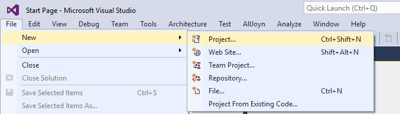
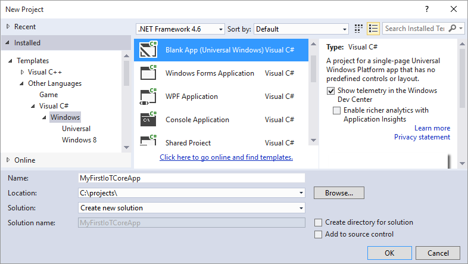
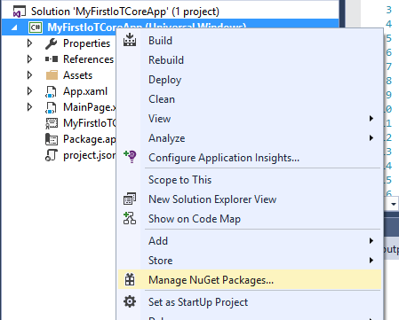
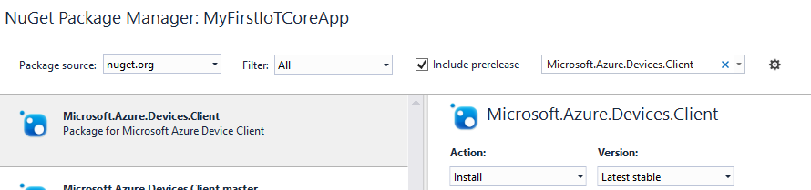
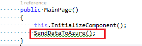
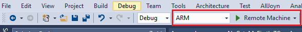
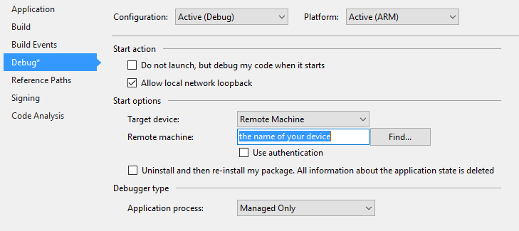
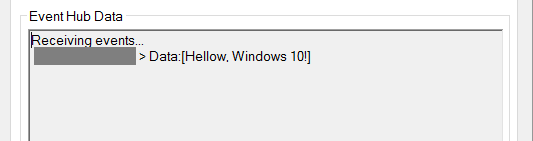
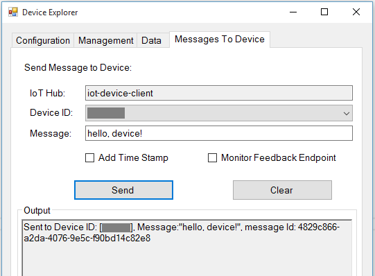
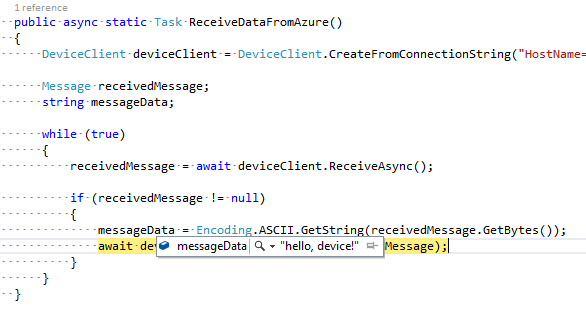

# Getting Started with Azure IoT Hub on Windows 10 IoT Core

## Objective

This step-by-step guide will allow you to familiarize yourself with Windows 10 IoT Core platform, set up your device and create your first application that connects to Azure IoT Hub.

## Windows 10 IoT Core

You can leverage the power of the Windows platform and Visual Studio to create innovative solutions on a variety of devices running Windows 10 IoT Core.

## Prerequisites

Before you get started, you should:

- [Setup your IoT Hub][setup-iothub]
- Configure your device in IoT Hub.  See the section "Configure IoT Hub connection" in the document [How to use Device Explorer][device-explorer].

## Setting Up You Device

First of all, you need to set up your device.

- If you’re using Raspberry Pi, set up your device according to instructions [here](http://ms-iot.github.io/content/en-US/win10/SetupRPI.htm).
- If you’re using MinnowBoard Max set up your device according to instructions [here](http://ms-iot.github.io/content/en-US/win10/SetupMBM.htm).
- If you’re using Dragonboard setup instructions should come soon [here](http://ms-iot.github.io/content/en-US/GetStarted.htm).

> Note: We recommend using the RTM version of Windows 10 IoT Core unless there is a specific feature in a Windows 10 Insider Preview version that you want to use.

## Install Visual Studio 2015 and Tools

To create Windows IoT Core solutions, you will need to install [Visual Studio 2015](https://www.visualstudio.com/en-us/products/vs-2015-product-editions.aspx). You can install any edition of Visual Studio, including the free Community edition.

Make sure to select the **Universal Windows App Development Tools**, the component required for writing apps Windows 10:

## Create a Visual Studio UWP Solution

UWP (Universal Windows Platform) is an evolution of Windows application model introduced in Windows 8. UWP provides a common app platform available on every device that runs Windows 10, including the IoT Core.

To create a UWP solution in Visual Studio, on the **File** menu, click **New** then **Project**:

In the New Project dialog that comes up, select **Blank App (Universal Windows) Visual C#**. Give your project a name, for example **MyFirstIoTCoreApp**:

## Get Microsoft.Azure.Devices.Client Library

Once the project has been created, we need to include a reference to the Microsoft.Azure.Devices.Client library -- this is the component that contains the functionality necessary to connect to Azure IoT Hub.

In **Solution Explorer**, right-click on the solution and select **Manage NuGet Packages**:

The NuGet Package Manager will open. Make sure to select **Include prerelease**. Find the package named **Microsoft.Azure.Devices.Client** and click **Install**:  

On the **Review Changes** dialog, click **OK**, then accept the license terms. The package is downloaded and added to your project.

## Build and run the Device Explorer tool

You can use the Device Explorer sample application on your Windows desktop machine to create and register a device ID and symmetric key for your device. The Device Explorer interfaces with Azure IoT Hubs, and has some basic capabilities. For more info, check out [How to use Device Explorer][device-explorer].

- **Device management**: creates device IDs and obtains a list of registered devices on your IoT Hub.
- **Monitors and consumes data** sent by your devices to your IoT Hub.
- **Sends messages** to your devices.

## Sample 1: Sending Data to Azure IoT Hub

At last, you can start writing code! Open the file named **MainPage.xaml.cs** and add a few `using` directives:

    using System.Text;
    using System.Threading.Tasks;
    using Microsoft.Azure.Devices.Client;

In our first sample, we will try to send a simple string to Azure IoT Hub.

Add the following function to class `MainPage`:

    private async Task SendDataToAzure()
    {
        DeviceClient deviceClient = DeviceClient.CreateFromConnectionString("<replace>", TransportType.Http1);

        var text = "Hellow, Windows 10!";
        var msg = new Message(Encoding.UTF8.GetBytes(text));

        await deviceClient.SendEventAsync(msg);
    }

### Using The Real Connection String

Important: remember to replace the `"<replace>"` string in the above snippet with the actual connection string. To get the connection string for your device, return the Device Explorer **Management** tab, find your device in the list, right-click on it and select **Copy connection string for selected device**. Now paste this string into your code, replacing the string `"<replace>"`.

This string gives you access to the service, so remember to keep it secret -- in particular, you don't want to check it into your source control system, especially if you project is open source.

### Build and Run

Finally, it's time to run the app! Add the call to the function `SendDataToAzure` from the constructor of the `MainPage` class:

Now choose the right architecture (x86 or ARM, depending on your device) and set the debugging method to **Remote Machine**:

If you're using a Raspberry Pi device, select ARM. For other supported devices, consult [windowsondevices.com](http://www.windowsondevices.com).

You will need to deploy your app to an IoT device so that you can run and debug it remotely. Right-click on the solution in Solution Explorer, select **Properties** and navigate to the **Debug** tab:

Type in the name of your device. Make sure the **Use authentication** box is unchecked.

Now, you're ready to build and deploy the app. Choose **Build** and then **Deploy** from the top menu.

Hit F5 to run the app. It might take a few second for the app to start.  

> Note: For more information about deploying and debugging your code on a device, see the ["Hello, World!" Sample][hello-sample] for IoT on the [Windows Dev Center][iot-dev-center].

## Validate Your Solution

Use the Device Explorer to inspect data coming to Azure IoT Hub and manage devices.

Navigate to the **Data** tab in the Device Explorer and make sure you see "Hello, Windows 10" string there:

Congratulations! You have successfully sent your string to Azure IoT Hub.

## Sample 2: Receiving Data from Azure IoT Hub

In this sample, we will learn how to receive data from Azure IoT Hub. Define the function `ReceiveDataFromAzure` as follows:

    public async static Task ReceiveDataFromAzure()
    {
        DeviceClient deviceClient = DeviceClient.CreateFromConnectionString("<replace>", TransportType.Http1);

        Message receivedMessage;
        string messageData;

        while (true)
        {
            receivedMessage = await deviceClient.ReceiveAsync();

            if (receivedMessage != null)
            {
                messageData = Encoding.ASCII.GetString(receivedMessage.GetBytes());
                await deviceClient.CompleteAsync(receivedMessage);
            }
        }
    }

This function can be invoked from `MainPage` similarly to how we did in the previous example.

    public MainPage()
    {
        this.InitializeComponent();
        ReceiveDataFromAzure();
    }

Now, before you run the app, switch to the Device Explorer and open the Message To Device tab:

Select your device in the Device ID list, and type "hello, device!" in the Message box. Hit Send.

Now set the breakpoint at the `await` statement and start the application. When the control reaches the breakpoint, you should see the value of `messageData` as "hello, device!":

Congratulations! You have successfully received your string from Azure IoT Hub.

[device-explorer]: ../../tools/DeviceExplorer/doc/how_to_use_device_explorer.md
[setup-iothub]: ../../doc/setup_iothub.md
[hello-sample]: http://ms-iot.github.io/content/win10/samples/HelloWorld.htm
[iot-dev-center]: https://dev.windows.com/iot
