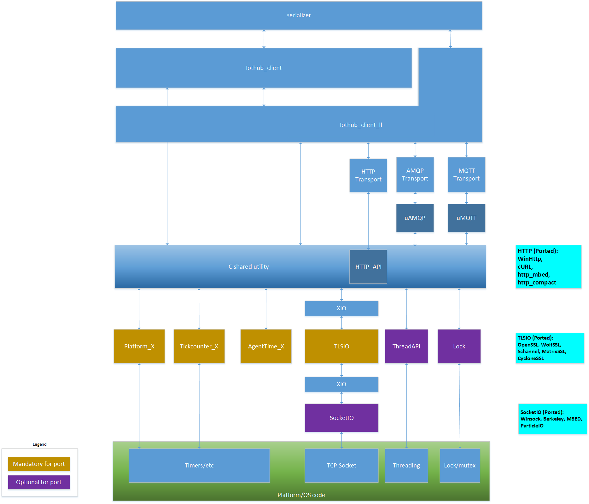

# C SDK Architecture Overview

The purpose of this document is to provide an overview of the C SDK for the IoT Hub device client.

# Table of contents

- [Overview](#Overview)

<a name="Overview"/>

## Overview

Below is high level architecture diagram representing the C SDK for the IoT Hub device client:

