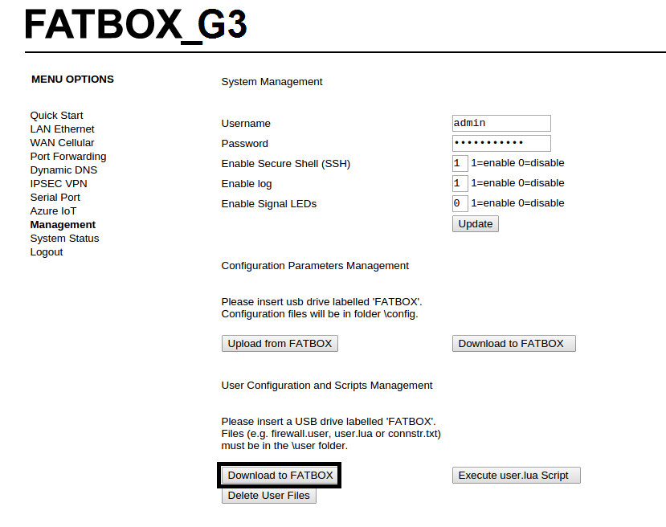
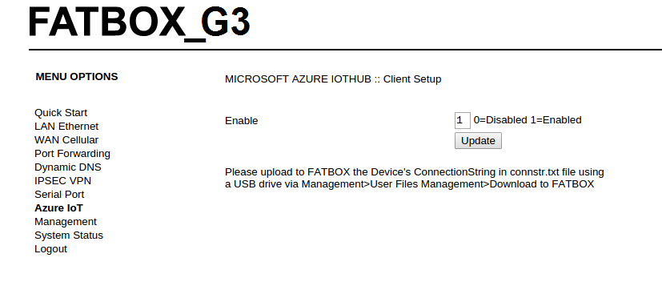

Configure FATBOX G3 as a LTE device gateway for Azure IoT
===
---

# Table of Contents

-   [Introduction](#Introduction)
-   [Step 1: Prerequisites](#Prerequisites)
-   [Step 2: Prepare your Device](#PrepareDevice)
-   [Step 3: Test the IoT client](#Test)

# Introduction

**About this document**

This document describes how to configure FATBOX G3 as device gateway for Azure IoT with Azure IoT SDK. This multi-step process includes:
-   Configuring Azure IoT Hub
-   Registering your IoT device
-   Test your device

<a href="http://www.amplified.com.au/#!4gltegateway/c192n">FATBOX G3</a>

An industrial LTE gateway device to allow secure remote monitoring and management of industrial equipment with Modbus RTU, Modbus TCP, RS-485 or CAN bus using the Azure IoT platform.

# Step 1: Prerequisites

You should have the following items ready before beginning the process:

-   [Setup your IoT hub][lnk-setup-iot-hub]
-   [Provision your device and get its credentials][lnk-manage-iot-hub]
-   FATBOX G3 device
-   Save your device connection string into a text file named connstr.txt. It will be used to setup and configure your FATBOX G3 as a secure device to connect to your IoT Hub.

# Step 2: Prepare your Device

-   Login to your FATBOX G3 using the LAN port.

    We suggest 2 ways to upload your unique Azure IoT Hub device connection string to your FATBOX.

    1)  Using a USB drive (with micro USB connector)
        -   Copy the connstr.txt file into your USB drive /user folder.
	-   Insert USB drive into FATBOX G3's USB port in the rear.
        -   From 'Management', click on 'Download to FATBOX' and check that 'OK' led on FATBOX blinks once.
	
	    
	    
    2)  Using SCP or WINSCP over Ethernet connection
        -   Enable SSH on the FATBOX (reboot after 'Update').
	-   Use SCP or WINSCP to transfer the connstr.txt from your computer to the FATBOX /user folder. 
-   In the FATBOX G3 'Azure IoT' menu, enable the Azure IoT device client option.

            
	    

# Step 3: Test the IoT client

## 3.1 Send Device Events to IoT Hub:

-   SSH to the FATBOX (using root and password as setup in your LOGIN).
-   Create or copy a few lines of 'test data' into the /tmp/dataq.txt file.
-   Run the /etc/M2MBOT in the FATBOX.
-	'Test data' will be sent line by line by the IoT client to your Azure IoT Hub  
-   See [Manage IoT Hub][lnk-manage-iot-hub] to learn how to observe the messages IoT Hub receives from the application.

## 3.2 Receive messages from IoT Hub

-   See [Manage IoT Hub][lnk-manage-iot-hub] to learn how to send cloud-to-device messages to the application.

[lnk-setup-iot-hub]: ../setup_iothub.md
[lnk-manage-iot-hub]: ../manage_iot_hub.md
