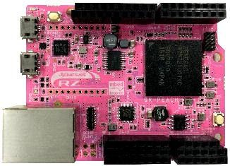
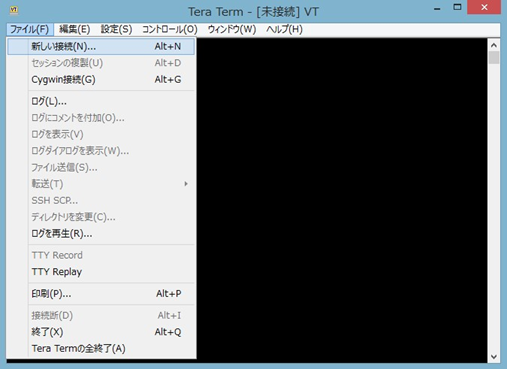
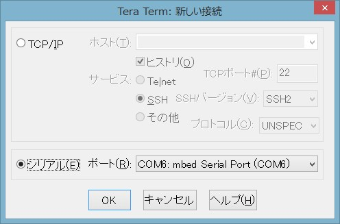
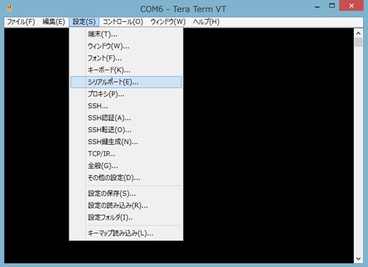
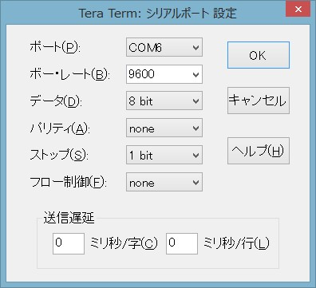
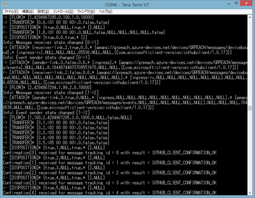

Run a simple C sample on GR-PEACH device running Mbed
===
---

# Table of Contents

-   [Introduction](#Introduction)
-   [Step 1: Azure IoT Hub の設定](#Prerequisites)
-   [Step 2: デバイスの準備](#PrepareDevice)
-   [Step 3: サンプルプログラムのビルドと実行](#Build)

# はじめに 

本手順書は、GR-PEACH を用いて Azure IoT Hub に接続する手順を示したものである。手順は以下のステップに分かれる。 

-   Azure IoT Hub の設定 
-   デバイスのレジストリ登録 
-   サンプルプログラムのビルドと実行 
 
本手順を実行するにあたり、以下のものを用意する。 

-   GR-PEACH 
-   mbed 開発環境 
-   インターネット環境 
-   SSH クライアント（本手順では Tera Tarm を使用し説明する） 
-   Microsoft Azure アカウント 
 

# Azure IoT Hub の設定 

## セットアップ 

以下の URL を参照し、Azure IoT Hub の設定を行う。

<https://github.com/Azure/azure-iot-sdks/blob/master/doc/setup_iothub.md> 

## Device Explorer のインストール
 
以下の URL を参照し、Device Explorer をインストールし、デバイス名を登録する。 

<https://github.com/Azure/azure-iot-sdks/blob/master/doc/manage_iot_hub.md> 

# デバイスの準備 

## インターネット接続 
GR-PEACH にイーサネットケーブルを接続し、インターネットに接続する。 

 
## microUSB ケーブルの接続 
GR-PEACH のハードリセットボタンの横にある microUSB 端子と、開発 PC の USB ポートを microUSB ケーブルで接続する。 

 
 

# サンプルプログラムのビルドと実行 
 
## サンプルプログラムのインポート 

以下の URL を参照し、自身の mbed 開発者ページにサンプルプログラムをインポートし、接続文字列を置き換える。 
 
<https://github.com/Azure/azure-iot-sdks/blob/master/doc/get_started/mbed-renesasgr-peach-c.md#create-mbed-project-and-import-the-sample-code>

## ビルド 

以下の URL を参照し、ビルドを行う。 
ビルドが成功すると自動的にバイナリファイルがダウンロードされる。 
エクスプローラを開き、外付けUSBドライブとして認識されているMBEDドライブにダウンロードされたバイナリファイルをドラッグ＆ドロップしコピーする。 
 
<https://github.com/Azure/azure-iot-sdks/blob/master/doc/get_started/mbed-renesasgr-peach-c.md#build-and-run-the-program> 
 
## 実行 

-   MBEDドライブにバイナリファイルが書き込まれたら、GR-PEACHのハードリセットボタンを押し、実行する。 
Tera Term や Device Explorer を用いて Azure IoT Hub とのデータ通信をモニタする。 

    
 
-   補足 Tera Term によるモニタデバイスマネージャーを開き、GR-PEACH が接続されている COM ポート番号を確認する。 

    

    ### Tera Term を起動する

    -   ファイル(F)タブの新しい接続をクリックする。 

        
  
    -   シリアルポートを選択し、GR-PEACH が接続されている COM ポートを選び、OK をクリックする。 

        
 
    -   接続(S)タブのシリアルポートをクリックする。 

        

    -   ボーレートを 9600 に設定し、OK をクリックする。 

        
 
-   GR-PEACH のハードリセットボタンを押すとプログラムが再実行され、結果が出力される。 

    
