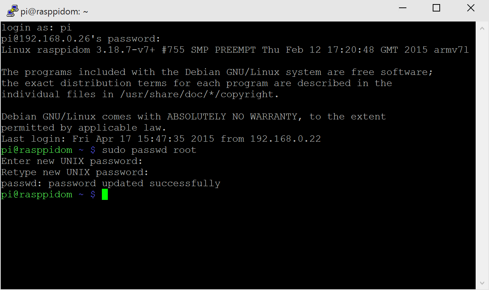

Run a simple C sample on Raspberry Pi 2 device running Raspbian
===
---

# Table of Contents

-   [Introduction](#Introduction)
-   [Step 1: Prerequisites](#Step-1-Prerequisites)
-   [Step 2: Prepare your Device](#Step-2-PrepareDevice)
-   [Step 3: Build and Run the Sample](#Step-3-Build)
-   [Tips](#tips)

<a name="Introduction"></a>
# Introduction

**About this document**

This document describes the process of setting up a [Raspberry Pi 2](https://www.raspberrypi.org/) device to connect to an Azure IoT hub. This multi-step process includes:
-   Configuring Azure IoT Hub
-   Registering your IoT device
-   Build and deploy Azure IoT SDK on device

<a name="Step-1-Prerequisites"></a>
# Step 1: Prerequisites

You should have the following items ready before beginning the process:
-   Computer with Git client installed and access to the
    [azure-iot-sdks](https://github.com/Azure/azure-iot-sdks) GitHub
    public repository.
-   SSH client on your desktop computer, such as [PuTTY](http://www.putty.org/), so you can remotely access the command line on the Raspberry Pi.
-   Required hardware:
	-   [Raspberry Pi 2](http://www.amazon.com/Raspberry-Pi-Model-Project-Board/dp/B00T2U7R7I/ref=sr_1_1?ie=UTF8&qid=1429516842&sr=8-1&keywords=raspberry+pi)
	-   8GB or larger MicroSD Card
	-   USB keyboard
	-   USB mouse (optional; you can navigate NOOBS with a keyboard)
	-   USB Mini cable
	-   HDMI cable
	-   TV/ Monitor that supports HDMI
	-   Ethernet cable or Wi-Fi dongle
	    
	    You may wish to consider a Starter Kit such as [CanaKit](http://www.amazon.com/CanaKit-Raspberry-Complete-Original-Preloaded/dp/B008XVAVAW/ref=sr_1_4?ie=UTF8&qid=1429516842&sr=8-4&keywords=raspberry+pi) that
	    includes some of these hardware requirements.
-   [Setup your IoT hub][lnk-setup-iot-hub]
-   [Provision your device and get its credentials][lnk-manage-iot-hub]

<a name="Step-2-PrepareDevice"></a>
# Step 2: Prepare your Device

-   Install the latest Raspbian operating system on your Raspberry Pi 2 by
following the instructions in the [NOOBS setup guide](http://www.raspberrypi.org/help/noobs-setup/).
-   When the installation process is complete, the Raspberry Pi configuration menu
(raspi-config) loads. Here you are able to set the time and date for your region
and enable a Raspberry Pi camera board, or even create users. Under **Advanced
Options**, enable **ssh** so you can access the device remotely with
PuTTY or WinSCP. For more information, see <https://www.raspberrypi.org/documentation/remote-access/ssh/>.
-   Connect your Raspberry Pi to your network using an ethernet cable or by using
a WiFi dongle on the device.
-   You need to determine the IP address of your Raspberry Pi in order to connect over the network. For more information, see
<https://www.raspberrypi.org/documentation/remote-access/ip-address.md>.
-   Once you see that your board is working, open an SSH terminal program such as [PuTTY](http://www.putty.org/) on your desktop machine.
-   Use the IP address from step 4 as the Host name, Port=22, and Connection type=SSH to complete the connection.
-   When prompted, log in with username **pi**, and password **raspberry**.
-   Create a **root** account using the following command `sudo passwd root` and choosing a new password:

  

The root account is necessary in order to install some libraries required by the device SDK.

<a name="Step-3-Build"></a>
# Step 3: Build and Run the sample

Run the following commands in the terminal window connected to your Raspberry Pi.

-   Download the Azure IoT device SDK to your Raspberry Pi:

    ```
    git clone --recursive https://github.com/Azure/azure-iot-sdks.git
    ```

-   Confirm that you now have a copy of the SDK under the directory ./azure-iot-sdks. Then cd to the directory:

    ```
    cd azure-iot-sdks
    ```

-   Prepare your environment by running. Answer **y** when you are prompted to install the additional components needed to run the samples:
    ```
    sudo c/build_all/linux/setup.sh
    ```

-   Edit the file ./c/serializer/samples/simplesample_amqp/simplesample_amqp.c and replace connection string placeholder with the device connection string you obtained when you [provisioned your device](../manage_iot_hub.md#use-the-iothub-explorer-tool-to-provision-a-device).The device connection string should be in this format "`HostName=<iothub-name>.azure-devices.net;DeviceId=<device-name>;SharedAccessKey=<device-key>`".  
(You can use the console-based text editor **nano** to edit the file):

    ```
    static const char* connectionString = "[device connection string]";
    ```
    > Note: You can skip this step if you only want to build the samples without running them.

-   Finally, build the sample applications:

    ```
    ./c/build_all/linux/build.sh --skip-unittests
    ```

<a name="buildsimplesample"/>
## Run the AMQP simple sample

-   Run the **simplesample_amqp** sample:

    ```
    azure-iot-sdks/c/cmake/iotsdk_linux/serializer/samples/simplesample_amqp/simplesample_amqp
    ```
This sample application sends simulated sensor data to your IoT Hub.

<a name="tips"/>
# Tips

-   See [Manage IoT Hub][lnk-manage-iot-hub] to learn how to observe the messages IoT Hub receives from the application and how to send cloud-to-device messages to the application.

[lnk-setup-iot-hub]: ../setup_iothub.md
[lnk-manage-iot-hub]: ../manage_iot_hub.md

