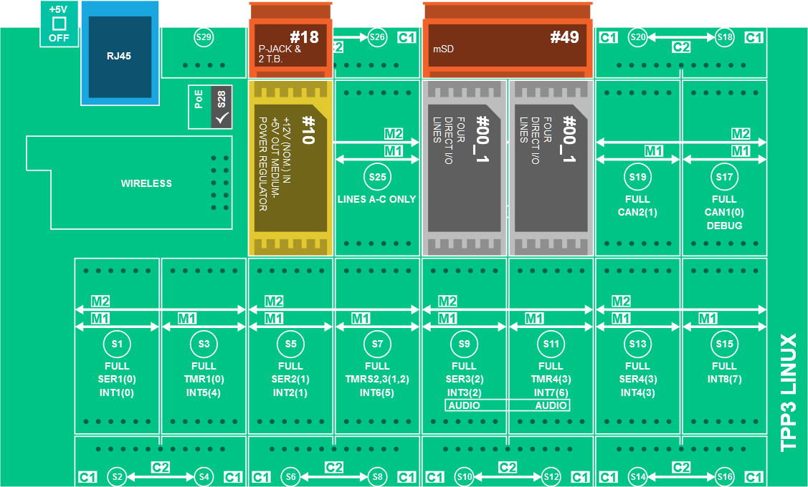

Run a simple JavaScript sample on LTPP3-based Tibbo Project System running Tibbo Linux
===
---

# Table of Contents

-   [Introduction](#Introduction)
-   [Step 1: Prerequisites](#Prerequisites)
-   [Step 2: Prepare your Device](#PrepareDevice)
-   [Step 3: Build and Run the Sample](#Build)

# Introduction

**About this document**

This document describes how to connect LTPP3-based Tibbo Project System device running Tibbo Linux with Azure IoT SDK. This multi-step process includes:
-   Configuring Azure IoT Hub
-   Registering your IoT device
-   Build and deploy Azure IoT SDK on device

# Step 1: Prerequisites

You should have the following items ready before beginning the process:

-   [Prepare your development environment][setup-devbox-linux]
-   [Setup your IoT hub][lnk-setup-iot-hub]
-   [Provision your device and get its credentials][lnk-manage-iot-hub]
-   Computer with Git client installed 
-   LTPP3-based TPS device or LTPP3 board.
-   Tibbit Module #49 (Micro SD Card)
-   2 x Tibbits #00-1 (4 Direct IO Lines)
-   Micro SD Card with at least 1 GB

# Step 2: Prepare your Device

## Preparing hardware

LTPP3 has only 512Mb of NAND while at least 650Mb of free space needed to run tests.
To enhance disk space the SD Card Tibbit Module must be installed:

-   Put Tibbit Module #49 (Micro SD Card) into S22-S24 socket as shown on the scheme below
-   Insert an SD card into Tibbits slot
-   Put Tibbits #00-1 (4 Direct IO Lines) into S21 and S23 sockets

    

    **Attention:** it's strongly recommended to turn power off before installing or removing Tibbit modules.

-   Login to LTPS Web Interface by entering IP address in browser
-   Go to Tibbits Layout tab and click "Launch TPS Configurator..."
-   Configure Tibbits Layout as shown on the scheme above
-   Click File/Save
-   Switch back to LTPS Web Interface, select Maintenance tab and click Reboot

    To support symlinks the SD card must be formatted to EXT2 filesystem

    **Attention:** all data on the SD card will be lost. 

-   Open an SSH session and do the following:

        umount /dev/mmcblk0p1
        mkfs.ext2 /dev/mmcblk0p1
           
    **Note:** it tooks about a minute to format a 4GB SD card
-   Remove SD card and insert it again
-   Open an SSH session and verify that a new folder (proposed name is /mmc0p1) appears in /mnt directory           

## Preparing software

Node.js, Git and Python 2.7 are installed on each LTPS by default, but NPM is not.

For installing, open an SSH session, connect to the device and do the following:

    # Setup package repositories
    smart channel --add 150a type=rpm-md name="LTPS all" baseurl=http://tibbo.com/downloads/LTPS/packets/all/ -y
    smart channel --add 150c type=rpm-md name="LTPS cortexa" baseurl=http://tibbo.com/downloads/LTPS/packets/cortexa8hf_neon/ -y
    smart update
    
    # Install NPM
    smart install nodejs-npm -y
    
    # Enhance Git functionality in order to support Git submodules
    smart install git-perltools -y

# Step 3: Build and Run the Sample

## 3.1 Load the Azure IoT bits and prerequisites on device

-   Download the SDK to the board by issuing the following command in the SSH terminal:

        # Change folder
        cd /mnt/mmc0p1
    
        # Clone Azure IoT SDK
        git clone --recursive https://github.com/Azure/azure-iot-sdks.git

-   Verify that you now have a copy of the source code under the directory /mnt/mmc0p1/azure-iot-sdks.

## 3.2 Build the samples

-   To validate the source code run the following commands on the device:

        export IOTHUB_CONNECTION_STRING='<iothub_connection_string>'

    Replace the `<iothub_connection_string>` placeholder with IoTHub Connection String you got in [Step 1](#Prerequisites).    

-   Run the following commands 

        cd /mnt/mmc0p1/azure-iot-sdks/node
        build/dev-setup.sh
        build/build.sh | tee LogFile.txt

    ***Note:*** *LogFile.txt in above command should be replaced with a file name where build output will be written.*

-   Install npm package to run sample.

        cd /mnt/mmc0p1/azure-iot-sdks/node/device/samples

    **For AMQP Protocol:**
	
        npm install azure-iot-device-amqp
	
    **For HTTP Protocol:**
	
        npm install azure-iot-device-http
	
    **For MQTT Protocol:**

        npm install azure-iot-device-mqtt	

-   To update sample, run the following command on device:

        mc
        
-   This launched Midnight Commander. Select **simple_sample_device.js** on the left tab and push F4 to edit.            

-   Find the below code:

        var Protocol = require('azure-iot-device-amqp').Amqp;
	
    The default protocol used is AMQP. Code for other protocols(HTTP/MQTT) are mentioned just below the above line in the script.
    Uncomment the line as per the protocol you want to use.

-   Scroll down to the connection information.
    Find the following place holder for IoT connection string:

        var connectionString = "[IoT Device Connection String]";

-   Replace the above placeholder with device connection string. You can get this from DeviceExplorer as explained in [Step 1](#Prerequisites), that you copied into Notepad.

-   Save your changes by pressing F2, then press F10 to close editor.

-   Press F10 once again to close Midnight Commander.

-   Run the following command before leaving the **/mnt/mmc0p1/azure-iot-sdks/node/device/samples** directory

        npm link azure-iot-device

## 3.3 Run and Validate the Samples

### 3.3.1 Send Device Events to IOT Hub

-   Run the sample by issuing following command and verify that data has been successfully sent and received.

        node /mnt/mmc0p1/azure-iot-sdks/node/device/samples/simple_sample_device.js

-   See [Manage IoT Hub][lnk-manage-iot-hub] to learn how to observe the messages IoT Hub receives from the application.

### 3.3.2 Receive messages from IoT Hub

-   See [Manage IoT Hub][lnk-manage-iot-hub] to learn how to send cloud-to-device messages to the application.

[setup-devbox-linux]: https://github.com/Azure/azure-iot-sdks/blob/master/doc/get_started/node-devbox-setup.md
[lnk-setup-iot-hub]: ../../setup_iothub.md
[lnk-manage-iot-hub]: ../../manage_iot_hub.md
