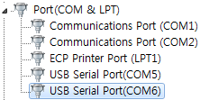
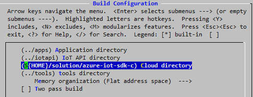
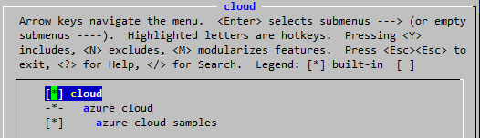
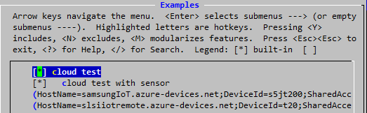
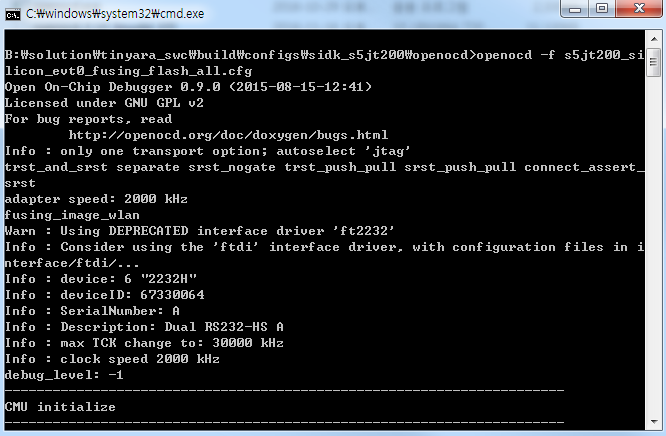
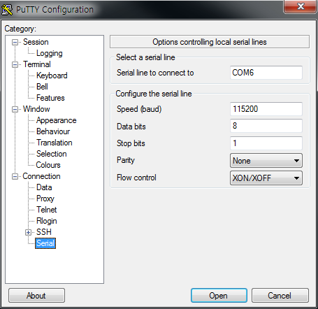
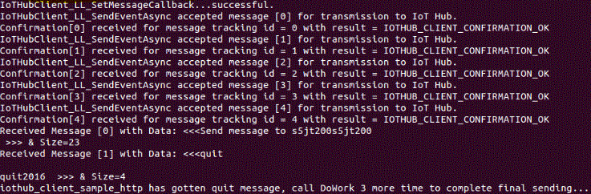

Run a simple C sample on S5JT200 device running Tizen RT
===
---

# Table of Contents

-   [Introduction](#Introduction)
-   [Step 1: Prerequisites](#Step-1-Prerequisites)
-   [Step 2: Prepare your Device](#Step-2-PrepareDevice)
-   [Step 3: Build and Run the Sample](#Step-3-Build)

<a name="Introduction"></a>
# Introduction

**About this document**

This document describes the steps for connecting an [Tizen RT-enabled s5jt200](http://www.samsung.com/semiconductor/minisite/Exynos/w/) device to Azure IoT Hub. This multi-step process includes:
-   Configuring Azure IoT Hub
-   Registering your IoT device
-   Build and deploy Azure IoT SDK on device

<a name="Step-1-Prerequisites"></a>
# Step 1: Prerequisites

You should have the following items ready before beginning the process:

-   Prepare [azure-iot-sdk-c](https://github.com/Azure/azure-iot-sdk-c) to MS Azure IoT services
-   [Setup your IoT hub][lnk-setup-iot-hub]
-   [Provision your device and get its credentials][lnk-manage-iot-hub]

<a name="Step-2-PrepareDevice"></a>
# Step 2: Prepare your Device

S5JT200 is a IoT device with Wi-Fi connectivity. s5jt200 can communicate Azure IoThub with Wi-Fi connection.

-   Prepare [SIDK_S5JT200](http://meritech.co.kr/eng/products/ap_dp.php) HW platform  with S5JT200
-   Prepare [Software and development environment](https://git.tizen.org/cgit/rtos/tinyara/)

After unboxing your HW platform, Please do the followings:

-   Install the [ARM compile toolchain](https://launchpad.net/gcc-arm-embedded/4.9/4.9-2015-q3-update) and add your environment about cross compiler path likes
```ruby
export CROSSDEV=/toolchain/gcc-arm-none-eabi-4_9-2015q3/bin/arm-none-eabi-
```

-   Get source code in your machine.
```ruby
git clone git://git.tizen.org/rtos/tinyara
```

-   Config and compile for SIDK_S5JT200.
```ruby
cd tinyara/os/tools
./configure.sh sidk_s5jt200/sidk_tash
cd ..
make
```

-   Install OpenOCD and FTDI chip drivers.
When you first connect sidk board using USB , there isn’t correct driver.You need to install FT2232 IC driver following below instruction.

    -   Copy openocd directory (build\configs\sidk_s5jt200\openocd) to your windows PC.
    -   Install FTDI chip drivers for your environment.
    -   If you properly install the driver, then you can see USB Serial Port on windows device manager.

    .

<a name="Step-3-Build"></a>
# Step3: Build and Fusing the samples

## Build Tizen RT with azure-iot-sdk-c

-   Download the azure-iot-sdk-c.
```ruby
git clone --recursive https://github.com/Azure/azure-iot-sdk-c.git
cd azure-iot-sdk-c
git submodule init
git submodule update
```
-   Open iothub_client/samples/iothub_client_sample_http/iothub_client_sample_http.c on azure-iot-sdk-c and replace "[device connection string]" with the device connection string that you obtained in Step 1.

-   Configure Tizen RT to support Azure cloud with 'make menuconfig'.
```ruby
cd tinyara/os
make menuconfig
```

    -   Set your azure-iot-sdk-c path.
    -   Go to 'Build Configuration' and set your azure-iot-sdk-c path on cloud directory.

        

    -   Enable azure-iot-sdk-c.
    -   Go to 'Application Configuration' and select 'cloud'.
    -   If you want to run Azure samples like iothub_client_sample_http and simplesample_http, select 'Azure cloud samples'.

        

    -   Enable built-in cloud application.
    -   Go to 'Application Configuration' and 'Examples' and select 'cloud test'.
    -   If you want to run Azure samples with sensor devices on HW platform, select 'cloud test with sensor'. And then write the device connection string that you obtained in Step 1 on 'azure device connection string'

        

-   Execute 'make' after configuration. Then you can see libazure.a on os/libraries directory.

## Fusing OS image

-   Plug the USB cable on board.
You can check two USB serial ports. First port is for USB download and second port is for serial.
-   Execute flash.bat on openocd directory. It erases flash memory and writes new image.

    

## Run samples
-   Execute console application likes putty. Configure it with 115200 baud rate and then run it with serial session.

    

-   Reset board and write 'cloud azure-iothub-client' on console application to run azure sample.

    


[lnk-setup-iot-hub]: ../setup_iothub.md
[lnk-manage-iot-hub]: ../manage_iot_hub.md
