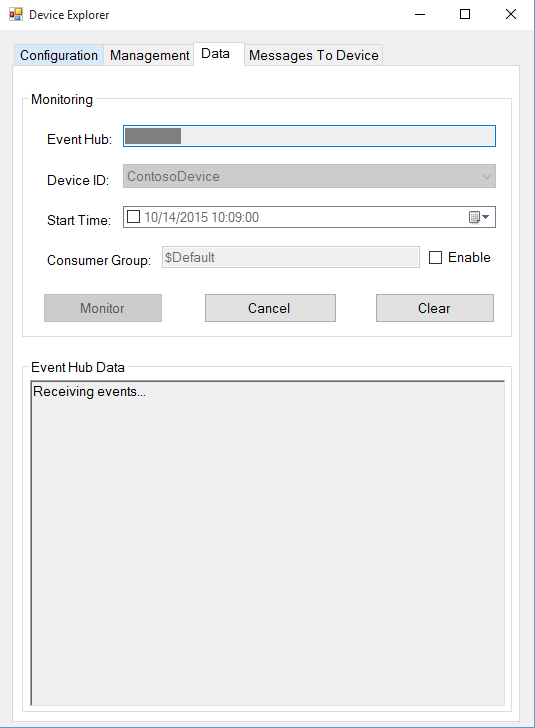
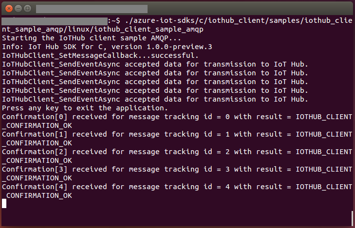
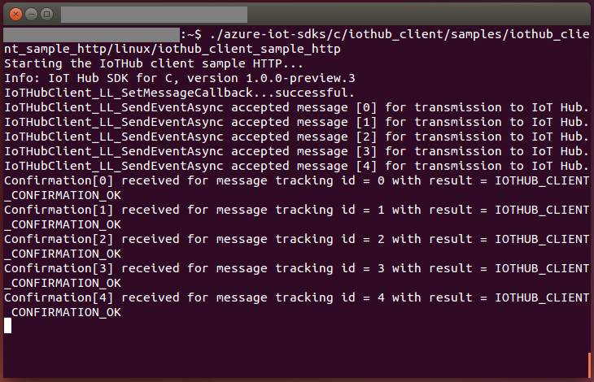
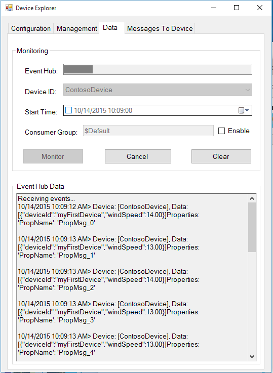
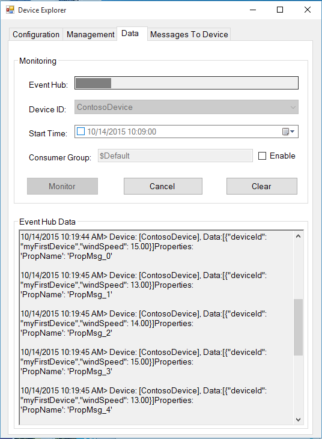
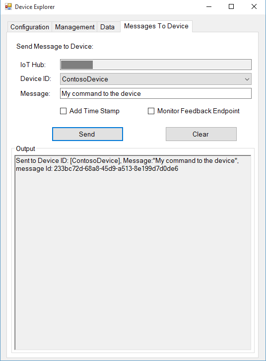
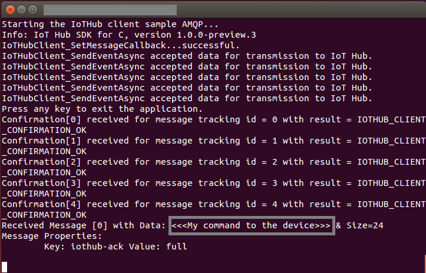
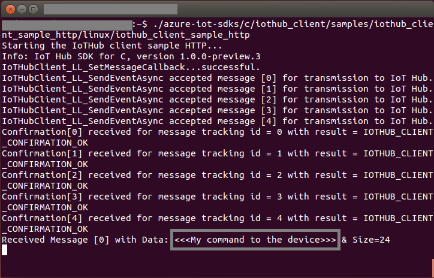

How to certify IoT devices running Linux with Azure IoT SDK
===========================================================

--------------------------------------------------------------------------------

# Table of Contents

-   [Introduction](#Introduction)
-   [Step 1: Configure Azure IoT Hub](#Step-1:-Configure)
-   [Step 2: Register Device](#Step-2:-Register)
-   [Step 3: Build and Validate the sample using C client
    libraries](#Step-3:-Build)
    -   [3.1 Load the Azure IoT bits and prerequisites on device](#Step-3-1:-Load)
    -   [3.2 Build the samples](#Step-3-2:-Build)
    -   [3.3 Run and Validate the Samples](#Step-3-3:-Run)
-   [Step 4: Package and Share](#Step-4:-Package_Share)
    -   [4.1 Package build logs and sample test results](#Step-4-1:-Package)
    -   [4.2 Share package with Engineering Support](#Step-4-2:-Share)
    -   [4.3 Next steps](#Step-4-3:-Next)
-   [Step 5: Troubleshooting](#Step-5:-Troubleshooting)
    -   [5.1 E2E Test Cases](#Step-5-1:-E2E)

# Introduction

**About this document**

This document provides step-by-step guidance to IoT hardware publishers on how
to certify an IoT enabled hardware with Azure IoT SDK. This multi-step process
includes:
-   Configuring Azure IoT Hub
-   Registering your IoT device
-   Build and deploy Azure IoT SDK on device
-   Packaging and sharing the logs

**Prepare**

Before executing any of the steps below, read through each process, step by step
to ensure end to end understanding.

You should have the following items ready before beginning the process:

-   Computer with GitHub installed and access to the
    [azure-iot-sdks](https://github.com/Azure/azure-iot-sdks) GitHub
    private repository.
-   SSH client, such as [PuTTY](http://www.putty.org/), so you can access the
    command line.
-   Required hardware to certify.

***Note:*** *If you haven't contacted Microsoft about being an Azure Certified for IoT partner, please submit this [form](<https://iotcert.cloudapp.net/>) first to request it and then follow these instructions.*

# Step 1: Sign Up To Azure IoT Hub

Follow the instructions [here](https://account.windowsazure.com/signup?offer=ms-azr-0044p) on how to sign up to the Azure IoT Hub service. As part of the sign up process, you will receive the connection string.

-   **IoT Hub Connection String**: An example of IoT Hub Connection String is as below:

         HostName=[YourIoTHubName];SharedAccessKeyName=[YourAccessKeyName];SharedAccessKey=[YourAccessKey]

# Step 2: Register Device

In this section, you will register your device using DeviceExplorer. The DeviceExplorer is a Windows application that interfaces with Azure IoT Hub and can perform the following operations:

-   Device management
    -   Create new devices
    -   List existing devices and expose device properties stored on Device Hub
    -   Provides ability to update device keys
    -   Provides ability to delete a device
-   Monitoring events from your device
-   Sending messages to your device

To run DeviceExplorer tool, use following configuration string as described in
[Step1](#Step-1:-Configure):

-   IoT Hub Connection String

**Steps:**
1.  Click [here](<https://github.com/Azure/azure-iot-sdks/blob/develop/tools/DeviceExplorer/doc/how_to_use_device_explorer.md>) to download and install DeviceExplorer.

2.  Add connection information under the Configuration tab and click the **Update** button.

3.  Create and register the device with your IoT Hub using instructions as below.

    a. Click the **Management** tab.

    b. Your registered devices will be displayed in the list. In case your device is not there in the list, click **Refresh** button. If this is your first time, then you shouldn't retrieve anything.

    c. Click **Create** button to create a device ID and key.

    d. Once created successfully, device will be listed in DeviceExplorer.

    e. Right click the device and from context menu select "**Copy connection
    string for selected device**".

    f. Save this information in Notepad. You will need this information in
    later steps.

***Not running Windows on your PC?*** - Please send us an email on
<iotcert@microsoft.com> and we will follow up with you with instructions.

# Step 3: Build and Validate the sample using C client libraries

This section walks you through building, deploying and validating the IoT Client SDK on your device running a Linux operating system. You will install necessary prerequisites on your device. Once done, you will build and deploy the IoT Client SDK and validate the sample tests required for IoT certification with the Azure IoT SDK.

## 3.1 Load the Azure IoT bits and prerequisites on device

-   Open a PuTTY session and connect to the device.

-   Install the prerequisite packages by issuing the following commands from the command line on the device. Choose your commands based on the OS running on your device.

    **Debian or Ubuntu**

        sudo apt-get update

        sudo apt-get install -y curl libcurl4-openssl-dev uuid-dev uuid g++ make cmake git unzip openjdk-7-jre

    **Fedora**

        sudo dnf check-update -y

        sudo dnf install libcurl-devel openssl-devel libuuid-devel uuid-devel gcc-c++ make cmake git unzip java-1.7.0-openjdk

    **Any Other Linux OS**

        Use equivalent commands on the target OS

    ***Note:*** *this setup process requires cmake version 3.0 or higher.* 
    
    *You can verify the current version installed in your environment using the  following command.*

        cmake --version

    *For information about how to upgrade your version of cmake to 3.2 on Ubuntu 14.04, see <http://askubuntu.com/questions/610291/how-to-install-cmake-3-2-on-ubuntu-14-04>.*
    
-   Download the SDK to the board by issuing the following command in PuTTY:

        git clone https://github.com/Azure/azure-iot-sdks.git

-   Verify that you now have a copy of the source code under the
    directory ~/azure-iot-sdks.

## 3.2 Build the samples

-   There are two different samples available, one supporting AMQP protocol and other supporting HTTP protocol. You can use either of these protocols to validate a sample on your device. Based on your choice of protocol, run the following command on device.

    **For AMQP protocol:**

        nano azure-iot-sdks/c/iothub_client/samples/iothub_client_sample_amqp/iothub_client_sample_amqp.c

    **For HTTP protocol:**

        nano azure-iot-sdks/c/iothub_client/samples/iothub_client_sample_http/iothub_client_sample_http.c

-   This launches a console-based text editor. Scroll down to the
    connection information.

-   Find the following place holder for IoT connection string:

        static const char* connectionString = "[device connection string]";

-   Replace the above placeholder with device connection string. You can get
    this from DeviceExplorer as explained in [Step 2](#Step-2:-Register), that you copied into Notepad.

-   Save your changes by pressing Ctrl+O and when nano prompts you to save it as the same file, just press ENTER.

-   Press Ctrl+X to exit nano.

-   Azure IoT Hub SDK depends on Apache Qpid Proton AMQP/HTTP to integrate with the IoT Hub. Run the following command to build/install Apache Proton.

        sudo ./azure-iot-sdks/c/build_all/linux/build_proton.sh --install /usr
        chmod +x ./azure-iot-sdks/c/build_all/linux/build_paho.sh
        ./azure-iot-sdks/c/build_all/linux/build_paho.sh

-   Assuming everything went OK with the build\_proton.sh and build\_paho.sh, proceed to set environment variables.

-   Open **IOT_DEVICE_PARAMS.TXT** to edit.

        nano azure-iot-sdks/tools/iot_hub_e2e_tests_params/iot_device_params.txt

-   Set the values for all the variables listed in the file as explained below.

    -   **IOTHUB_CONNECTION_STRING:** Connection string to your IoT Hub you have received in [Step 1](#Step-1:-Configure)
    -   **IOTHUB_DEVICE_ID:** Id of the device you have registered in [Step 2](#Step-2:-Register)
    -   **IOTHUB_DEVICE_KEY:** Primary key of the device registered in [Step 2](#Step-2:-Register)
    -   **IOTHUB_EVENTHUB_CONNECTION_STRING:** Connection string to your Event Hub. It should be in the form:
    
            Endpoint=[Event Hub-compatible endpoint];SharedAccessKeyName=[IOTHUB_POLICY_NAME];SharedAccessKey=[IOTHUB_POLICY_KEY]
        
    -   **IOTHUB_EVENTHUB_CONSUMER_GROUP:** Set value as **$Default**
    -   **IOTHUB_EVENTHUB_LISTEN_NAME:** Name of your Event Hub
    -   **IOTHUB_SHARED_ACCESS_SIGNATURE:** this value can be generated from DeviceExplorer

        Go to **Configuration** tab &minus;&gt; Click **Generate SAS** button
        
    -   **IOTHUB_PARTITION_COUNT:** Partition count from azure portal, as shown in figure below.

        

-   Set environment variables by running following command on your device:

        cd ./azure-iot-sdks/tools/iot_hub_e2e_tests_params/
        chmod +x setiotdeviceparametersfore2etests.sh
        sudo ./setiotdeviceparametersfore2etests.sh

-   Restart the Linux machine.

-   Build the SDK using following command. If you are facing any issues during build, follow troubleshooting [Step 5](#Step-5:-Troubleshooting).

        sudo ./azure-iot-sdks/c/build_all/linux/build.sh | tee LogFile.txt

    ***Note:*** *LogFile.txt in above command should be replaced with a file name where build output will be written.*
    
    *build.sh creates a folder called "cmake" in your home folder. Inside "cmake" are all the results of the compilation of the complete software.*

## 3.3 Run and Validate the Samples

In this section you will run the Azure IoT client SDK samples to validate
communication between your device and Azure IoT Hub. You will send messages to the Azure IoT Hub service and validate that IoT Hub has successfully receive the data. You will also monitor any messages send from the Azure IoT Hub to client.

**Note:** Take screenshots of all the operations you will perform in this
section. These will be needed in [Step 4](#Step-4-2:-Share)

### 3.3.1 Send Device Events to IOT Hub:

1.  Launch the DeviceExplorer as explained in [Step 2](#Step-2:-Register) and
    navigate to **Data** tab. Select the device name you created from the
    drop-down list of device IDs and click **Monitor** button.

    

2.  DeviceExplorer is now monitoring data sent from the selected device to the IoT Hub.

3.  Run the sample by issuing following command.

    **If using AMQP protocol:** Run sample *iothub\_client\_sample\_amqp*

        ~/cmake/iothub_client/samples/iothub_client_sample_amqp/linux/iothub_client_sample_amqp

    **If using HTTP protocol:** Run sample *iothub\_client\_sample\_http*

        ~/cmake/c/iothub\_client/samples/iothub_client_sample_http/linux/iothub_client_sample_http

4.  Verify that the confirmation messages show an OK. If not, then you may have
    incorrectly copied the device hub connection information.

    **If using AMQP protocol:**
    

    **If using HTTP protocol:**
    

5.  DeviceExplorer should show that IoT Hub has successfully received data sent
    by sample test.

    **If using AMQP protocol:**
    
    

    **If using HTTP protocol:**
    
    

### 3.3.2 Receive messages from IoT Hub

1.  To verify that you can send messages from the IoT Hub to your device,
    go to the **Message To Device** tab in DeviceExplorer.

2.  Select the device you created using Device ID drop down.

3.  Add some text to the Message field, then click Send.

    

4.  You should be able to see the command received in the console window for the
    client sample.

    **If using AMQP protocol:**
    

    **If using HTTP protocol:**
    

# Step 4: Package and Share

## 4.1 Package build logs and sample test results

Package following artifacts from your device:

1.  Build logs and E2E test results that were logged in the log files during
    build run.

2.  All the screenshots that are shown above in "**Send Device Events to IoT Hub**" section.

3.  All the screenshots that are above in "**Receive messages from IoT Hub**" section.

4.  Send us clear instructions of how to run this sample with your hardware
    (explicitly highlighting the new steps for customers). As a guideline on how
    the instructions should look please refer the examples published on
    GitHub repository [here](<https://github.com/Azure/azure-iot-sdks/tree/master/c/doc>)

## 4.2 Share package with Microsoft Azure IoT team

Share the package in email to  <iotcert@microsoft.com>.

## 4.3 Next steps

Once you shared the documents with us, we will contact you in the following 48
to 72 business hours with next steps.

# Step 5: Troubleshooting

## 5.1 E2E Test Cases

Please make sure that you have performed below tasks:

-   **iot_device_params.txt** should have correct values. Double-check these items:

    -   **IOTHUB_EVENTHUB_CONNECTION_STRING** should be in the below format
    
            Endpoint=[Event Hub-compatible endpoint];SharedAccessKeyName=[IOTHUB_POLICY_NAME];SharedAccessKey=[IOTHUB_POLICY_KEY]

    -   **IOTHUB_PARTITION_COUNT** should have matching value as in the azure portal.
    
-   Environment variables are set using the script file **setiotdeviceparametersfore2etests.sh**.

-   Machine/device is restarted after executing above script.

-   To confirm that environment variables are set correctly execute following command and verify the values.

        set | grep IOT

If you still face any problem with E2E test cases, then please share following artifacts with us:

-   iot_device_params.txt
-   Result of command `set | grep IOT`
-   Build logs

Please contact engineering support on <iotcert@microsoft.com> for help with
troubleshooting.
