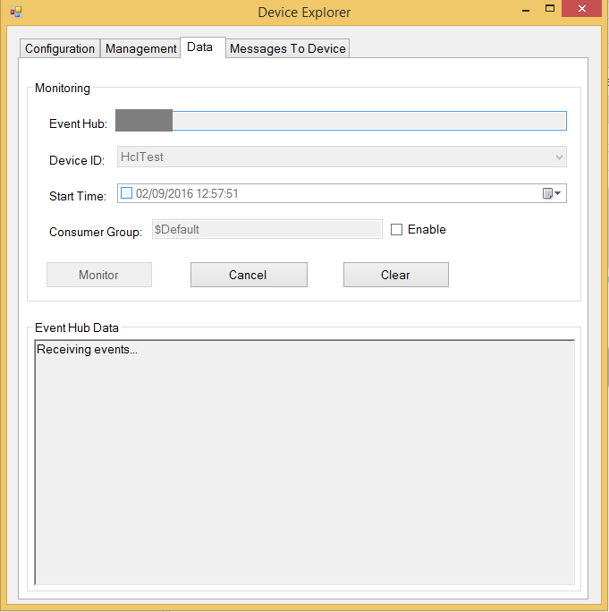

How to certify IoT devices running Linux with Azure IoT SDK
===
---

# Table of Contents

-   [Introduction](#Introduction)
-   [Step 1: Sign Up To Azure IoT Hub](#Step_1)
-   [Step 2: Register Device](#Step_2)
-   [Step 3: Build and Validate the sample using Java client libraries](#Step_3)
    -   [3.1 Install Azure IoT Device SDK and prerequisites on device](#Step_3_1)
    -   [3.2 Run and Validate the Samples](#Step_3_2)
-   [Step 4: Package and Share](#Step_4)
    -   [4.1 Package build logs and sample test results](#Step_4_1)
    -   [4.2 Share with the Azure IoT Certification team](#Step_4_2)
    -   [4.3 Next steps](#Step_4_3)
-   [Step 5: Troubleshooting](#Step_5)

<a name="Introduction"/>
# Introduction

**About this document**

This document provides step by step guidance to IoT hardware publishers on how
to certify an IoT enabled hardware with Azure IoT Java SDK. This multi-step process
includes: 
-   Configuring Azure IoT Hub 
-   Registering your IoT device
-   Build and deploy Azure IoT SDK on device
-   Packaging and sharing the logs

**Prepare**

Before executing any of the steps below, read through each process, step by step
to ensure end to end understanding.

You should have the following items ready before beginning the process:

-   Computer with GitHub installed and access to the
    [azure-iot-sdks](https://github.com/Azure/azure-iot-sdks) GitHub public repository.
-   SSH client, such as [PuTTY](http://www.putty.org/), so you can access the
    command line.
-   Required hardware to certify.

<a name="Step_1"/>
# Step 1: Sign Up To Azure IoT Hub

Follow the instructions [here](https://account.windowsazure.com/signup?offer=ms-azr-0044p) on how to sign up to the Azure IoT Hub service.

As part of the sign up process, you will receive the connection string. 

-   **IoT Hub Connection String**: An example of IoT Hub Connection String is as below:

         HostName=[YourIoTHubName];SharedAccessKeyName=[YourAccessKeyName];SharedAccessKey=[YourAccessKey]

<a name="Step_2"/>
# Step 2: Register Device

In this section, you will register your device using DeviceExplorer. The DeviceExplorer is a Windows application that interfaces with Azure IoT Hub and can perform the following operations:

-   Device management
    -   Create new devices
    -   List existing devices and expose device properties stored on Device Hub
    -   Provides ability to update device keys
    -   Provides ability to delete a device
-   Monitoring events from your device
-   Sending messages to your device

To run DeviceExplorer tool, use following configuration string as described in
[Step1](#Step_1):

-   IoT Hub Connection String
    

**Steps:**
1.  Click [here](<https://github.com/Azure/azure-iot-sdks/blob/master/tools/DeviceExplorer/doc/how_to_use_device_explorer.md>) to download and install DeviceExplorer

2.  Add connection information under the Configuration tab and click the **Update** button.

3.  Create and register the device with your IoT Hub using instructions as below.

    a. Click the **Management** tab.

    b. Your registered devices will be displayed in the list. In case your device is not there in the list, click **Refresh** button. If this is your first time, then you shouldn't retrieve anything.

    c. Click **Create** button to create a device ID and key.

    d. Once created successfully, device will be listed in DeviceExplorer.

    e. Right click the device and from context menu select "**Copy connection
    string for selected device**".

    f. Save this information in Notepad. You will need this information in
    later steps.

***Not running Windows on your PC?*** - Please send us an email on
<iotcert@microsoft.com> and we will follow up with you with instructions.

<a name="Step_3"/>
# Step 3: Build and Validate the sample using Java client libraries

This section walks you through building, deploying and validating the IoT Client SDK on your device running a Linux operating system. You will install the necessary prerequisites on your device. Once done, you will build and deploy the IoT Client SDK, and validate the sample tests required for IoT certification with the Azure IoT SDK.

<a name="Step_3_1"/>
## 3.1 Install Azure IoT Device SDK and prerequisites on device

-   Open a PuTTY session and connect to the device.

-   Install the prerequisite packages by issuing the following commands from the command line on the device.

<a name="Step_3_1_1"/>
### 3.1.1  Install Java JDK and set up environment variables
        
1.  Choose your commands based on the OS running on your device.
        
    **Debian**

        sudo apt-get update        
        sudo apt-get install openjdk-8-jdk      
   
    ***Note:*** *If openjdk-8-jdk package is not available, use following steps to add source in sources.list and rerun above commands again.*
    
    -   Edit /etc/apt/sources.list
    
    -   Add below line and save the changes.
        
        `deb http://ftp.debian.org/debian testing main`
   
    **Ubuntu**

        sudo apt-get update        
        sudo apt-get install openjdk-8-jdk 
   
    **Fedora**
   
        sudo dnf check-update -y
        sudo dnf install java-1.8.0-openjdk-devel
        
    **Any Other Linux OS**

        Use equivalent commands on the target OS
       
2.  Update the PATH environment variable to include the full path to the bin folder containing Java. To ensure the correct path of Java run below command:     
       
        which java
        
3.  Ensure that the directory shown by the `which java` command matches one of the directories shown in your $PATH variable. You can confirm this by running following command.

        echo $PATH

4.  If Java path is missing in PATH environment variable, run following command to set the same.    

        export PATH=[PathToJava]/bin:$PATH       

    ***NOTE:*** *Here **[PathToJava]** is output of `which java` command. For example, if `which java` output is /usr/bin/java, then export command will be* **export PATH=/usr/bin/java/bin:$PATH**

5.  Make sure that the JAVA_HOME environment variable includes the full path to the JDK. Use below command to get the JDK path.

        update-alternatives --config java

6.  Take note of the JDK location. `update-alternatives` output will show something similar to **/usr/lib/jvm/java-8-openjdk-amd64/jre/bin/java**. The JDK directory would then be **/usr/lib/jvm/java-8-openjdk-amd64/**.

7.  Run the following command to set **JAVA_HOME** environment variable.

        export JAVA_HOME=[PathToJDK]

    ***Note***: *Here [PathToJDK] is JDK directory. For example if jdk directory is /usr/lib/jvm/java-8-openjdk-amd64/, export command will be* **export JAVA_HOME=/usr/lib/jvm/java-8-openjdk-amd64/**

<a name="Step_3_1_2"/>
### 3.1.2  Install Maven and set up environment variables

1.  Choose your commands based on the OS running on your device.

    **Debian or Ubuntu**

        sudo apt-get install maven

    **Fedora**

        sudo dnf install maven
   
    **Any Other Linux OS**

        Use equivalent commands on the target OS

2.  Update the PATH environment variable to include the full path to the bin folder containing maven. To ensure the correct path of maven, run below command:     
       
        which mvn
         
3.  Ensure that the directory shown by the `which mvn` command matches one of the directories shown in your $PATH variable. You can confirm this by running following command.
 
        echo $PATH

4.  If maven path is missing in PATH environment variable, run following command to set the same.     

        export PATH=[PathToMvn]/bin:$PATH

    ***Note***: *Here [PathToMvn] is output of `which mvn`. For example if `which mvn` output is /usr/bin/mvn, export command will be* **export PATH=/usr/bin/mvn/bin:$PATH**
   
5.  You can verify that the environment variables necessary to run Maven 3 have been set correctly by running `mvn --version`.

<a name="Step_3_1_3"/>
### 3.1.3  Install GIT

1.  Choose your commands based on the OS running on your device.

    **Debian or Ubuntu**

        sudo apt-get install git

    **Fedora**

        sudo dnf install git   

    **Any Other Linux OS**

        Use equivalent commands on the target OS

<a name="Step_3_1_4"/>
### 3.1.4  Build Qpid JMS

1.  Clone the repository for Qpid JMS.
    
        git clone https://github.com/avranju/qpid-jms.git

2.  Install Qpid JMS by executing following commands in sequence:

        cd qpid-jms
        mvn install | tee Qpid_Build_Logs.txt
        cd ..
    
    ***Note:*** *We have noticed that certain unit tests can fail when running  `mvn install` as given above with the latest version of JDK 8 (1.8.0_60 at the time this document was written). It works fine with older versions however. If this occurs please skip running unit tests using following command:*
    
        mvn install -DskipTests

<a name="Step_3_1_5"/>
### 3.1.5 Build the Azure IoT Device SDK for Java

1.  Download the SDK to the board by issuing the following command in PuTTY:

        git clone https://github.com/Azure/azure-iot-sdks.git

2.  Verify that you now have a copy of the source code under the directory **azure-iot-sdks**.

3.  Run the following commands on device in sequence to build Azure IoT SDK.

        cd azure-iot-sdks/java/device
        mvn install | tee JavaSDK_Build_Logs.txt

4.  Above command will generate the compiled JAR files with all dependencies. This bundle can be found at:

        azure-iot-sdks/java/device/iothub-java-client/target/iothub-java-client-{version}-with-deps.jar

<a name="Step_3_2"/>
## 3.2 Run and Validate the Samples

In this section you will run the Azure IoT client SDK samples to validate
communication between your device and Azure IoT Hub. You will send messages to the Azure IoT Hub service and validate that IoT Hub has successfully receive the data. You will also monitor any messages sent from the Azure IoT Hub to client.

***Note:*** *Take screenshots of all the operations you will perform in this
section. These will be needed in [Step 4](#Step_4_2).*

<a name="Step_3_2_1"/>
### 3.2.1 Send Device Events to IoT Hub:

1.  Launch the DeviceExplorer as explained in [Step 2](#Step_2) and navigate to **Data** tab. Select the device name you created from the drop-down list of device IDs and click **Monitor** button.

    

2.  DeviceExplorer is now monitoring data sent from the selected device to the IoT Hub.

3.  Navigate to the folder containing the executable JAR file for send event sample.

        cd azure-iot-sdks/java/device/samples/send-event/target

4.  Run the sample by issuing following command.

    **If using AMQP protocol:**

        java -jar ./send-event-{version}-with-deps.jar "{connection string}" "{number of requests to send}" "amqps"
    
    **If using HTTP protocol:**

        java -jar ./send-event-{version}-with-deps.jar "{connection string}" "{number of requests to send}" "https"

    Replace the following in above command:
    
    -   `{version}`: Version of binaries you have build
    -   `{connection string}`: Your device connection string
    -   `{number of requests to send}`: Number of messages you want to send to IoT Hub

5.  Verify that the confirmation messages show an OK. If not, then you may have incorrectly copied the device hub connection information.

    **If using AMQP protocol:**  
    

    **If using HTTP protocol:**  
    

6.  DeviceExplorer should show that IoT Hub has successfully received data sent by sample test.

    **If using AMQP protocol:**  
    

    **If using HTTP protocol:**  
    

<a name="Step_3_2_2"/>
### 3.2.2 Receive messages from IoT Hub

1.  To verify that you can send messages from the IoT Hub to your device, go to the **Messages To Device** tab in DeviceExplorer.

2.  Select the device you created using Device ID drop down.

3.  Add some text to the Message field, then click Send.

    

4.  Navigate to the folder containing the executable JAR file for the receive message sample.

        cd azure-iot-sdks/java/device/samples/handle-messages/target
     
5.  Run the sample by issuing following command.

    **If using AMQP protocol:**
   
        java -jar ./handle-messages-{version}-with-deps.jar "{connection string}" "amqps"
    
    **If using HTTP protocol:**
   
        java -jar ./handle-messages-{version}-with-deps.jar "{connection string}" "https"

    Replace the following in above command:
    
    -   `{version}`: Version of binaries you have build
    -   `{connection string}`: Your device connection string
    -   `{number of requests to send}`: Number of messages you want to send to IoT Hub

6.  You should be able to see the command received in the console window for the client sample.

    **If using AMQP protocol:**  
    

    **If using HTTP protocol:**  
    

<a name="Step_4"/>
# Step 4: Package and Share

<a name="Step_4_1"/>
## 4.1 Package build logs and sample test results

Package the following artifacts from your device:

1.  Build logs and test results that were logged in the log files during steps 3.1.4 and 3.1.5.

2.  All the screenshots that are shown above in "**Send Device Events to IoT Hub**" section.

3.  All the screenshots that are above in "**Receive messages from IoT Hub**" section.

4.  Send us clear instructions of how to run this sample with your hardware (explicitly highlighting the new steps for customers). As a guideline on how the instructions should look please refer the examples published on GitHub repository at <https://github.com/Azure/azure-iot-sdks/tree/master/java/device/doc>.

<a name="Step_4_2"/>
## 4.2 Share with the Azure IoT Certification team

Send the package in email to  <iotcert@microsoft.com>.

<a name="Step_4_3"/>
## 4.3 Next steps

Once you shared the documents with us, we will contact you in the following 48 to 72 business hours with next steps.

<a name="Step_5"/>
# Step 5: Troubleshooting

Please contact engineering support on <iotcert@microsoft.com> for help with troubleshooting.