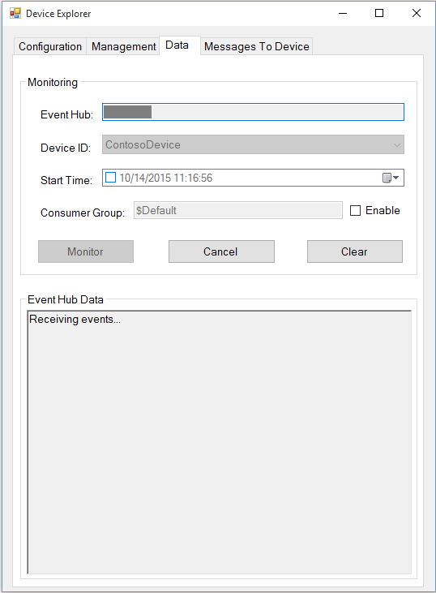

How to certify IoT devices running Linux with Azure IoT SDK
===
---

# Table of Contents

-   [Introduction](#Introduction)
-   [Step 1: Configure Azure IoT Hub](#Configure)
-   [Step 2: Register Device](#Register)
-   [Step 3: Build and validate the sample using Node JS client libraries](#Build)
    -   [3.1 Load the Azure IoT bits and prerequisites on device](#Load)
    -   [3.2 Build the samples](#BuildSamples)
    -   [3.3 Run and Validate the Samples](#Run)
-   [Step 4: Package and Share](#PackageShare)
    -   [4.1 Package build logs and sample test results](#Package)
    -   [4.2 Share package with Engineering Support](#Share)
    -   [4.3 Next steps](#Next)
-   [Step 5: Troubleshooting](#Troubleshooting)

# Introduction

**About this document**

This document provides step-by-step guidance to IoT hardware publishers on how to certify an IoT enabled hardware with Azure IoT SDK. This multi-step process includes:

-   Configuring Azure IoT Hub
-   Registering your IoT device
-   Build and deploy Azure IoT SDK on device
-   Packaging and sharing the logs

**Prepare**

Before executing any of the steps below, read through each process, step by step to ensure end to end understanding. You should have the following items ready before beginning the process:

-   Computer with GitHub installed and access to the [azure-iot-sdks](https://github.com/Azure/azure-iot-sdks) GitHub private repository
-   SSH client, such as [PuTTY](http://www.putty.org/), so you can access the command line
-   Required hardware to certify

***Note:*** *If you haven’t contacted Microsoft about being an Azure Certified for IoT partner, please submit this [form](<https://iotcert.cloudapp.net/>) first to request it and then follow these instructions.*

# Step 1: Sign Up To Azure IoT Hub

Follow the instructions [here](https://account.windowsazure.com/signup?offer=ms-azr-0044p) on how to sign up to the Azure IoT Hub service.

As part of the sign up process, you will receive the connection string.

-   **IoT Hub Connection String**: An example of IoT Hub Connection String is as below:

          HostName=[YourIoTHubName];CredentialType=SharedAccessSignature;CredentialScope=[ContosoIotHub];SharedAccessKeyName=[YourAccessKeyName];SharedAccessKey=[YourAccessKey]

# Step 2: Register Device

In this section, you will register your device using DeviceExplorer. The DeviceExplorer is a Windows application that interfaces with Azure IoT Hub and can perform the following operations:

-   Device management
    -   Create new devices
    -   List existing devices and expose device properties stored on Device Hub
    -   Provides ability to update device keys
    -   Provides ability to delete a device
-   Monitoring events from your device.
-   Sending messages to your device.

To run DeviceExplorer tool, follow the configuration strings as described in  [Step1](#Configure):

-   IoT Hub Connection String

**Steps:**
1.   Click [here](<https://github.com/Azure/azure-iot-sdks/blob/develop/tools/DeviceExplorer/doc/how_to_use_device_explorer.md>) to download and install DeviceExplorer.

2.  Add connection information under the Configuration tab and click the **Update** button.

3.  Create and register the device with your IoT Hub using instructions as below.

    a. Click the **Management** tab.

    b. Your registered devices will be visible in the list. In case your device is not there in the list, click **Refresh** button. If this is your first time, then you shouldn't retrieve anything.

    c. Click **Create** button to create a device ID and key.

    d. Once created successfully, device will be listed in DeviceExplorer.

    e. Right click the device and from context menu select "**Copy connection string for selected device**".

    f. Save this information in Notepad. You will need this information in later steps.

***Not running Windows on your PC?*** - Please follow the instructions [here](<https://github.com/Azure/azure-iot-sdks/blob/master/doc/manage_iot_hub.md>) to provision your device and get its credentials.

# Step 3: Build and validate the sample using Node JS client libraries

This section walks you through building, deploying and validating the IoT Client SDK on your device running a Linux operating system. You will install necessary prerequisites on your device.  Once done,  you will build and deploy the IoT Client SDK and validate the sample tests required for IoT certification with the Azure IoT SDK.

## 3.1 Load the Azure IoT bits and prerequisites on device

-   Open a PuTTY session and connect to the device.

-   Choose your commands in next steps based on the OS running on your device.

-   Run following command to check if NodeJS is already installed

        node --version

    If version is **0.12.x or greater**, then skip next step of installing prerequisite packages. Else uninstall it by issuing following command from command line on the device.

    **Debian or Ubuntu**

        sudo apt-get remove nodejs

    **Fedora**

        sudo dnf remove nodejs

    **Any Other Linux OS**

        Use equivalent commands on the target OS

-   Install the prerequisite packages by issuing the following commands from the command line on the device. Choose your commands based on the OS running on your device.

    **Debian or Ubuntu**

        curl -sL https://deb.nodesource.com/setup_4.x | sudo bash -

        sudo apt-get install -y nodejs

    **Fedora**

        wget http://nodejs.org/dist/v4.2.1/node-v4.2.1-linux-x64.tar.gz

        tar xvf node-v4.2.1-linux-x64.tar.gz

        sudo mv node-v4.2.1-linux-x64 /opt

        echo "export PATH=\$PATH:/opt/node-v4.2.1-linux-x64/bin" >> ~/.bashrc

        source ~/.bashrc

    **Any Other Linux OS**

        Use equivalent commands on the target OS

    **Note:** To test successful installation of Node JS, try to fetch its version information by running following command:

        node --version

-   Download the SDK to the board by issuing the following command in
    PuTTY:

        git clone --recursive https://github.com/Azure/azure-iot-sdks.git

-   Verify that you now have a copy of the source code under the directory ~/azure-iot-sdks.

## 3.2 Build the samples

-   To validate the source code run the following commands on the device.

        export IOTHUB_CONNECTION_STRING='<iothub_connection_string>'

    Replace the `<iothub_connection_string>` placeholder with IoTHub Connection String you got in [Step 1](#Configure).    

-   Run the following commands 

        cd ~/azure-iot-sdks/node
        build/dev-setup.sh
        build/build.sh | tee LogFile.txt

    ***Note:*** *LogFile.txt in above command should be replaced with a file name where build output will be written.*

-   Install npm package to run sample.

        cd ~/azure-iot-sdks/node/device/samples

    **For AMQP Protocol:**
	
        npm install azure-iot-device-amqp
	
    **For HTTP Protocol:**
	
        npm install azure-iot-device-http
	
    **For MQTT Protocol:**

        npm install azure-iot-device-mqtt	

-   To update sample, run the following command on device.

        cd ~/azure-iot-sdks/node/device/samples
        nano simple_sample_device.js

-   This launches a console-based text editor. Scroll down to the
    protocol information.
    
-   Find the below code:

        var Protocol = require('azure-iot-device-amqp').Amqp;
	
    The default protocol used is AMQP. Code for other protocols(HTTP/MQTT) are mentioned just below the above line in the script.
    Uncomment the line as per the protocol you want to use.

-   Scroll down to the connection information.
    Find the following place holder for IoT connection string:

        var connectionString = "[IoT Device Connection String]";

-   Replace the above placeholder with device connection string. You can get this from DeviceExplorer as explained in [Step 2](#Register), that you copied into Notepad.

-   Save your changes by pressing Ctrl+O and when nano prompts you to save it as the same file, just press ENTER.

-   Press Ctrl+X to exit nano.

-   Run the following command before leaving the **~/azure-iot-sdks/node/device/samples** directory

        npm link azure-iot-device

## 3.3 Run and Validate the Samples

In this section you will run the Azure IoT client SDK samples to validate communication between your device and Azure IoT Hub service. You will send messages to the Azure IoT Hub service and validate that IoT Hub has successfully receive the data. You will also monitor any messages send from the Azure IoT Hub to client.

**Note:** Take screen shots of all operations, like sample screen shots, performed in below sections. These will be needed in [Step 4](#Share)

### 3.3.1 Send Device Events to IOT Hub:

1.  Launch the DeviceExplorer as explained in [Step 2](#Register) and navigate to **Data** tab. Select the device name you created from the drop-down list of device IDs, click **Monitor** button.

    

2.  DeviceExplorer is now monitoring data sent from the selected device to the IoT Hub.

3.  Run the sample by issuing following command:

        node ~/azure-iot-sdks/node/device/samples/simple_sample_device.js

4. Verify that data has been successfully sent and received. If any, then you may have incorrectly copied the device hub connection information.

   

5.  DeviceExplorer should show that IoT Hub has successfully received data sent by sample test.

    

### 3.3.2 Receive messages from IoT Hub

1.  To verify that you can send messages from the IoT Hub to your
    device, go to the **Message To Device** tab in DeviceExplorer.

2.  Select the device you created using Device ID drop down.

3.  Add some text to the Message field, then click Send button.

    

4.  You should be able to see the command received in the console window
    of the client sample.

    

# Step 4: Package and Share

## 4.1 Package build logs and sample test results

Package following artifacts from your device:

1.  Build logs and E2E test results that were logged in the log file during build
    run.

2.  All the screenshots that are shown above in "**Send Device Events to IoT Hub**" section.

3.  All the screenshots that are above in "**Receive messages from IoT Hub**" section.

4.  Send us clear instructions of how to run this sample with your hardware
    (explicitly highlighting the new steps for customers). Please use the template available [here](<https://github.com/Azure/azure-iot-sdks/blob/master/doc/iotcertification/templates/template-linux-nodejs.md>) to create your device-specific instructions.
    
    As a guideline on how the instructions should look please refer the examples published on GitHub repository [here](<https://github.com/Azure/azure-iot-sdks/tree/master/doc/get_started>).

## 4.2 Share package with Engineering Support

Share the package in email to <iotcert@microsoft.com>.

## 4.3 Next steps

Once you shared the documents with us, we will contact you in the following 48 to 72 business hours with next steps.

# Step 5: Troubleshooting

Please contact engineering support on <iotcert@microsoft.com> for help with troubleshooting.
