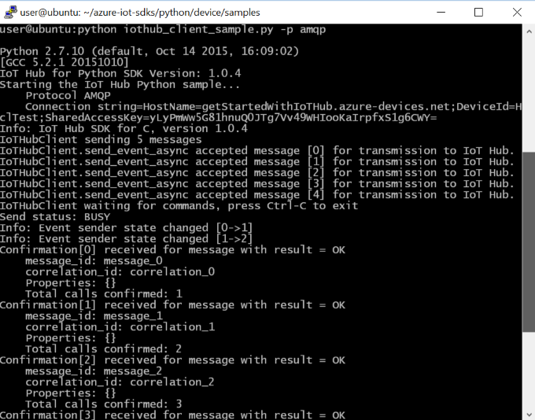
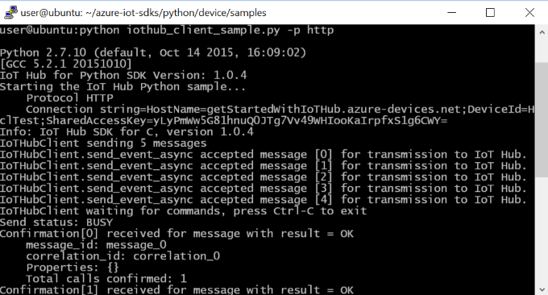
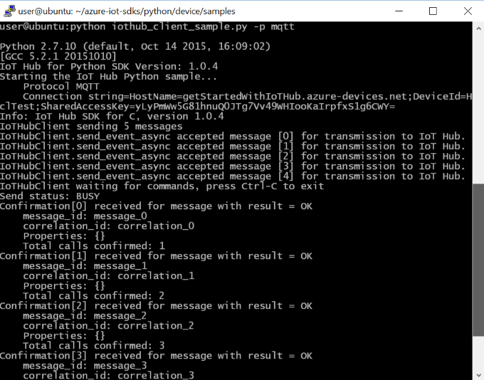
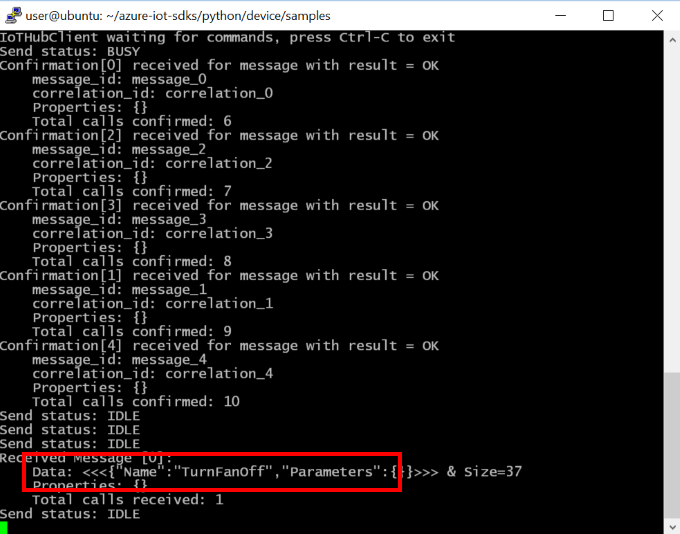
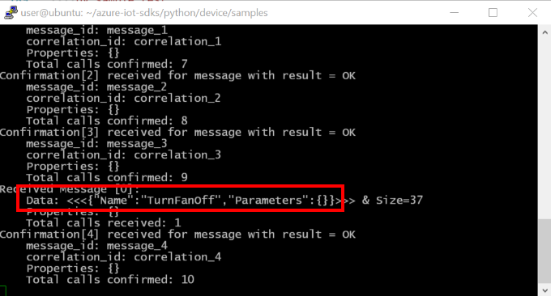
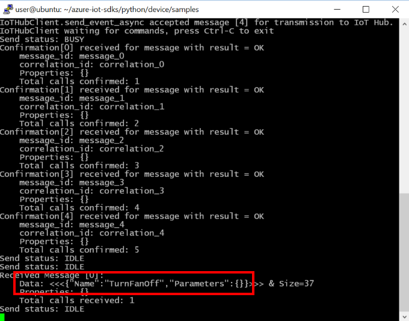

How to certify IoT devices running Linux with Azure IoT SDK
===
---

# Table of Contents

-   [Introduction](#Introduction)
-   [Step 1: Configure Azure IoT Hub](#Step-1-Configure)
-   [Step 2: Register Device](#Step-2-Register)
-   [Step 3: Build and Validate the sample using Python client
    libraries](#Step-3-Build)
    -   [3.1 Load the Azure IoT bits and prerequisites on device](#Step-3-1-Load)
    -   [3.2 Build the samples](#Step-3-2-Build)
    -   [3.3 Run and Validate the Samples](#Step-3-3-Run)
-   [Step 4: Package and Share](#Step-4-Package_Share)
    -   [4.1 Package build logs and sample test results](#Step-4-1-Package)
    -   [4.2 Share package with Engineering Support](#Step-4-2-Share)
    -   [4.3 Next steps](#Step-4-3-Next)
-   [Step 5: Troubleshooting](#Step-5-Troubleshooting)

# Introduction

**About this document**

This document provides step-by-step guidance to IoT hardware publishers on how
to certify an IoT enabled hardware with Azure IoT SDK. This multi-step process
includes:
-   Configuring Azure IoT Hub
-   Registering your IoT device
-   Build and deploy Azure IoT SDK on device
-   Packaging and sharing the logs

**Prepare**

Before executing any of the steps below, read through each process, step by step
to ensure end to end understanding.

You should have the following items ready before beginning the process:

-   Computer with GitHub installed and access to the
    [azure-iot-sdks](https://github.com/Azure/azure-iot-sdks) GitHub
    private repository.
-   SSH client, such as [PuTTY](http://www.putty.org/), so you can access the
    command line.
-   Required hardware to certify.

***Note:*** *If you haven't contacted Microsoft about being an Azure Certified for IoT partner, please submit this [form](<https://iotcert.cloudapp.net/>) first to request it and then follow these instructions.*

# Step 1: Sign Up To Azure IoT Hub

Follow the instructions [here](https://account.windowsazure.com/signup?offer=ms-azr-0044p) on how to sign up to the Azure IoT Hub service. As part of the sign up process, you will receive the connection string.

-   **IoT Hub Connection String**: An example of IoT Hub Connection String is as below:

         HostName=[YourIoTHubName];SharedAccessKeyName=[YourAccessKeyName];SharedAccessKey=[YourAccessKey]

# Step 2: Register Device

-   Follow the instructions [here](<https://github.com/Azure/azure-iot-sdks/blob/master/doc/manage_iot_hub.md>) on how to provision your device and get its credentials.

# Step 3: Build and Validate the sample using Python libraries

This section walks you through building, deploying and validating the IoT Client SDK on your device running a Linux operating system. You will install necessary prerequisites on your device. Once done, you will build and deploy the IoT Client SDK and validate the sample tests required for IoT certification with the Azure IoT SDK.

## 3.1 Load the Azure IoT bits and prerequisites on device

-   Open a PuTTY session and connect to the device.

-   Install the prerequisite packages by issuing the following commands from the command line on the device. Choose your commands based on the OS running on your device.

    **Debian or Ubuntu**

        sudo apt-get update

        sudo apt-get install -y curl libcurl4-openssl-dev build-essential cmake git python2.7-dev libboost-python-dev

    **Fedora**

        sudo dnf check-update -y

        sudo dnf install libcurl-devel openssl-devel gcc-c++ make cmake git python2.7-dev libboost-python-dev

    **Any Other Linux OS**

        Use equivalent commands on the target OS

    ***Note:*** *This setup process requires cmake version 2.8.12 or higher.* 
    
    *You can verify the current version installed in your environment using the  following command:*

        cmake --version

    *This library also requires gcc version 4.9 or higher. You can verify the current version installed in your environment using the following command:*
    
        gcc --version 

    *For information about how to upgrade your version of gcc on Ubuntu 14.04, see <http://askubuntu.com/questions/466651/how-do-i-use-the-latest-gcc-4-9-on-ubuntu-14-04>.*

    *This library also requires Python version 2.7.x. You can verify the current version installed in your environment using the following command:*
    
          python --version

-   Download the SDK to the board by issuing the following command in PuTTY:

        git clone --recursive https://github.com/Azure/azure-iot-sdks.git

-   Verify that you now have a copy of the source code under the
    directory ~/azure-iot-sdks.

## 3.2 Build the samples

-   Run following commands to build the SDK:

        cd python/build_all/linux
        sudo ./build.sh | tee LogFile.txt

    ***Note:*** *LogFile.txt in above command should be replaced with a file name where build output will be written.*

-   After a successful build, the `iothub_client.so` Python extension module is copied to the **python/device/samples** folder.

## 3.3 Run and Validate the Samples

In this section you will run the Azure IoT client SDK samples to validate
communication between your device and Azure IoT Hub. You will send messages to the Azure IoT Hub service and validate that IoT Hub has successfully receive the data. You will also monitor any messages send from the Azure IoT Hub to client.

-   Navigate to samples folder by executing following command:

        cd azure-iot-sdks/python/device/samples/

-   Run the following command on the device:

        nano iothub_client_sample.py

-   This launches a console-based text editor. Scroll down to the
    connection information.

-   Find the following place holder for device connection string:

        connectionString = "[device connection string]"

-   Replace the above placeholder with device connection string you got in [Step 2](#Step-2-Register).

-   Save your changes by pressing Ctrl+O and when nano prompts you to save it as the same file, just press ENTER.

-   Press Ctrl+X to exit nano.

**Note:** Take screenshots of all the operations you will perform in this
section. These will be needed in [Step 4](#Step-4-2-Share)

### 3.3.1 Send Device Events to IOT Hub:

-   Run the sample application using the following command:

    **For AMQP protocol:**

        python iothub_client_sample.py -p amqp

    **For HTTP protocol:**

        python iothub_client_sample.py -p http

    **For MQTT protocol:**

        python iothub_client_sample.py -p mqtt

-   See [Manage IoT Hub](<https://github.com/Azure/azure-iot-sdks/blob/master/doc/manage_iot_hub.md>) to learn how to observe the messages IoT Hub receives from the application.

-   Verify that the confirmation messages show an OK. If not, then you may have
    incorrectly copied the device connection string.

    **If using AMQP protocol:**
    
    

    **If using HTTP protocol:**
    
    

    **If using MQTT protocol:**
    
    

-   DeviceExplorer should show that IoT Hub has successfully received data sent
    by sample test.

    **If using AMQP protocol:**
    
    

    **If using HTTP protocol:**
    
    

    **If using MQTT protocol:**
    
    

### 3.3.2 Receive messages from IoT Hub

-   See [Manage IoT Hub](<https://github.com/Azure/azure-iot-sdks/blob/master/doc/manage_iot_hub.md>) to learn how to send cloud-to-device messages to the application.

-   You should be able to see the command received in the console window for the
    client sample.

    **If using AMQP protocol:**
    
    

    **If using HTTP protocol:**
    
    

    **If using MQTT protocol:**
    
    

# Step 4: Package and Share

## 4.1 Package build logs and sample test results

Package following artifacts from your device:

1.  Build logs and E2E test results that were logged in the log files during
    build run.

2.  All the screenshots that are shown above in "**Send Device Events to IoT Hub**" section.

3.  All the screenshots that are above in "**Receive messages from IoT Hub**" section.

4.  Send us clear instructions of how to run this sample with your hardware
    (explicitly highlighting the new steps for customers). Please use the template available [here](<https://github.com/Azure/azure-iot-sdks/blob/master/doc/iotcertification/templates/template-linux-python.md>) to create your device-specific instructions.
    
    As a guideline on how the instructions should look please refer the examples published on GitHub repository [here](<https://github.com/Azure/azure-iot-sdks/tree/master/doc/get_started>).

## 4.2 Share package with Microsoft Azure IoT team

Share the package in email to  <iotcert@microsoft.com>.

## 4.3 Next steps

Once you shared the documents with us, we will contact you in the following 48
to 72 business hours with next steps.

# Step 5: Troubleshooting

Please contact engineering support on <iotcert@microsoft.com> for help with
troubleshooting.
