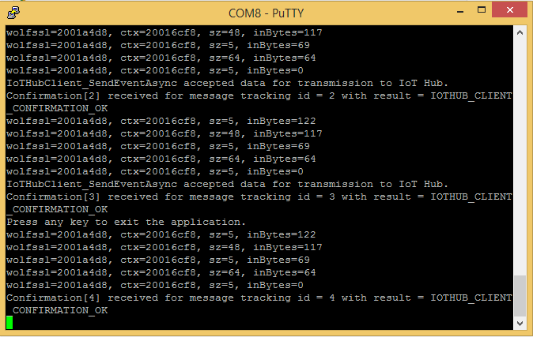

How to Certify IoT devices running Mbed OS with Azure IoT SDK 
===
---

# Table of Contents

-   [Introduction](#Introduction)
-   [Step 1: Configure Azure IoT Hub](#Step_1:_Configure)
-   [Step 2: Register Device](#Step_2:_Register)
-   [Step 3: Build and Validate the sample using C client libraries](#Step_3:_Build)
    -   [3.1 Connect the Device](#Step_3_1:_Load)
    -   [3.2 Build the samples](#Step_3_2:_Build)
    -   [3.3 Run and Validate the Samples](#Step_3_3:_Run)
-   [Step 4: Package and Share](#Step_4:_Package_Share)
    -   [4.1 Package build logs and sample test results](#Step_4_1:_Package)
    -   [4.2 Share package with Engineering Support](#Step_4_2:_Share)
    -   [4.3 Next steps](#Step_4_3:_Next)
-   [Step 5: Troubleshooting](#Step_5:_Troubleshooting)

<a name="Introduction"/>
# Introduction

**About this document**

This document provides step-by-step guidance to IoT hardware publishers on how to certify an IoT enabled hardware with Azure IoT SDK. This multi-step process includes:
-   Configuring Azure IoT Hub 
-   Registering your IoT device
-   Build and deploy Azure IoT SDK on device
-   Packaging and sharing the logs  

**Prepare**

Before executing any of the steps below, read through each process, step
by step to ensure end to end understanding.

You should have the following items ready before beginning the process:

-   Computer with GitHub installed and access to the
    [azure-iot-suite-sdks](https://github.com/Azure/azure-iot-sdks)
    GitHub private repository
-   SSH client, such as [PuTTY](http://www.putty.org/), so you can
    access the command line
-   Required hardware to certify

***Note:*** *If you haven’t contacted Microsoft about being an Azure Certified for IoT partner, please submit this [form](<https://iotcert.cloudapp.net/>) first to request it and then follow these instructions.*

<a name="Step_1:_Configure"/>
# Step 1: Sign Up To Azure IoT Hub

Follow the instructions [here](https://account.windowsazure.com/signup?offer=ms-azr-0044p) on how to sign up to the Azure IoT Hub service.As part of the sign up process, you will receive the connection string.

-   **IoT Hub Connection String**: An example
    of IoT Hub Connection String is as below:

         HostName=[YourIoTHubName];CredentialType=SharedAccessSignature;CredentialScope=[ContosoIotHub];SharedAccessKeyName=[YourAccessKeyName];SharedAccessKey=[YourAccessKey]

<a name="Step_2:_Register"/>
# Step 2: Register Device

In this section, you will register your device using Device Explorer. The Device Explorer is a Windows application that interfaces with Azure IoT Hub and can perform the following operations:

-   Device management
    -   Create new devices
    -   List existing devices and expose device properties stored on Device Hub
    -   Provides ability to update device keys
    -   Provides ability to delete a device
-   Monitoring events from your device
-   Sending messages to your device

To run Device Explorer tool, use following configuration string as described in [Step1](#Step_1:_Configure):

-   IoT Hub Connection String

1.  Click [here](<https://github.com/Azure/azure-iot-sdks/blob/develop/tools/DeviceExplorer/doc/how_to_use_device_explorer.md>) to download and install Device Explorer.

2.  Add connection information under the **Configuration** tab and click the **Update** button.

3.  Create and register the device with your IoT Hub using instructions as below.

    a. Click the **Management** tab.    
    
    b. Click **List** button to call the device hub and retrieve a list of devices. 
       If this is your first time, then you shouldn't retrieve anything.
       
    c. Click **Create** button to create a device ID and key. 
    
    d. Once created successfully, device will be listed in Device Explorer. 
    
    e. Right click the device and from context menu select "**Copy connection string for selected device**".
    
    f. Save this information in Notepad. You will need this information in later steps.

**Not running Windows on your PC?** - Please send us an email on 
<azureiotcertified@microsoft.com> and we will follow up with you with
instructions.

<a name="Step_3:_Build"/>
# Step 3: Build and Validate the sample using C client libraries 

This section walks you through building, deploying and validating the IoT Client SDK on your device running a mbed operating system. You will install necessary prerequisites on your device.  Once done,  you will build and deploy the IoT Client SDK and validate the sample tests required for IoT certification with the Azure IoT SDK.

<a name="Step_3_1:_Load"/>
## 3.1 Connect the Device

1.  Connect the board to your network using an Ethernet cable. This step
    is required, as the sample depends on internet access.

2.  Plug the device into your computer using a micro-USB cable.

3.  Install the Windows serial port drivers located
    [here](http://developer.mbed.org/handbook/Windows-serial-configuration#1-download-the-mbed-windows-serial-port).

4.  Install the 7-Zip software from [here](http://www.7-zip.org).

<a name="Step_3_2:_Build"/>
## 3.2  Build the samples

1. Clone [GitHub
    SDK](https://github.com/Azure/azure-iot-sdks.git) repository
    to your machine.

2.  Browse to the folder

        /azure-iot-sdks/c/iothub_client/samples/iothub_client_sample_amqp/mbed

3.  Run the **mkmbedzip.bat** file. This will generate
    **iothub\_client\_sample\_amqp.zip** file in the same folder.

      ***NOTE:*** *When the zip file is uploaded to the compiler web page, the browser will keep the zip file open. Attempting to create another zip while your browsers are open will fail.*

4.  In your web browser, go to the [mbed developer's
    site](https://developer.mbed.org/). If you haven't signed up, you
    will see an option to create a new account (it's free). Otherwise,
    log in with your account credentials.

5.  Click on **Compiler** in the upper right-hand corner of the page.
    This should bring you to the **Workspace Management** interface.

6.  Make sure the hardware platform you're using appears in the upper
    right-hand corner of the window. If not, click the **No device
    selected** button in the right-hand corner to select your
    hardware platform.

7.  From Workspace Management menu, select **New &minus;&gt; New Program**.

    

8.  The **Create new program** dialog is displayed. The platform field
    should be pre-populated with the hardware platform you selected.

9.  Set the **Template** field to **Empty Program**. Use any program
    name you want in the **Program Name** field, then click OK.

       

10.  Click **Import** on the main menu. This will bring up **Import
    Wizard**.

        

11.  Go to the **Upload** tab on Import Wizard and click the **Browse...**
    button at the bottom of the page.

12.  Browse to the directory in which you created your zip file (using
    mkmbedzip.bat) and double-click it. You will be back at the Import
    Wizard page, and the zip file name is displayed in the Name column.

13.  Click the **Import!** button in the upper right-hand corner of the
    Import Wizard. The **Import Library** dialog is displayed.

14.  Ensure that the target path matches the name of the project you
    created and then click **Import**.

  ***NOTE:*** *The target path matches the name of the program that was
  last selected before Import was selected from the main menu.*

15.  Open **iothub\_client\_sample\_amqp.c** file and replace the
    \[Iothub connection string\] with your device connection string. You
    can get this from Device Explorer as explained in [Step 2](#Step_2:_Register).

16.  Highlight your project in the Program Workspace pane and click the
    **Import** menu item again.

17.  At the top of the window, click the **Click Here** link to import
    from a URL. The **Import Library** dialog appears.

        

18.  Enter the following URL into the Source URL field.

          http://developer.mbed.org/users/donatien/code/NTPClient/

19.  Once done click **Import**.

        

20.  Repeat Steps 16 and 17 and enter the following URL into the Source
    URL field. Once done click **Import**:
    
         https://developer.mbed.org/users/wolfSSL/code/wolfSSL/
         http://developer.mbed.org/users/mbed_official/code/EthernetInterface/
         http://developer.mbed.org/users/mbed_official/code/mbed-rtos/
         http://mbed.org/users/mbed_official/code/mbed/

21.  Import Proton library by repeating Steps 16 and 17 and enter the following URL into the Source URL field. Once done click **Import**:

         http://developer.mbed.org/users/AzureIoTClient/code/proton-c-mbed/

22.  Click **Compile** from main menu to build the program. If the build is successful, a .bin file with the name of your project will get generated. Save this file on your machine. It will be used in next step.
    

  ***Note:*** *You can safely ignore any warnings, but if the build
  generates errors, fix them before proceeding.*

<a name="Step_3_3:_Run"/>
## 3.3 Run and Validate the samples
    
In this section you will run the Azure IoT client SDK samples to validate
communication between your device and Azure IoT Hub. You will send messages to the Azure IoT Hub service and validate that IoT Hub has successfully receive the data. You will also monitor any messages send from the Azure IoT Hub to client.

***Note:*** *Take screenshots of all the operations you will perform in this
section. These will be needed in [Step 4](#Step_4_2:_Share).*

### 3.3.1 Send Device Events to IOT Hub

1.  Launch the Device Explorer as explained in [Step 2](#Step_2:_Register) and navigate to **Data** tab. Select the device name you created from the drop-down list of device IDs and click **Monitor** button.

     

2.  Device Explorer is now monitoring data sent from the selected device to the IoT Hub.

3.  Copy the .bin file generated in last step to the device.

    ***Note:*** *Saving the .bin file to the device causes the current terminal session to the device to reset. When it reconnects, reset the terminal again manually, or start a new terminal. This enables the mbed device to reset and start executing the program.*

4.  Connect to the device using an SSH client application, such as PuTTY. You can determine which serial port your device uses by checking the Windows Device Manager.

    

5.  In PuTTY, click the **Serial** connection type. The device most
    likely connects at 115200, so enter that value in the Speed box.
    Then click Open.

    

6.  The iothub\_client\_sample\_amqp program starts executing.

    

    Verify that the confirmation messages show an OK. If not, then you may have incorrectly copied the device hub connection information.
    
      ***NOTE:*** *If the program does not starts, reset the board manually.*
     
7. You should be able to see the events received in the Device Explorer's data tab.

     
    
### 3.3.2 Receive messages from IoT Hub

1.  To verify that you can send messages from the IoT Hub to your device,
    go to the **Notification** tab in Device Explorer.

2.  Select the device you created using Device ID drop down.

3.  Add some text to the Notification field, then click Send.

    

4.  You should be able to see the message received in the terminal window.

    

<a name="Step_4:_Package_Share"/>
# Step 4: Package and Share

<a name="Step_4_1:_Package"/>
## 4.1 Package build logs and sample test results
  
Package following artifacts from your device:

1.  Screenshot for the build results generated while compiling on the [mbed
    developer's site](https://developer.mbed.org/).
2.  All the screenshots that are shown above in "**Send Device Events to IoT Hub**" section.
2.  All the screenshots that are shown above in "**Receive messages from IoT Hub**" section.
3.  Send us clear instructions of how to run this sample with your hardware
    (explicitly highlighting the new steps for customers). As a
    guideline on how the instructions should look please refer the
    examples published on github repository [here](<https://github.com/Azure/azure-iot-sdks/tree/master/c/doc>)

<a name="Step_4_2:_Share"/>
## 4.2 Share package with Engineering Support

Share the package in email to <azureiotcertified@microsoft.com>.

<a name="Step_4_3:_Next"/>
## 4.3 Next steps

Once you shared the documents with us, we will contact you in the following 48 to 72 business hours with next steps.

<a name="Step_5:_Troubleshooting"/>
# Step 5: Troubleshooting

Please contact engineering support on <azureiotcertified@microsoft.com> for help with troubleshooting.
