How to certify IoT devices running Windows with Azure IoT SDK 
===
---

# Table of Contents

-   [Introduction](#Introduction)
-   [Step 1: Sign Up To Azure IoT Hub](#Step_1_Sign_Up)
-   [Step 2: Register Device](#Step_2_Register)
-   [Step 3: Build and Validate the Sample using C Client Libraries](#Step_3_Build_and_Validate)
    -   [3.1 Connect the Device](#Step_3_1_Connect)
    -   [3.2 Build the Samples](#Step_3_2_Build)
    -   [3.3 Run and Validate the Samples](#Step_3_3_Run)
-   [Step 4: Package and Share](#Step_4_Package_Share)
    -   [4.1 Package build logs and sample test results](#Step_4_1_Package)
    -   [4.2 Share package with Engineering Support](#Step_4_2_Share)
    -   [4.3 Next steps](#Step_4_3_Next)
-   [Step 5: Troubleshooting](#Step_5_Troubleshooting)

<a name="Introduction"/>
# Introduction

**About this document**

This document provides step by step guidance to IoT hardware publishers on how to certify an IoT enabled hardware with Azure IoT SDK. This multi-step process includes:
-   Configuring Azure IoT Hub 
-   Registering your IoT device
-   Build and deploy Azure IoT SDK on device
-   Packaging and sharing the logs  

**Prepare**

Before executing any of the steps below, read through each process, step
by step to ensure end to end understanding. Follow the instructions [here](<https://github.com/Azure/azure-iot-sdks/blob/master/c/doc/devbox_setup.md>) to prepare your development environment. 

You should have the following items ready before beginning the process:

-   Computer with GitHub installed and access to the [azure-iot-sdks](https://github.com/Azure/azure-iot-sdks) GitHub public repository.
-   Install Visual Studio 2015 and Tools. You can install any edition of Visual Studio, including the free Community edition.

<a name="Step_1_Sign_Up"/>
# Step 1: Sign Up To Azure IoT Hub

Follow the instructions [here](https://account.windowsazure.com/signup?offer=ms-azr-0044p) on how to sign up to the Azure IoT Hub service.

As part of the sign up process, you will receive the connection string.

-   **IoT Hub Connection String**: An example of IoT Hub Connection String is as below:

        HostName=[YourIoTHubName];SharedAccessKeyName=[YourAccessKeyName];SharedAccessKey=[YourAccessKey]

<a name="Step_2_Register"/>
# Step 2: Register Device

In this section, you will register your device using DeviceExplorer. The DeviceExplorer is a Windows application that interfaces with Azure IoT Hub and can perform the following operations:

-   Device management
    -   Create new devices
    -   List existing devices and expose device properties stored on Device Hub
    -   Provides ability to update device keys
    -   Provides ability to delete a device
-   Monitoring events from your device
-   Sending messages to your device

To run DeviceExplorer tool, use following configuration string as described in [Step1](#Step_1_Sign_Up):

-   IoT Hub Connection String

**Steps:**

1.  Click [here](https://github.com/Azure/azure-iot-sdks/blob/master/tools/DeviceExplorer/readme.md) to download and install DeviceExplorer.

2.  Add connection information under the **Configuration** tab and click the **Update** button.

3.  Create and register the device with your IoT Hub using instructions as below.

    a. Click the **Management** tab.    
    
    b. Your registered devices will be visible in the list. In case your device is not there in the list, click **Refresh** button. If this is your first time, then you shouldn't retrieve anything.
       
    c. Click **Create** button to create a device ID and key. 
    
    d. Once created successfully, device will be listed in DeviceExplorer. 
    
    e. Right click the device and from context menu select "**Copy connection string for selected device**".
    
    f. Save this information in Notepad. You will need this information in later steps.

***Not running Windows on your PC?*** - Please follow the instructions [here](<https://github.com/Azure/azure-iot-sdks/blob/master/doc/manage_iot_hub.md>) to provision your device and get its credentials.

<a name="Step_3_Build_and_Validate"/>
# Step 3: Build and Validate the Sample using C Client Libraries 

This section walks you through building, deploying and validating the IoT Client SDK on your device running Windows 10 operating system. You will install the necessary prerequisites on your device. Once done, you will build and deploy the IoT Client SDK, and validate the sample tests required for IoT certification with the Azure IoT SDK.

<a name="Step_3_1_Connect"/>
## 3.1 Connect the Device

1.  Connect the board to your network using an Ethernet cable. This step
    is required, as the sample depends on internet access.

2.  Plug the device into your computer using a micro-USB cable.

<a name="Step_3_2_Build"/>
## 3.2  Build the Samples

1.  Start a new instance of Visual Studio 2015. Open the **azure_iot_sdks.sln** solution in the **cmake** folder in your home directory.

2.  In Visual Studio, from **Solution Explorer**, navigate to project based on your choice of protocol:

	**For AMQP protocol:**

	Navigate to **simplesample_amqp** project and open the **simplesample_amqp.c** file.

	**For HTTP protocol:**
	
	Navigate to **simplesample_http** project and open the **simplesample_http.c** file.

	**For MQTT protocol:**
	
	Navigate to **simplesample_mqtt** project and open the **simplesample_mqtt.c** file.

	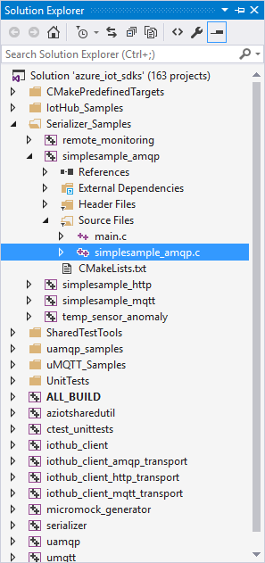

3.  Find the following place holder for IoT connection string:

  		static const char* connectionString = "[device connection string]";
	
4.  Replace the above placeholder with device connection string. You can get this from DeviceExplorer as explained in [Step 2](#Step_2_Register), that you copied into Notepad.

	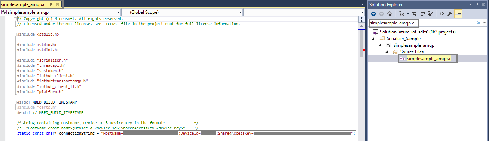

<a name="Step_3_3_Run"/>
## 3.3 Run and Validate the Samples
    
In this section you will run the Azure IoT client SDK samples to validate the communication between your device and Azure IoT Hub. You will send the messages to the Azure IoT Hub service and validate that IoT Hub has successfully receive the data. You will also monitor any messages sent from the Azure IoT Hub to client.

**Note:** Take screenshots of all the operations you will perform in this
section. These will be needed in [Step 4](#Step_4_2_Share).

### 3.3.1 Send Device Events to IoT Hub

1.  Launch the DeviceExplorer as explained in [Step 2](#Step_2_Register) and navigate to **Data** tab. Select the device name you created from the drop-down list of device IDs and click **Monitor** button.

    

2.  DeviceExplorer is now monitoring data sent from the selected device to the IoT Hub.
     
3.  In Visual Studio, from **Solution Explorer**, right-click on the project and click **Debug -> Start new instance** to build and run the sample. 

	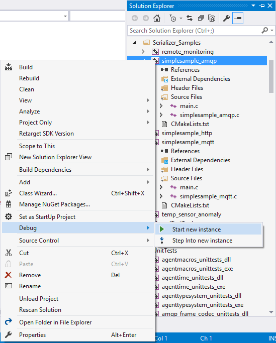
       
4. Verify that the confirmation messages show an OK. If not, then verify the device hub connection information.

	**If HTTP protocol:**

	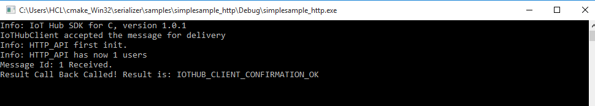

	**If AMQP protocol:**

	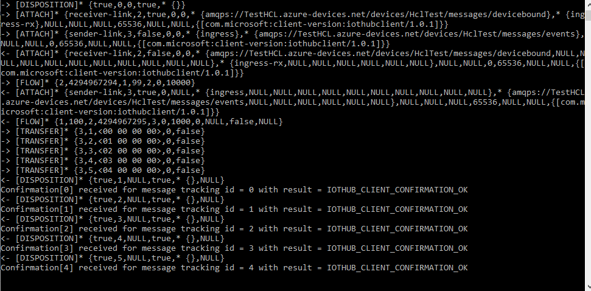

	**If MQTT protocol:**

	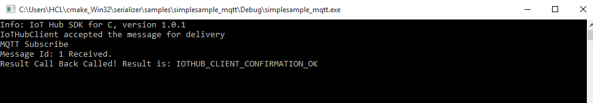

5. DeviceExplorer should show that IoT Hub has successfully received data sent by sample test.

	**If HTTP protocol:**	

	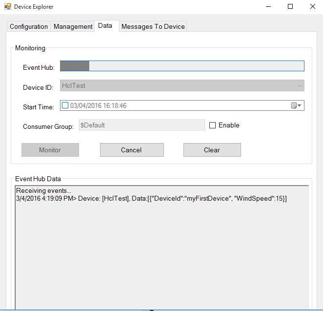

	**If AMQP protocol:**

	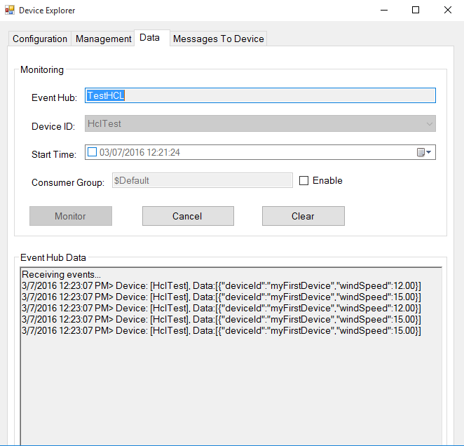

	**If MQTT protocol:**

	

### 3.3.2 Receive messages from IoT Hub

1.  To verify that you can send messages from the IoT Hub to your device, go to the **Messages to Device** tab in DeviceExplorer.

2.  Select the device you created using Device ID drop down.

3.  Add some text to the Message field, then click Send.

   	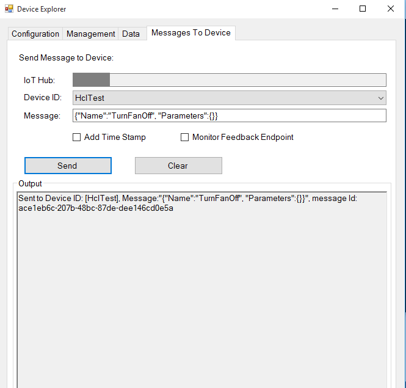

4. You should be able to see the message received in the device console window.
	
	**If using HTTP protocol:**

	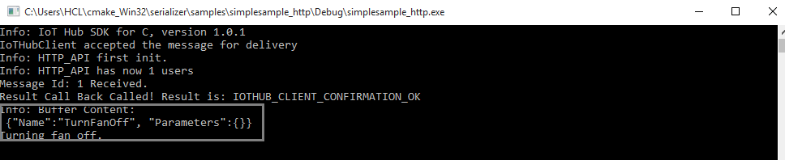

	**If using AMQP protocol:**

	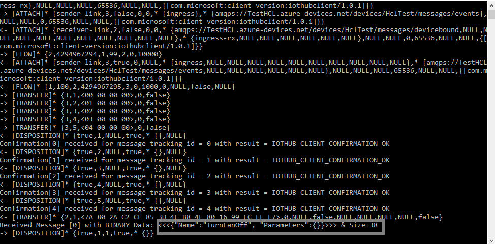
    
	**If using MQTT protocol:**

	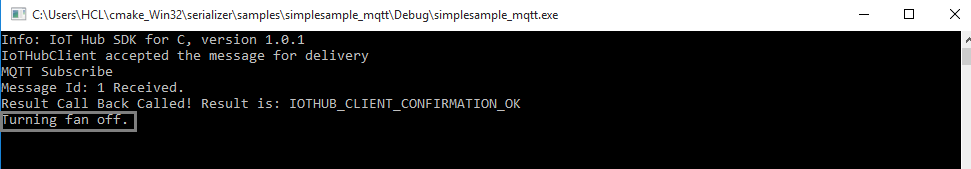

<a name="Step_4_Package_Share"/>
# Step 4: Package and Share

<a name="Step_4_1_Package"/>
## 4.1 Package build logs and sample test results
  
Package the following artifacts from your device:

1.  Build logs from section 3.2.
2. All the screenshots that are shown above in "**Send Device Events to IoT Hub**" section.
3.  All the screenshots that are shown above in "**Receive messages from IoT Hub**" section.
4.  Send us clear instructions of how to run this sample with your hardware
    (explicitly highlighting the new steps for customers). Please use the template available [here](<https://github.com/Azure/azure-iot-sdks/blob/master/doc/iotcertification/templates/template-windows-c.md>) to create your device-specific instructions.
    
    As a guideline on how the instructions should look please refer the examples published on GitHub repository [here](<https://github.com/Azure/azure-iot-sdks/tree/master/doc/get_started>).

<a name="Step_4_2_Share"/>
## 4.2 Share package with the Azure IoT Certification Team

Send the package in email to <iotcert@microsoft.com>.

<a name="Step_4_3_Next"/>
## 4.3 Next steps

Once you shared the documents with us, we will contact you in the following 48 to 72 business hours with next steps.

<a name="Step_5_Troubleshooting"/>
# Step 5: Troubleshooting

Please contact engineering support on <iotcert@microsoft.com> for help with  troubleshooting.
