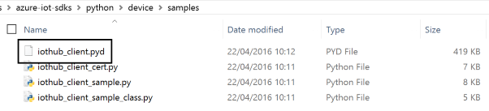
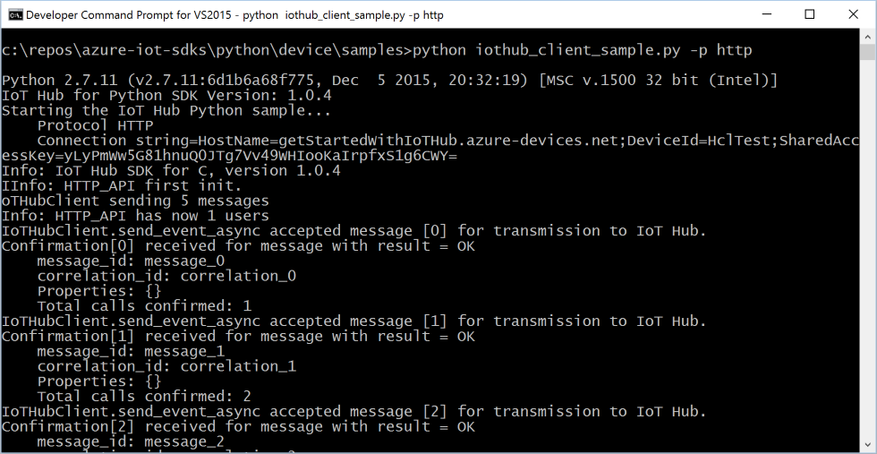
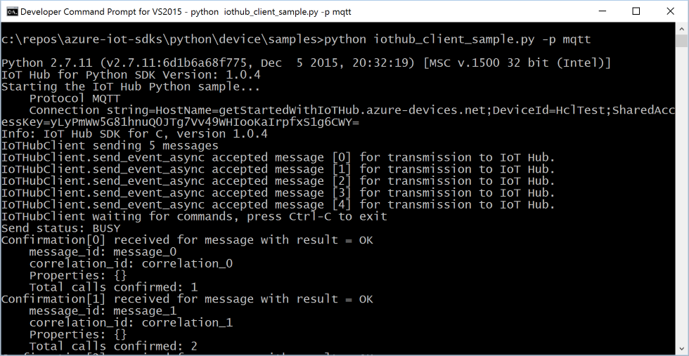
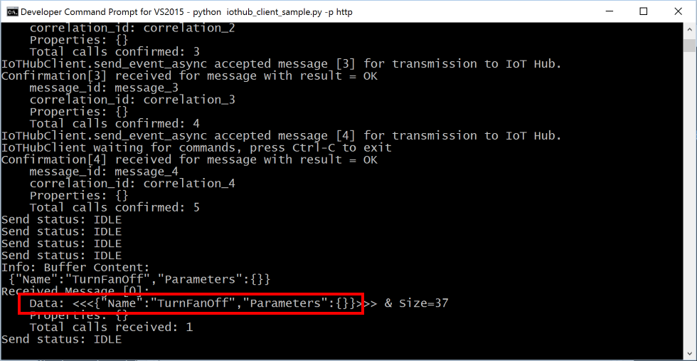
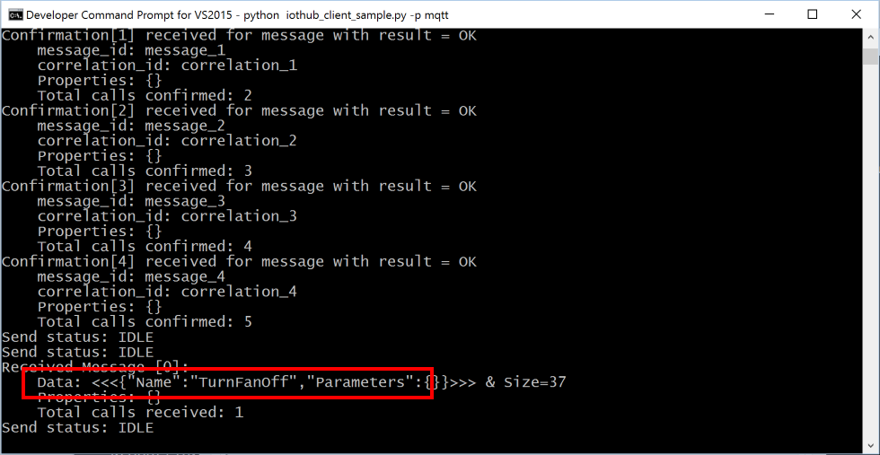
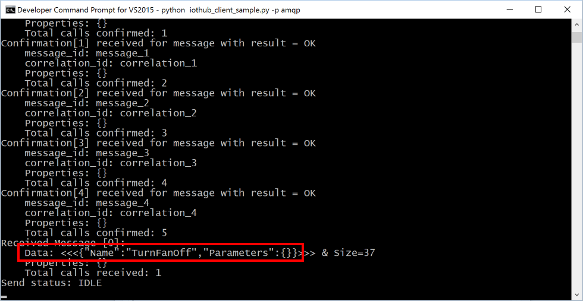

How to certify IoT devices running Windows 10 with Azure IoT SDK 
===
---


# Table of Contents

-   [Introduction](#Introduction)
-   [Step 1: Sign Up To Azure IoT Hub](#Step_1:_Sign_Up)
-   [Step 2: Register Device](#Step_2:_Register)
-   [Step 3: Build and Validate the Sample using Python Client Libraries](#Step_3:_Build_and_Validate)
    -   [3.1 Connect the Device](#Step_3_1:_Connect)
    -   [3.2 Setup your development environment](#Step_3_2:_Setup)
    -   [3.3 Build the Python iothub_client module on Windows using Nuget packages (recommended)](#Step_3_3:_Build)
    -   [3.4 Run and Validate the Samples](#Step_3_4:_Run)
-   [Step 4: Package and Share](#Step_4:_Package_Share)
    -   [4.1 Package build logs and sample test results](#Step_4_1:_Package)
    -   [4.2 Share package with Engineering Support](#Step_4_2:_Share)
    -   [4.3 Next steps](#Step_4_3:_Next)
-   [Step 5: Troubleshooting](#Step_5:_Troubleshooting)

<a name="Introduction"/>
# Introduction

**About this document**

This document provides step by step guidance to IoT hardware publishers on how to certify an IoT enabled hardware with Azure IoT SDK. This multi-step process includes:
-   Configuring Azure IoT Hub 
-   Registering your IoT device
-   Build and deploy Azure IoT SDK on device
-   Packaging and sharing the logs  

**Prepare**

Before executing any of the steps below, read through each process, step
by step to ensure end to end understanding.

You should have the following items ready before beginning the process:

-   Computer with GitHub installed and access to the [azure-iot-sdks](https://github.com/Azure/azure-iot-sdks) GitHub public repository.
-   Install Visual Studio 2015 and Tools. You can install any edition of Visual Studio, including the free Community edition.

<a name="Step_1:_Sign_Up"/>
# Step 1: Sign Up To Azure IoT Hub

Follow the instructions [here](https://account.windowsazure.com/signup?offer=ms-azr-0044p) on how to sign up to the Azure IoT Hub service.

As part of the sign up process, you will receive the connection string.

-   **IoT Hub Connection String**: An example of IoT Hub Connection String is as below:

        HostName=[YourIoTHubName];SharedAccessKeyName=[YourAccessKeyName];SharedAccessKey=[YourAccessKey]

<a name="Step_2:_Register"/>
# Step 2: Register Device

- [Provision your device and get its credentials](<https://github.com/Azure/azure-iot-sdks/blob/master/doc/manage_iot_hub.md>)

<a name="Step_3:_Build_and_Validate"/>
# Step 3: Build and Validate the Sample using Python Client Libraries 

This section walks you through building, deploying and validating the IoT Client SDK on your device running Windows 10 operating system. You will install the necessary prerequisites on your device. Once done, you will build and deploy the IoT Client SDK, and validate the sample tests required for IoT certification with the Azure IoT SDK.

<a name="Step_3_1:_Connect"/>
## 3.1 Connect the Device

1.  Connect the board to your network using an Ethernet cable. This step
    is required, as the sample depends on internet access.

2.  Plug the device into your computer using a micro-USB cable.

<a name="Step_3_2:_Setup"/>
## 3.2  Setup your development environment

Complete the following steps to set up your development environment:

1. Download latest SDK using following command:
  
  ```
  git clone --recursive https://github.com/Azure/azure-iot-sdks.git
  ```

2. Install the latest x86 or x64 Python 2.7 client. The build needs a valid Python.exe in the path. Based on the active Python version (e.g. Python 2.7.11 x86 32bit) the build script choses the compiler.

> You can install the latest x86 or x64 Python 2.7 client from [python-2.7](https://www.python.org/downloads/).

<a name="Step_3_2:_Build"/>
## 3.3  Build the Python iothub_client module on Windows using Nuget packages (recommended)

The following instructions outline how you can build the libraries in Windows:

1. Open a Visual Studio 2015 x86 Native Tools command prompt and navigate to the folder python/build_all/windows in your local copy of the repository.

			
	
2. Run the script build.cmd in the python\build_all\windows directory.

3. As a result, the **iothub_client.pyd** Python extension module is copied to the python/device/samples folder

		

<a name="Step_3_3:_Run"/>
## 3.3 Run and Validate the Samples
    
In this section you will run the Azure IoT client SDK samples to validate the communication between your device and Azure IoT Hub. You will send the messages to the Azure IoT Hub service and validate that IoT Hub has successfully receive the data. You will also monitor any messages sent from the Azure IoT Hub to client.

***Note:*** *Take screenshots of all the operations you will perform in this
section. These will be needed in [Step 4](#Step_4_2:_Share).*

### 3.3.1 Send Device Events to IoT Hub

1.  Launch the DeviceExplorer as explained in [Step 2](#Step_2:_Register) and navigate to **Data** tab. Select the device name you created from the drop-down list of device IDs and click **Monitor** button.

    

2.  DeviceExplorer is now monitoring data sent from the selected device to the IoT Hub.
     
3. Navigate to the folder python/device/samples in your local copy of the repository. 

4. Open the file **iothub_client_sample.py** or  **iothub_client_sample_class.py** in a text editor.

5. Locate the following code in the file:

		connectionString = "[device connection string]"

6. Replace [device connection string] with the connection string for your device. Save the changes.

7.  Run the sample application using the following command through Visual Studio 2015 x86 Native Tools command prompt and navigate to the folder python/build_all/windows in your local copy of the repository:
	
	**If HTTP protocol:**

		python iothub_client_sample.py -p http

	**If MQTT protocol:**

		python iothub_client_sample.py -p mqtt

	**If AMQP protocol:**

		python iothub_client_sample.py -p amqp

8. Verify that the confirmation messages show an OK. If not, then you may have incorrectly copied the device hub connection information.
  
  **If HTTP protocol:**	
  
  
  
  **If MQTT protocol:**
  
  
  
  **If AMQP protocol:**
  
  
  
9. You should be able to see the events received in the DeviceExplorer's data tab.

	**If HTTP protocol:**	

     

	**If MQTT protocol:**

	 

	**If AMQP protocol:**
	
	 

### 3.3.2 Receive messages from IoT Hub

1.  To verify that you can send messages from the IoT Hub to your device, go to the **Messages to Device** tab in DeviceExplorer.

2.  Select the device you created using Device ID drop down.

3.  Add some text to the Message field, then click Send.

   	

4. You should be able to see the message received in the device console window.
	
	**If HTTP protocol:**

	

	**If MQTT protocol:**

	

	**If AMQP protocol:**

	
    
<a name="Step_4:_Package_Share"/>
# Step 4: Package and Share

<a name="Step_4_1:_Package"/>
## 4.1 Package build logs and sample test results
  
Package the following artifacts from your device:

1. Build logs from section 3.2.

2. All the screenshots that are shown above in "**Send Device Events to IoT Hub**" section.

3. All the screenshots that are shown above in "**Receive messages from IoT Hub**" section.

4. Send us clear instructions of how to run this sample with your hardware (explicitly highlighting the new steps for customers).

> Please use the template available [here](<https://github.com/Azure/azure-iot-sdks/blob/master/doc/iotcertification/templates/template-windows-python.md>) to create your device-specific instructions.
	
> As a guideline on how the instructions should look please refer the examples published on GitHub repository [here](<https://github.com/Azure/azure-iot-sdks/tree/master/doc/get_started>).

<a name="Step_4_2:_Share"/>
## 4.2 Share package with the Azure IoT Certification Team

Send the package in email to <iotcert@microsoft.com>.

<a name="Step_4_3:_Next"/>
## 4.3 Next steps

Once you shared the documents with us, we will contact you in the following 48 to 72 business hours with next steps.

<a name="Step_5:_Troubleshooting"/>
# Step 5: Troubleshooting

Please contact engineering support on <iotcert@microsoft.com> for help with  troubleshooting.

