# node-red-contrib-azure-iot-hub

node-red-contrib-azure-iot-hub is a <a href="http://nodered.org" target="_new">Node-RED</a> node that allows you to send messages and register devices with Azure IoT Hub. This is a fork from the original Node-RED example by the Azure IoT team found [here](https://github.com/Azure/azure-iot-sdks/tree/master/node/device/node-red).

It contains two new Node-RED cloud nodes: **Azure IoT Hub** and **Azure IoT Registry**

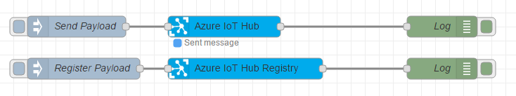

#### Azure IoT Hub

This node allows you to send messages to your Azure IoT Hub.  It has the following payload format:
```
{
  "deviceId": "testenode1",
  "key": "cw3nniq77BbjpOCDLqb7xEFTU509HeR6Ki1NwR20jj0=",
  "protocol": "amqp",
  "data": "{tem: 25, wind: 20}"
}
```
- deviceId is your device's unique id.
- key is your device's primary or secondary key.
- protocol options are: amqp, amqpws, mqtt or http.
- data can either be a plain string or string wrapped JSON.

#### Azure IoT Registry

This node allows you to registers devices with your Azure IoT Hub. It has the following payload format:

```
{
  "deviceId": "testenode1"
}
```

## Installation

```
npm install -g node-red-contrib-azure-iot-hub
```


## How to Use


### Node-RED Setup
Follow the instructions [here](http://nodered.org/docs/getting-started/installation) to get Node-RED setup locally.

### Register Azure IoT Hub Device

1. Open Node-RED, usually: <http://127.0.0.1:1880>

2. Go to Hamburger Menu -> Import -> Clipboard

    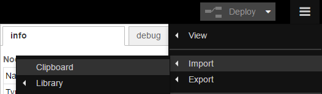

3. Paste the following code into the "Import nodes" dialog

    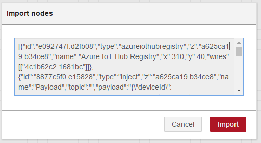

    ```
    [{"id":"e092747f.d2fb08","type":"azureiothubregistry","z":"a625ca19.b34ce8","name":"Azure IoT Hub Registry","x":370,"y":120,"wires":[["4c1b62c2.1681bc"]]},{"id":"8877c5f0.e15828","type":"inject","z":"a625ca19.b34ce8","name":"Register Payload","topic":"","payload":"{\"deviceId\": \"device146\"}","payloadType":"json","repeat":"","crontab":"","once":false,"x":140,"y":120,"wires":[["e092747f.d2fb08"]]},{"id":"4c1b62c2.1681bc","type":"debug","z":"a625ca19.b34ce8","name":"Log","active":true,"console":"false","complete":"true","x":650,"y":120,"wires":[]},{"id":"a3b3f737.a7a428","type":"debug","z":"a625ca19.b34ce8","name":"Log","active":true,"console":"false","complete":"true","x":650,"y":60,"wires":[]},{"id":"2be1c658.c9bbea","type":"azureiothub","z":"a625ca19.b34ce8","name":"Azure IoT Hub","protocol":"amqp","x":340,"y":60,"wires":[["a3b3f737.a7a428"]]},{"id":"600a3eb0.2b238","type":"inject","z":"a625ca19.b34ce8","name":"Send Payload","topic":"","payload":"{ \"deviceId\": \"device145\", \"key\": \"Qmq2SSe4CzuB5N0v2FvfV3LAE8OKf2rWj6IQPx+AU3w=\", \"protocol\": \"amqp\", \"data\": \"{tem: 25, wind: 20}\" }","payloadType":"json","repeat":"","crontab":"","once":false,"x":130,"y":60,"wires":[["2be1c658.c9bbea"]]}]
    ```
4. Double-click the Register Payload node

    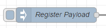

5. Enter your desired deviceId into the Payload field and click Done. Check "Inject once at start?" to register this device when you click Deploy.

    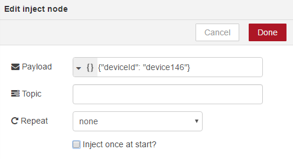

6. Double-click the Azure IoT Hub Registry node, enter your IoT Hub connection string and click Done.

    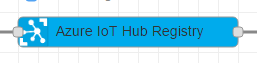 
    
    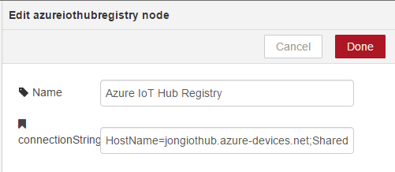

7. Click Deploy

    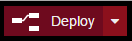

8. Click the square button on the left side of the Register Payload node.
    
    

9. Click on the debug tab to your right and you'll see the device's primary and secondary keys.

    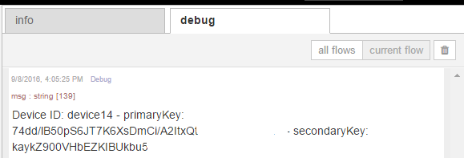


### Send Data to Azure IoT Hub

1. Double-click on the Send Payload node and modify the JSON in the Payload field to contain your deviceId, key, protocol and data.

    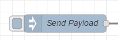

    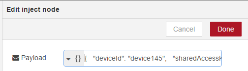

2. Double-click the Azure IoT Hub node and enter your hostname and click Done.

    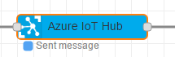

    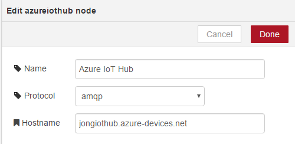

3. Click Deploy

    

4. Click the square button on the left side of the Send Payload node.
    
    

5. You should then see a Message sent debug message in the debug pane.

    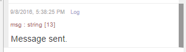

### References
You can read more about Azure IoT Hub [here](https://azure.microsoft.com/en-us/documentation/services/iot-hub/).


