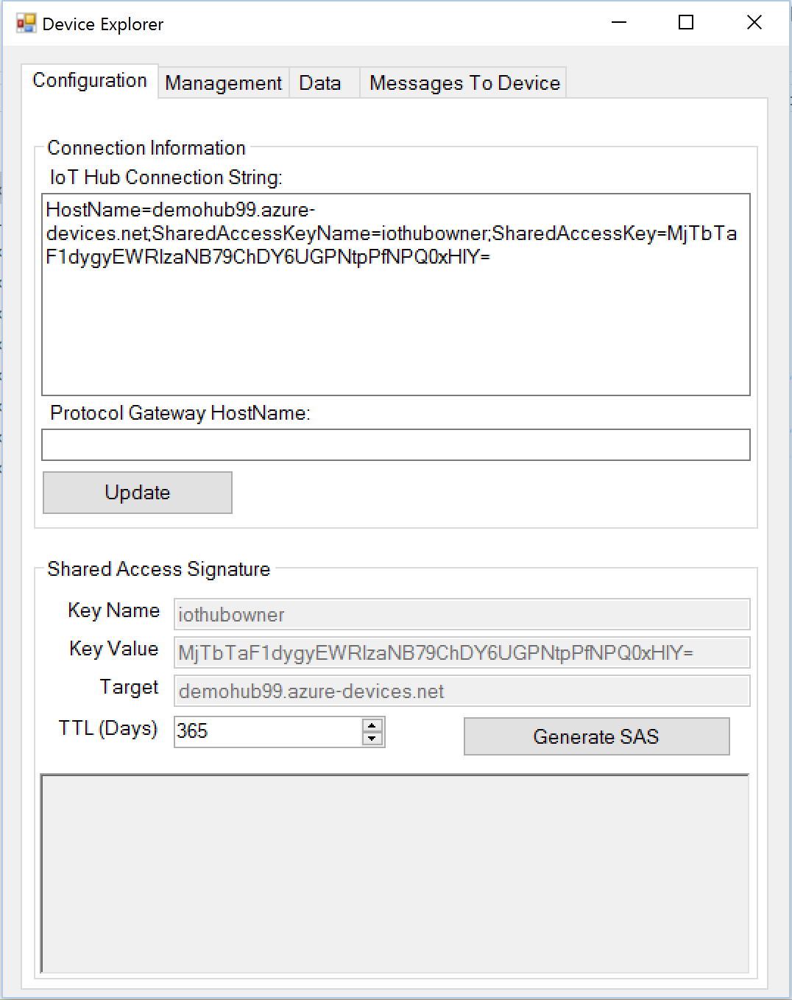
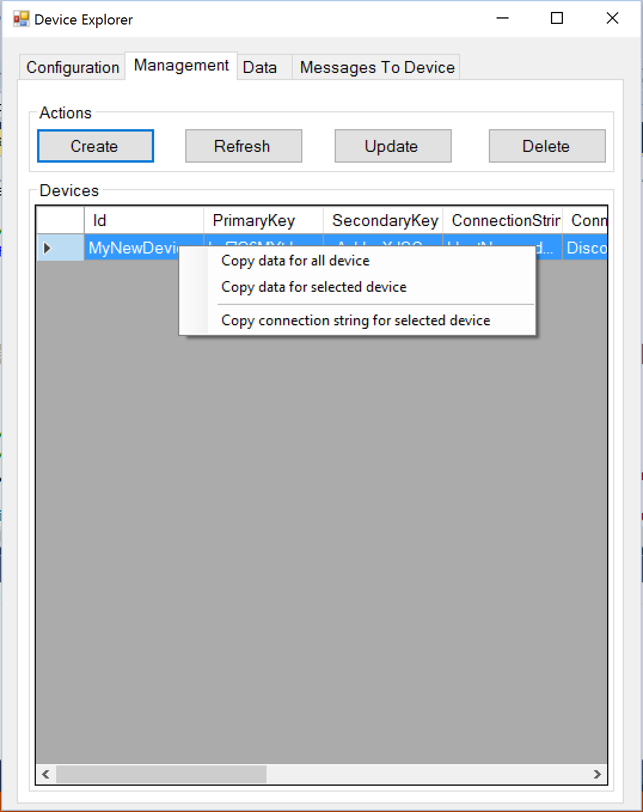

# How to use Device Explorer for IoT Hub devices
This topic describes how to download, build and use the Device Explorer tool. You can use this tool to manage devices connecting to your IoT hub. For example, you can register a device with your IoT hub, monitor messages from your devices, and send messages to your devices.

> **Note:** The Device Explorer utility only runs on Windows.

## Table of Contents
- [Getting Device Explorer](#download)
- [Configure an IoT Hub connection](#configure)
- [Manage devices](#managedevices)
  - [List registered devices](#listdevices)
  - [Create device](#createdevice)
  - [Update device](#updatedevice)
  - [Delete device](#deletedevice)
  - [Get device connection string or data](#getdatadevice)
- [Monitor device-to-cloud events](#monitor)
- [Send cloud-to-device messages](#send)

<a name="download"/>
## Getting Device Explorer

You can either download a pre-built version of Device Explorer or build it yourself.

### Download a pre-built version of the Device Explorer application

A pre-built version of the Device Explorer application for Windows can be downloaded by clicking on this link [DeviceExplorer.msi](https://github.com/Azure/azure-iot-sdks/releases/download/v1.0.0-preview.3/SetupDeviceExplorer.msi).

### Build the Device Explorer application

To build Device Explorer yourself, open the **tools\\DeviceExplorer\\DeviceExplorer.sln** file in your local copy of this repository ([azure-iot-sdks](https://github.com/Azure/azure-iot-sdks)) in Visual Studio 2015. Then build and run the solution.

<a name="configure"/>
## Configure an IoT Hub connection

-  In the **Configuration** tab, add the connection string for your IoT Hub. For information about how to find this connection string, see the document [Setup your IoT Hub][setup-iothub]. Then click **Update**.
-  If you are using a Protocol Gateway (For example, MQTT Protocol Gateway), make sure you fill the **Protocol Gateway HostName** field with the address of your protocol gateway (for example **localhost** if it is deployed locally to your developmemt box) before getting a device connection string.

  

<a name="managedevices"/>
## Manage devices
-  Click the **Management** tab to manage the devices connected to the IoT hub.

  

<a name="listdevices"/>
-  Click **List** to query the list of registered devices with the connected IoT Hub.

<a name="createdevice"/>
### Create device

Creating a device adds device details to the device identity registry. IoT Hub uses this information to generate a device-specific connection string that enables the device to connect to the IoT hub.

-  On the **Management** tab, click **Create** to register a new device with that IoT Hub. The **Create Device** dialog appears. In the **Device ID** field, type a unique name for your device (or select **Auto Generate ID** to generate a unique ID instead). Then click **Create**.

  

-  A **Device Created** window appears, indicating that your device has been successfully registered with this IoT Hub.

  

<a name="updatedevice"/>
### Update device

- Click **Update** to change the primary or secondary key for the selected device. You will need to update your device to use any new keys you generate.

<a name="deletedevice"/>
### Delete device

- Click **Delete** to delete the selected devices from the connected IoT hub.

<a name="getdatadevice"/>
### Get device connection string or configuration data

- Use the mouse right click for context menu for the selected device. The menu has the following option

  

<a name="monitor"/>
## Monitor device-to-cloud events

The following steps describe how to use Device Explorer to monitor device-to-cloud events sent from a sample application on a client to an IoT hub and use the **Device Explorer** utility to observe as the IoT hub receives the event data.

### Obtain the device connection string and setup monitoring

You can use one of the sample applications included in this repository ([azure-iot-sdks](https://github.com/Azure/azure-iot-sdks)) to send device-to-cloud events to your IoT Hub. Use Device Explorer to [create a device](#createdevice) and generate a connection string.

-  You can obtain the IoT Hub connection string from Device Explorer. In the Management tab, right-click on the selected device and select "Copy connection string for selected device". The device connection string is silently copied to the clipboard.

> Note: Device Explorer requires an IoT hub connection string obtained from the Azure portal to enable it to connect to the hub. You can then use Device Explorer to generate device-specific connection strings that enable devices to communicate with the hub.

- Update the device connection string placeholder in the sample application you are using with the connection string from Device Explorer.

-  In the Device Explorer **Data** tab, select the device name you created from the drop-down list of device IDs and leave the other fields with their default values for now.

-  Click **Monitor**.

  

-  Device Explorer is now monitoring data sent from that device to the IoT hub.

### Run the sample application

Run your sample application. Device Explorer should now show that the IoT hub has successfully received device-to-cloud data from this device.

  

<a name="send"/>
## Send cloud-to-device messages

-  To verify that you can send cloud-to-device messages from the IoT hub to your device, go to the **Messages To Device** tab in Device Explorer.

-  Select the device you created.

-  Add some text to the **Message** field, then click **Send**.

  

-  You should be able to see the command received in the console window for the client sample application you are using.

  

[setup-iothub]: ../../../doc/setup_iothub.md
