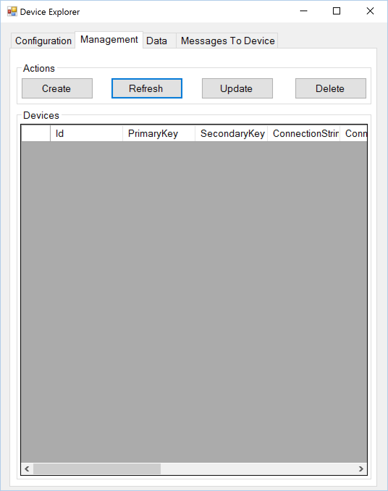
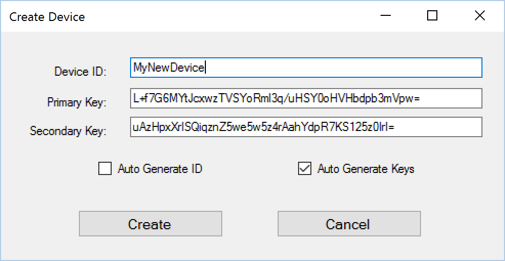
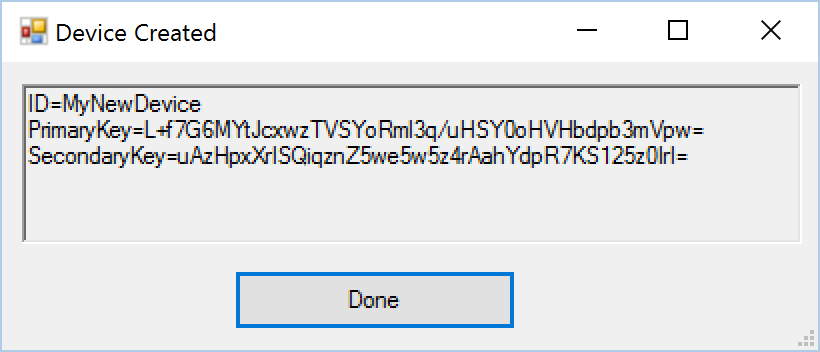
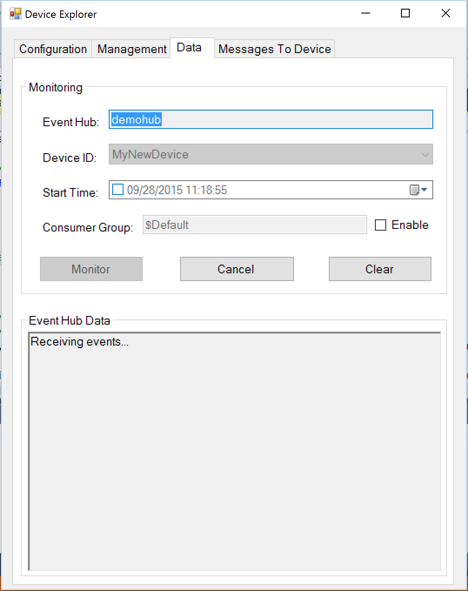
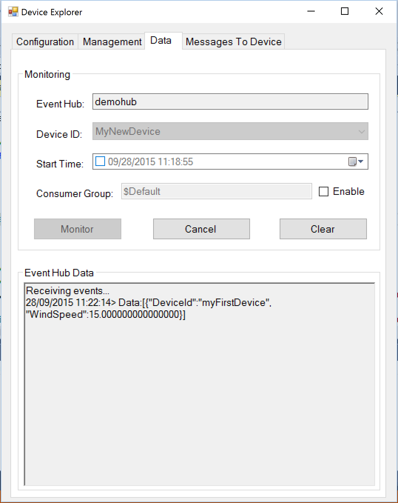
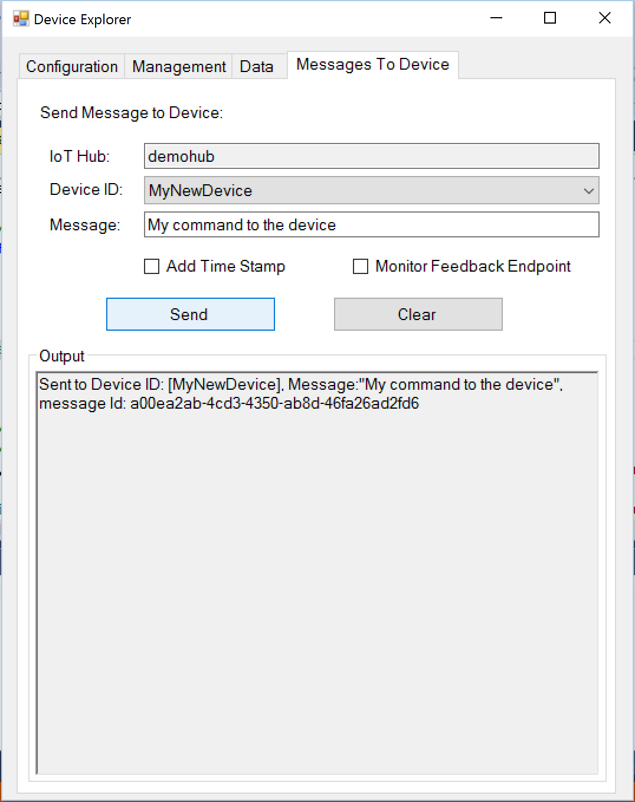

# How to use Device Explorer for IoT Hub devices
This topic describes how to download, build and use the Device Explorer tool for managing and using IoT Hub devices.

## Table of Contents
- [Download a pre-built version of the Device Explorer application](#download)
- [Build the Device Explorer application](#build)
- [Configure an IoT Hub connection](#configure)
- [Manage devices](#managedevices)
  - [List registered devices](#listdevices)
  - [Create device](#createdevice)
  - [Update device](#updatedevice)
  - [Delete device](#deletedevice)
  - [Get device connection string or data](#getdatadevice)
- [Monitor device-to-cloud events](#monitor)
- [Send cloud-to-device notifications](#send)

<a name="download"/>
## Download a pre-built version of the Device Explorer application

-  A pre-built version of the Device Explorer application for Windows can be downloaded by clicking on this link [DeviceExplorer.msi](placeholder)

<a name="build"/>
## Build the Device Explorer application

-  Start a new instance of Visual Studio 2015 and open the DeviceExplorer.sln solution, which is located in the **tools\\DeviceExplorer** directory.

-  Build the solution.

-  Run the Device Explorer application you created above.

<a name="configure"/>
## Configure an Iot Hub connection

-  In the **Configuration** tab, add the connection string for your IoT Hub. For information about how to find this connection string, see the document [Setup your IoT Hub][setup-iothub]. Then click **Update**.
-  If you are using a Protocol Gateway (For example, MQTT Protocol Gateway), make sure you fill the **Protocol Gateway HostName** field with the address of your protocol gateway (i.e. localhost if it is deployed locally to your dev box) before getting a device Connection String.

  

<a name="managedevices"/>
## Manage devices
-  Click the **Management** tab.

  

<a name="listdevices"/>
### List devices

-  Click **List** to query the list of registered devices with the connected IoT Hub.

<a name="createdevice"/>
### Create device

-  Click the **Management** tab.

  

-  Click **Create** to register a new device with that IoT Hub. The **Create Device** dialog appears.

  

-  In the **Device ID** field, type a unique name for your device (or select **Auto Generate ID** to generate a unique ID instead). Then click **Create**.

-  A **Device Created** window appears, indicating that your device has been successfully registered with this IoT Hub.

  

<a name="updatedevice"/>
### Update device

- Click **Update** to change the primary or secondary key for the selected device.

<a name="deletedevice"/>
### Delete device

- Click **Delete** to delete the selected devices from the connected IoT Hub.

<a name="getdatadevice"/>
### Get device connection string or configuration data

- Use the mouse right click for context menu for the selected device. The menu has the following option

  

> Note: The device connection string or data is silently copied to the clipboard.

<a name="monitor"/>
## Monitor device-to-cloud events

The following steps describe how to use Device Explorer to monitor device-to-cloud events sent from a sample application to IoT Hub and use the **Device Explorer** utility to observe as IoT Hub receives the event data.

### Obtain the device connection string and setup monitoring

You can use one of the sample applications included in this repository to send device-to-cloud events to your IoT Hub. Use Device Explorer to [create a device](#createdevice) and generate a connection string.

-  You can obtain the IoT Hub connection string from Device Explorer. In the Management tab, right-click on the selected device and select "Copy connection string for selected device".

- Update the connection string placeholder in the sample application you are using with the connection string from Device Explorer.

-  In the Device Explorer **Data** tab, select the device name you created from the drop-down list of device IDs and leave everything else as the default for now.

-  Click **Monitor**.

  

-  Device Explorer is now monitoring data sent from that device to the IoT Hub.

### Run the sample application

-  Run your sample application.

-  Device Explorer should now show that IoT Hub has successfully received device-to-cloud data from this device.

  

<a name="send"/>
## Send cloud-to-device notifications

-  To verify that you can send notifications from the IoT Hub to your device, go to the **Notification** tab in Device Explorer.

-  Select the device you created.

-  Add some text to the **Notification** field, then click **Send**.

  

-  You should be able to see the command received in the console window for the client sample application you are using.

  

[setup-iothub]: ../../../doc/setup_iothub.md
